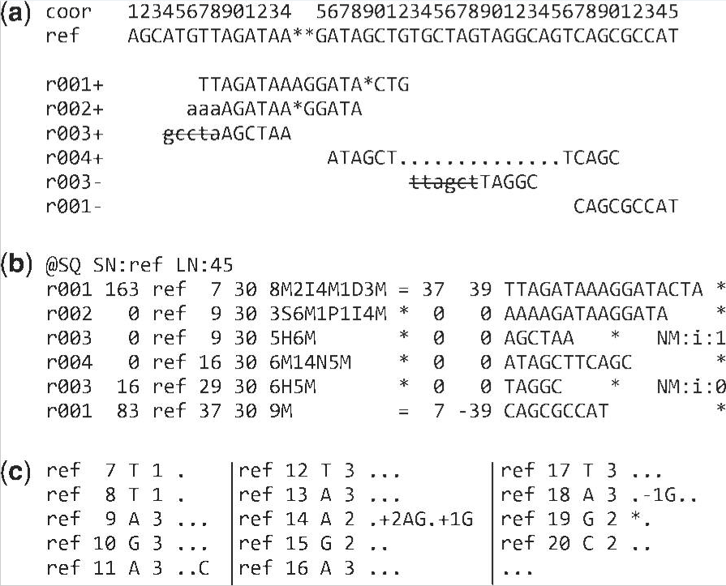

(High-throughput) DNA sequencing
================================

Sequencing techniques
---------------------
- (Meta)barcoding of specific markers
- Probing for ultraconserved regions
- RNA sequencing
- etc.

Sequencing platforms
--------------------
- Old school: Sanger sequencing
- Short read standard: Illumina HiSeq
- Long reads: PacBio
- Longer reads: Nanopore MinION

Data centric view of genome resequencing workflow
-------------------------------------------------
1. (semi-)raw reads come out of lab as FASTQ
2. reads are aligned to a (pseudo-)reference as SAM/BAM/CRAM
3. alignment is viewed in genome browser, with additional tracks as BED
4. variants are called (e.g. as VCF/BCF), consensus is computed (e.g. as FASTA)
5. consensus is annotated as GFF

The FASTQ format
----------------
- The initial mountain of data to deal with
- Sequential [format](FASTQ.pdf) returned by most HTS platforms
- Includes base calling quality scores

Record layout:

1. `@`+identifier - _note paired-end sequencing_
2. Sequence data - _IUPAC single character nucleotides_
3. `+` - _separator between sequence and quality_
4. Quality lines - _map phred scores to ASCII characters_

Example:

    @FAKE0005
    ACGTACGTACGTACGTACGTACGTACGTACGTACGTACGTACGTACGTACGTACGTACGTACG
    +
    @ABCDEFGHIJKLMNOPQRSTUVWXYZ[\]^_`abcdefghijklmnopqrstuvwxyz{|}~

Quality (phred) scores
----------------------

Different platforms map phred scores in different ways to ASCII:
- sanger: 33..126
- solexa: 59..126
- illumina: 64..126

| code  | char  | code  | char  | code  | char  | code  | char  | code  | char  | code  | char  |
|-------|-------|-------|-------|-------|-------|-------|-------|-------|-------|-------|-------|
|   33  |   !   |   49  |   1   |   65  |   A   |   81  |   Q   |   97  |   a   |   113 |   q   |
|   34  |   "   |   50  |   2   |   66  |   B   |   82  |   R   |   98  |   b   |   114 |   r   |
|   35  |   #   |   51  |   3   |   67  |   C   |   83  |   S   |   99  |   c   |   115 |   s   |
|   36  |   $   |   52  |   4   |   68  |   D   |   84  |   T   |   100 |   d   |   116 |   t   |
|   37  |   %   |   53  |   5   |   69  |   E   |   85  |   U   |   101 |   e   |   117 |   u   |
|   38  |   &   |   54  |   6   |   70  |   F   |   86  |   V   |   102 |   f   |   118 |   v   |
|   39  |   '   |   55  |   7   |   71  |   G   |   87  |   W   |   103 |   g   |   119 |   w   |
|   40  |   (   |   56  |   8   |   72  |   H   |   88  |   X   |   104 |   h   |   120 |   x   |
|   41  |   )   |   57  |   9   |   73  |   I   |   89  |   Y   |   105 |   i   |   121 |   y   |
|   42  |   *   |   58  |   :   |   74  |   J   |   90  |   Z   |   106 |   j   |   122 |   z   |
|   43  |   +   |   59  |   ;   |   75  |   K   |   91  |   [   |   107 |   k   |   123 |   {   |
|   44  |   ,   |   60  |   <   |   76  |   L   |   92  |   \   |   108 |   l   |   124 |   \|  |
|   45  |   -   |   61  |   =   |   77  |   M   |   93  |   ]   |   109 |   m   |   125 |   }   |
|   46  |   .   |   62  |   >   |   78  |   N   |   94  |   ^   |   110 |   n   |   126 |   ~   |
|   47  |   /   |   63  |   ?   |   79  |   O   |   95  |   _   |   111 |   o   |       |       |
|   48  |   0   |   64  |   @   |   80  |   P   |   96  |   \`  |   112 |   p   |       |       |

The SAM/BAM/CRAM format
-----------------------
- Format to represent (FASTQ) reads aligned to a reference sequence
- Textual (SAM) and binary representations (BAM)
- Accessed using tools such as samtools, picard, EMBOSS, (Bio::SamTools, Galaxy)



Example of extended CIGAR and the pileup output. 

**(a)** Alignments of one pair of reads and three single-end reads.

**(b)** The corresponding SAM file. The ‘@SQ’ line in the header section gives the order 
of reference sequences. Notably, r001 is the name of a read pair. According to 
`FLAG 163 (=1 + 2 + 32 + 128)`, the read mapped to position 7 is the second read in the 
pair (128) and regarded as properly paired (1 + 2); its mate is mapped to 37 on the 
reverse strand (32). Read r002 has three soft-clipped (unaligned) bases. The coordinate 
shown in SAM is the position of the first aligned base. The CIGAR string for this 
alignment contains a P (padding) operation which correctly aligns the inserted sequences. 
Padding operations can be absent when an aligner does not support multiple sequence 
alignment. The last six bases of read r003 map to position 9, and the first five to 
position 29 on the reverse strand. The hard clipping operation H indicates that the 
clipped sequence is not present in the sequence field. The NM tag gives the number of 
mismatches. Read r004 is aligned across an intron, indicated by the N operation. 
   
**(c)** Simplified pileup output by SAMtools. Each line consists of reference name, sorted 
coordinate, reference base, the number of reads covering the position and read bases. In 
the fifth field, a dot or a comma denotes a base identical to the reference; a dot or a 
capital letter denotes a base from a read mapped on the forward strand, while a comma or a 
lowercase letter on the reverse strand.

The VCF/BCF format
------------------
- Format for variants (SNPs, indels, microsats) computed from a SAM/BAM/CRAM file
- Concise, good for resequencing projects, but lossy
- [Text](VCFv4.2.pdf) and binary version

```
##fileformat=VCFv4.2
##fileDate=20090805
##source=myImputationProgramV3.1
##reference=file:///seq/references/1000GenomesPilot-NCBI36.fasta
##contig=<ID=20,length=62435964,assembly=B36,md5=f126cdf8a6e0c7f379d618ff66beb2da,species="Homo sapiens",taxonomy=x>
##phasing=partial
##INFO=<ID=NS,Number=1,Type=Integer,Description="Number of Samples With Data">
##INFO=<ID=DP,Number=1,Type=Integer,Description="Total Depth">
##INFO=<ID=AF,Number=A,Type=Float,Description="Allele Frequency">
##INFO=<ID=AA,Number=1,Type=String,Description="Ancestral Allele">
##INFO=<ID=DB,Number=0,Type=Flag,Description="dbSNP membership, build 129">
##INFO=<ID=H2,Number=0,Type=Flag,Description="HapMap2 membership">
##FILTER=<ID=q10,Description="Quality below 10">
##FILTER=<ID=s50,Description="Less than 50% of samples have data">
##FORMAT=<ID=GT,Number=1,Type=String,Description="Genotype">
##FORMAT=<ID=GQ,Number=1,Type=Integer,Description="Genotype Quality">
##FORMAT=<ID=DP,Number=1,Type=Integer,Description="Read Depth">
##FORMAT=<ID=HQ,Number=2,Type=Integer,Description="Haplotype Quality">
#CHROM  POS     ID          REF ALT     QUAL    FILTER  INFO                                FORMAT      NA00001         NA00002         NA00003
20      14370   rs6054257   G   A       29      PASS    NS=3;DP=14;AF=0.5;DB;H2             GT:GQ:DP:HQ 0|0:48:1:51,51  1|0:48:8:51,51  1/1:43:5:.,.
20      17330   .           T   A       3       q10     NS=3;DP=11;AF=0.017                 GT:GQ:DP:HQ 0|0:49:3:58,50  0|1:3:5:65,3    0/0:41:3
20      1110696 rs6040355   A   G,T     67      PASS    NS=2;DP=10;AF=0.333,0.667;AA=T;DB   GT:GQ:DP:HQ 1|2:21:6:23,27  2|1:2:0:18,2    2/2:35:4
20      1230237 .           T   .       47      PASS    NS=3;DP=13;AA=T                     GT:GQ:DP:HQ 0|0:54:7:56,60  0|0:48:4:51,51  0/0:61:2
20      1234567 microsat1   GTC G,GTCT  50      PASS    NS=3;DP=9;AA=G                      GT:GQ:DP    0/1:35:4        0/2:17:2        1/1:40:3
```

1. a good simple SNP 
2. a possible SNP that has been filtered out because its quality is below 10
3. a site at which two alternate alleles are called, with one of them (T) being ancestral 
   (possibly a reference sequencing error)
4. a site that is called monomorphic reference (i.e. with no alternate alleles)
5. a microsatellite with two alternative alleles, one a deletion of 2 bases (TC), and the 
   other an insertion of one base (T). 
   
Genotype data are given for three samples, two of which are phased and the third unphased, 
with per sample genotype quality, depth and haplotype qualities (the latter only for the 
phased samples) given as well as the genotypes. The microsatellite calls are unphased.

BED files
---------

The GFF format
--------------