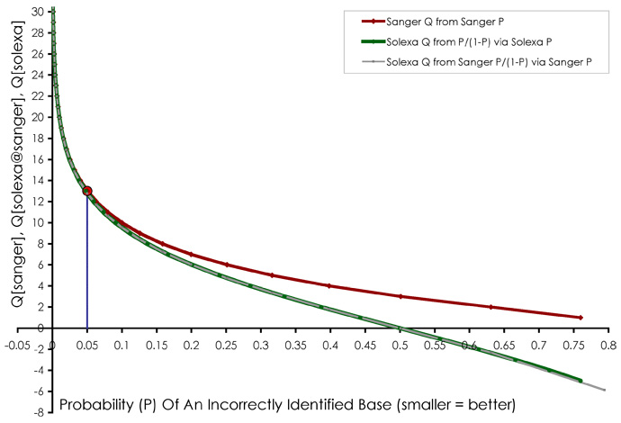

High-throughput DNA sequencing
==============================

Data centric view of genome resequencing workflow
-------------------------------------------------
1. (semi-)raw reads come out of lab as FASTQ
2. reads are assembled to a FASTA file
3. reads are aligned to a (pseudo-)reference as SAM/BAM/CRAM
4. alignment is viewed in genome browser, with additional tracks as BED
5. variants are called (e.g. as VCF/BCF), consensus is computed (e.g. as FASTA)
6. consensus is annotated as GFF

The FASTA format
----------------
- The simplest, and therefore most common sequence format
- Holds DNA/RNA/AA sequence data in IUPAC single characters
- Seen in Genomic Architectures, used for online BLAST
- Syntax:
```
>Definition_line
agctcagactacgactacgcatcagcga
```

Extensions:
- The first words in the definition line are often used to embed data, e.g. identifiers
- Sequence quality is sometimes written to separate FASTA-like files with records
  in the same order (and same length)
- Can be one or multiple records, which might be aligned, in which case there
  might be gap `-` characters
- Lower case and capitalized are sometimes used to embed information such as
  base quality or strandedness

The FASTQ format
----------------
- The initial mountain of data to deal with
- Sequential [format](lecture2/FASTQ.pdf) returned by most HTS platforms
- Includes base calling quality scores

Record layout:

1. `@`+identifier - _note paired-end sequencing_
2. Sequence data - _IUPAC single character nucleotides_
3. `+` - _separator between sequence and quality_
4. Quality lines - _map phred scores to ASCII characters_

Example:

    @FAKE0005
    ACGTACGTACGTACGTACGTACGTACGTACGTACGTACGTACGTACGTACGTACGTACGTACG
    +
    @ABCDEFGHIJKLMNOPQRSTUVWXYZ[\]^_`abcdefghijklmnopqrstuvwxyz{|}~

Quality (phred) scores
----------------------
Phred quality scores _Q_ are defined as a property which is logarithmically related to 
the base-calling error probabilities _P_.

_Q_ = -10 log<sub>10</sub> _P_

For example, if Phred assigns a quality score of 30 to a base, the chances that this base 
is called incorrectly are 1 in 1000.

| Phred Quality Score | Probability of incorrect base call | Base call accuracy |
|---------------------|------------------------------------|--------------------|
| 10                  | 1 in 10                            | 90%                |
| 20                  | 1 in 100                           | 99%                |
| 30                  | 1 in 1000                          | 99.9%              |
| 40                  | 1 in 10,000                        | 99.99%             |
| 50                  | 1 in 100,000                       | 99.999%            |
| 60                  | 1 in 1,000,000                     | 99.9999%           |



Phred score encoding
--------------------

Different platforms map phred scores in different ways to ASCII:

- sanger: 33..126
- solexa: 59..126
- illumina: 64..126

| code  | char  | code  | char  | code  | char  | code  | char  | code  | char  | code  | char  |
|-------|-------|-------|-------|-------|-------|-------|-------|-------|-------|-------|-------|
|   33  |   !   |   49  |   1   |   65  |   A   |   81  |   Q   |   97  |   a   |   113 |   q   |
|   34  |   "   |   50  |   2   |   66  |   B   |   82  |   R   |   98  |   b   |   114 |   r   |
|   35  |   #   |   51  |   3   |   67  |   C   |   83  |   S   |   99  |   c   |   115 |   s   |
|   36  |   $   |   52  |   4   |   68  |   D   |   84  |   T   |   100 |   d   |   116 |   t   |
|   37  |   %   |   53  |   5   |   69  |   E   |   85  |   U   |   101 |   e   |   117 |   u   |
|   38  |   &   |   54  |   6   |   70  |   F   |   86  |   V   |   102 |   f   |   118 |   v   |
|   39  |   '   |   55  |   7   |   71  |   G   |   87  |   W   |   103 |   g   |   119 |   w   |
|   40  |   (   |   56  |   8   |   72  |   H   |   88  |   X   |   104 |   h   |   120 |   x   |
|   41  |   )   |   57  |   9   |   73  |   I   |   89  |   Y   |   105 |   i   |   121 |   y   |
|   42  |   *   |   58  |   :   |   74  |   J   |   90  |   Z   |   106 |   j   |   122 |   z   |
|   43  |   +   |   59  |   ;   |   75  |   K   |   91  |   \[  |   107 |   k   |   123 |   {   |
|   44  |   ,   |   60  |   <   |   76  |   L   |   92  |   \\  |   108 |   l   |   124 |   \|  |
|   45  |   -   |   61  |   =   |   77  |   M   |   93  |   ]   |   109 |   m   |   125 |   }   |
|   46  |   .   |   62  |   >   |   78  |   N   |   94  |   ^   |   110 |   n   |   126 |   ~   |
|   47  |   /   |   63  |   ?   |   79  |   O   |   95  |   _   |   111 |   o   |       |       |
|   48  |   0   |   64  |   @   |   80  |   P   |   96  |   \`  |   112 |   p   |       |       |

The SAM/BAM/CRAM format
-----------------------
- [Format](lecture2/SAM.pdf) to represent (FASTQ) reads aligned to a reference sequence
- Textual (SAM) and binary representations (BAM)
- Binary representation further compressed as CRAM
- Accessed using tools such as samtools, picard

Example alignment:

```
Coor    12345678901234  5678901234567890123456789012345
ref     AGCATGTTAGATAA**GATAGCTGTGCTAGTAGGCAGTCAGCGCCAT
+r001/1       TTAGATAAAGGATA*CTG                       
+r002        aaaAGATAA*GGATA
+r003      gcctaAGCTAA
+r004                    ATAGCT..............TCAGC
-r003                           ttagctTAGGC
-r001/2                                       CAGCGGCAT
```

- Read `r001/1` and `r001/2` constitute a read pair
- `r003` is a chimeric read
- `r004` represents a split alignment

SAM representation
------------------

Example:
```
@HD VN:1.5 SO:coordinate
@SQ SN:ref LN:45
r001    99 ref  7 30 8M2I4M1D3M = 37 39 TTAGATAAAGGATACTG *
r002     0 ref  9 30 3S6M1P1I4M * 0   0 AAAAGATAAGGATA    *
r003     0 ref  9 30 5S6M       * 0   0 GCCTAAGCTAA       *
r004     0 ref 16 30 6M14N5M    * 0   0 ATAGCTTCAGC       *
r003  2064 ref 29 17 6H5M       * 0   0 TAGGC             *
r001   147 ref 37 30 9M         = 7 -39 CAGCGGCAT         *
```

Mandatory columns: 

| No. |	Name  | Description                                        |
|-----|-------|----------------------------------------------------|
| 1   | QNAME | Query NAME of the read or the read pair            |
| 2   | FLAG  | Bitwise FLAG (pairing, strand, mate strand, etc.)  |
| 3   | RNAME | Reference sequence NAME                            |
| 4   | POS   | 1-Based leftmost POSition of clipped alignment     |
| 5   | MAPQ  | MAPping Quality (Phred-scaled)                     |
| 6   | CIGAR | Extended CIGAR string (operations: MIDNSHP)        |
| 7   | MRNM  | Mate Reference NaMe (‘=’ if same as RNAME)         |
| 8   | MPOS  | 1-Based leftmost Mate POSition                     |
| 9   | ISIZE | Inferred Insert SIZE                               |
| 10  | SEQ   | Query SEQuence on the same strand as the reference |
| 11  | QUAL  | Query QUALity (ASCII-33=Phred base quality)        |

What is a CIGAR?
----------------
The sequence being aligned to a reference may have additional bases that are not in the 
reference or may be missing bases that are in the reference. The CIGAR string is a 
sequence of base lengths and the associated operation. They are used to indicate things 
like which bases align (either a match/mismatch) with the reference, are deleted from the 
reference, and are insertions that are not in the reference.
For example:
```
RefPos:     1  2  3  4  5  6  7  8  9 10 11 12 13 14 15 16 17 18 19
Reference:  C  C  A  T  A  C  T  G  A  A  C  T  G  A  C  T  A  A  C
Read: ACTAGAATGGCT
```
Aligning these two:
```
RefPos:     1  2  3  4  5  6  7     8  9 10 11 12 13 14 15 16 17 18 19
Reference:  C  C  A  T  A  C  T     G  A  A  C  T  G  A  C  T  A  A  C
Read:                   A  C  T  A  G  A  A     T  G  G  C  T
```
With the alignment above, you get:
```
POS: 5
CIGAR: 3M1I3M1D5M
```
The POS indicates that the read aligns starting at position 5 on the reference. The CIGAR 
says that the first 3 bases in the read sequence align with the reference. The next base 
in the read does not exist in the reference. Then 3 bases align with the reference. The 
next reference base does not exist in the read sequence, then 5 more bases align with the 
reference. Note that at position 14, the base in the read is different than the reference,
but it still counts as an M since it aligns to that position.

Bitwise flags
-------------

| 2<sup>x</sup> | Value (Hex)       | Value (Decimal)    | Bits         | SAM property                             |
|---------------|-------------------|--------------------|--------------|------------------------------------------|
| 2<sup>0</sup> | 1                 | 1                  | 000000000001 | are there multiple fragments?            |
| 2<sup>1</sup> | 2                 | 2                  | 000000000010 | are all fragments properly aligned?      |
| 2<sup>2</sup> | 4                 | 4                  | 000000000100 | is this fragment unmapped?               |
| 2<sup>3</sup> | 8                 | 8                  | 000000001000 | is the next fragment unmapped?           |
| 2<sup>4</sup> | 10<sub>hex</sub>  | 16<sub>dec</sub>   | 000000010000 | is this query the reverse strand?        |
| 2<sup>5</sup> | 20<sub>hex</sub>  | 32<sub>dec</sub>   | 000000100000 | is the next fragment the reverse strand? |
| 2<sup>6</sup> | 40<sub>hex</sub>  | 64<sub>dec</sub>   | 000001000000 | is this the 1st fragment?                |
| 2<sup>7</sup> | 80<sub>hex</sub>  | 128<sub>dec</sub>  | 000010000000 | is this the last fragment?               |
| 2<sup>8</sup> | 100<sub>hex</sub> | 256<sub>dec</sub>  | 000100000000 | is this a secondary alignment?           |
| 2<sup>9</sup> | 200<sub>hex</sub> | 512<sub>dec</sub>  | 001000000000 | did this read fail quality controls?     |
| 2<sup>A</sup> | 400<sub>hex</sub> | 1024<sub>dec</sub> | 010000000000 | is this read a PCR or optical duplicate? |
| 2<sup>B</sup> | 800<sub>hex</sub> | 2048<sub>dec</sub> | 100000000000 | supplementary alignment                  |

The values in the `FLAG` column (2) correspond to bitwise flags as follows: 

| FLAG | hex   | [Explanation](https://broadinstitute.github.io/picard/explain-flags.html)       |
|------|-------|---------------------------------------------------------------------------------|
| 99   | 0x63  | first/next is reverse-complemented/properly aligned/multiple segments           |
| 0    |       | no flags set, thus a mapped single segment                                      |
| 2064 | 0x810 | supplementary/reversecomplemented                                               |
| 147  | 0x93  | last (second of a pair)/reverse-complemented/properly aligned/multiple segments |

Using the flags, we can filter the reads in a BAM file:

```
$ samtools view -f 4 file.bam > unmapped.sam
```

The BED format
--------------
If you load a SAM/BAM file in a genome browser (e.g. [UCSC](https://genome.ucsc.edu)) you
might want to load additional 'tracks' alongside the alignment. For this the BED format
is used.

```
track name=pairedReads description="Clone Paired Reads" useScore=1
chr22 1000 5000 cloneA 960 + 1000 5000 0 2 567,488, 0,3512
chr22 2000 6000 cloneB 900 - 2000 6000 0 2 433,399, 0,3601
```

1.  The name of the chromosome (e.g. chr3, chrY, chr2_random) or scaffold (e.g. 
    scaffold10671).
2.  The starting position of the feature in the chromosome or scaffold. The first base in 
    a chromosome is numbered 0.
3.  The ending position of the feature in the chromosome or scaffold. The chromEnd base is 
    not included in the display of the feature. For example, the first 100 bases of a 
    chromosome are defined as chromStart=0, chromEnd=100, and span the bases numbered 0-99.
4.  Defines the name of the BED line. This label is displayed to the left of the BED line 
    in the Genome Browser window when the track is open to full display mode or directly 
    to the left of the item in pack mode.
5.  A score between 0 and 1000. If the track line useScore attribute is set to 1 for this 
    annotation data set, the score value will determine the level of gray in which this 
    feature is displayed (higher numbers = darker gray).
6.  Defines the strand. Either "." (=no strand) or "+" or "-".
7.  The starting position at which the feature is drawn thickly (for example, the start 
    codon in gene displays). When there is no thick part, thickStart and thickEnd are 
    usually set to the chromStart position.
8.  The ending position at which the feature is drawn thickly (for example the stop codon 
    in gene displays).
9.  An RGB value of the form R,G,B (e.g. 255,0,0). If the track line itemRgb attribute is 
    set to "On", this RBG value will determine the display color of the data contained in 
    this BED line. NOTE: It is recommended that a simple color scheme (eight colors or 
    less) be used with this attribute to avoid overwhelming the color resources of the 
    genome Browser and your Internet browser.
10. The number of blocks (exons) in the BED line.
11. A comma-separated list of the block sizes. The number of items in this list should 
    correspond to blockCount.
12. A comma-separated list of block starts. All of the blockStart positions should be 
    calculated relative to chromStart. The number of items in this list should correspond 
    to blockCount.

The VCF/BCF format
------------------
- Format for variants (SNPs, indels, microsats) computed from a SAM/BAM/CRAM file
- Concise, good for resequencing projects, but lossy
- [Text](lecture2/VCFv4.2.pdf) and binary version

```
##fileformat=VCFv4.2
##fileDate=20090805
##source=myImputationProgramV3.1
##reference=file:///seq/references/1000GenomesPilot-NCBI36.fasta
##contig=<ID=20,length=62435964,assembly=B36,md5=f126cdf8a6e0c7f379d618ff66beb2da,species="Homo sapiens",taxonomy=x>
##phasing=partial
##INFO=<ID=NS,Number=1,Type=Integer,Description="Number of Samples With Data">
##INFO=<ID=DP,Number=1,Type=Integer,Description="Total Depth">
##INFO=<ID=AF,Number=A,Type=Float,Description="Allele Frequency">
##INFO=<ID=AA,Number=1,Type=String,Description="Ancestral Allele">
##INFO=<ID=DB,Number=0,Type=Flag,Description="dbSNP membership, build 129">
##INFO=<ID=H2,Number=0,Type=Flag,Description="HapMap2 membership">
##FILTER=<ID=q10,Description="Quality below 10">
##FILTER=<ID=s50,Description="Less than 50% of samples have data">
##FORMAT=<ID=GT,Number=1,Type=String,Description="Genotype">
##FORMAT=<ID=GQ,Number=1,Type=Integer,Description="Genotype Quality">
##FORMAT=<ID=DP,Number=1,Type=Integer,Description="Read Depth">
##FORMAT=<ID=HQ,Number=2,Type=Integer,Description="Haplotype Quality">
#CHROM  POS     ID          REF ALT     QUAL    FILTER  INFO                                FORMAT      NA00001         NA00002         NA00003
20      14370   rs6054257   G   A       29      PASS    NS=3;DP=14;AF=0.5;DB;H2             GT:GQ:DP:HQ 0|0:48:1:51,51  1|0:48:8:51,51  1/1:43:5:.,.
20      17330   .           T   A       3       q10     NS=3;DP=11;AF=0.017                 GT:GQ:DP:HQ 0|0:49:3:58,50  0|1:3:5:65,3    0/0:41:3
20      1110696 rs6040355   A   G,T     67      PASS    NS=2;DP=10;AF=0.333,0.667;AA=T;DB   GT:GQ:DP:HQ 1|2:21:6:23,27  2|1:2:0:18,2    2/2:35:4
20      1230237 .           T   .       47      PASS    NS=3;DP=13;AA=T                     GT:GQ:DP:HQ 0|0:54:7:56,60  0|0:48:4:51,51  0/0:61:2
20      1234567 microsat1   GTC G,GTCT  50      PASS    NS=3;DP=9;AA=G                      GT:GQ:DP    0/1:35:4        0/2:17:2        1/1:40:3
```

1. a good simple SNP 
2. a possible SNP that has been filtered out because its quality is below 10
3. a site at which two alternate alleles are called, with one of them (T) being ancestral 
   (possibly a reference sequencing error)
4. a site that is called monomorphic reference (i.e. with no alternate alleles)
5. a microsatellite with two alternative alleles, one a deletion of 2 bases (TC), and the 
   other an insertion of one base (T). 
   
Genotype data are given for three samples, two of which are phased and the third unphased, 
with per sample genotype quality, depth and haplotype qualities (the latter only for the 
phased samples) given as well as the genotypes. The microsatellite calls are unphased.

The GFF format
--------------
Once a plausible sequence has been generated (e.g. by doing a de novo assembly or by 
computing a consensus from a genome alignment) the next step might be to annotate it, i.e.
predict ORFs and scan databases for homologies. Such genome annotations are stored in GFF
files:

```
contig_1    maker   gene            1797    7025    .   +   .   ID=CR513_016834;Name=CR513_016834;Alias=maker-contig_1-snap-gene-0.0;Note=Similar to SCAI: Protein SCAI (Homo sapiens);
contig_1    maker   five_prime_UTR  1797    1954    .   +   .   ID=CR513_016834-RA:five_prime_utr;Parent=CR513_016834-RA;
contig_1    maker   CDS             1955    2095    .   +   0   ID=CR513_016834-RA:cds;Parent=CR513_016834-RA;
contig_1    maker   CDS             2223    2359    .   +   0   ID=CR513_016834-RA:cds;Parent=CR513_016834-RA;
contig_1    maker   CDS             6748    6979    .   +   1   ID=CR513_016834-RA:cds;Parent=CR513_016834-RA;
contig_1    maker   three_prime_UTR 6980    7025    .   +   .   ID=CR513_016834-RA:three_prime_utr;Parent=CR513_016834-RA;
```

1. name of the chromosome or scaffold; chromosome names can be given with or without the 
   'chr' prefix. Important note: the seqname must be one used within Ensembl, i.e. a 
   standard chromosome name or an Ensembl identifier such as a scaffold ID, without any 
   additional content such as species or assembly. See the example GFF output below.
2. name of the program that generated this feature, or the data source (database or 
   project name)
3. feature type name, e.g. Gene, Variation, Similarity
4. start position of the feature, with sequence numbering starting at 1.
5. end position of the feature, with sequence numbering starting at 1.
6. a floating point value.
7. defined as + (forward) or - (reverse).
8. one of '0', '1' or '2'. '0' indicates that the first base of the feature is the first 
   base of a codon, '1' that the second base is the first base of a codon, and so on.
9. semicolon-separated list of tag-value pairs, providing additional information about 
   each feature.
