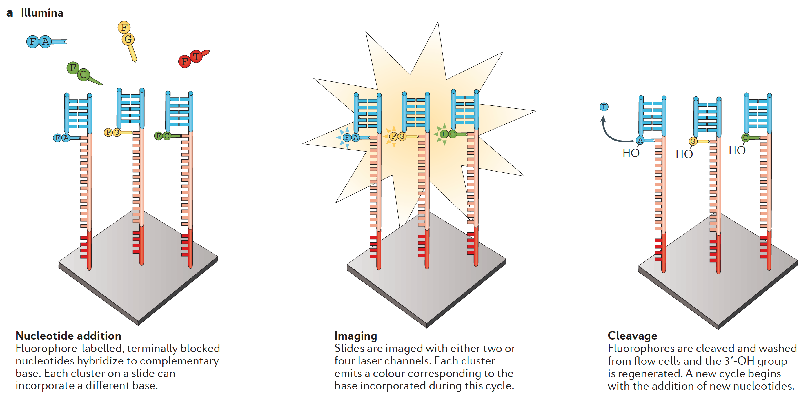
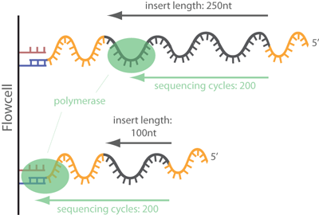
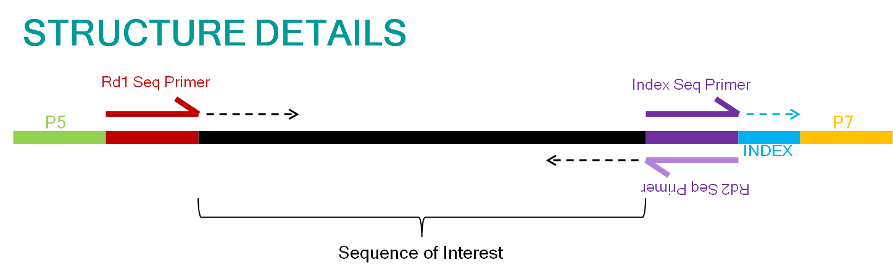
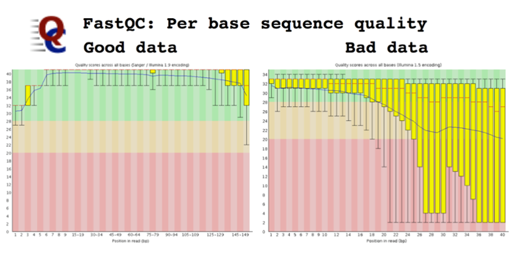
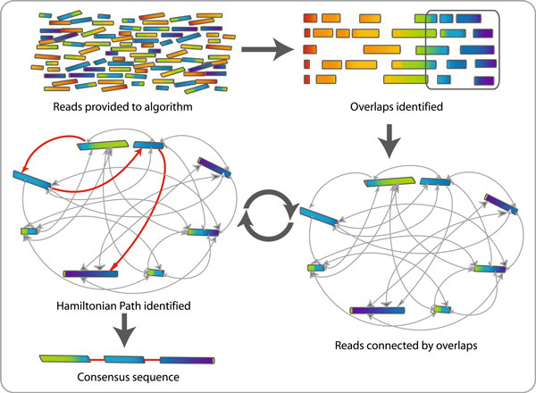
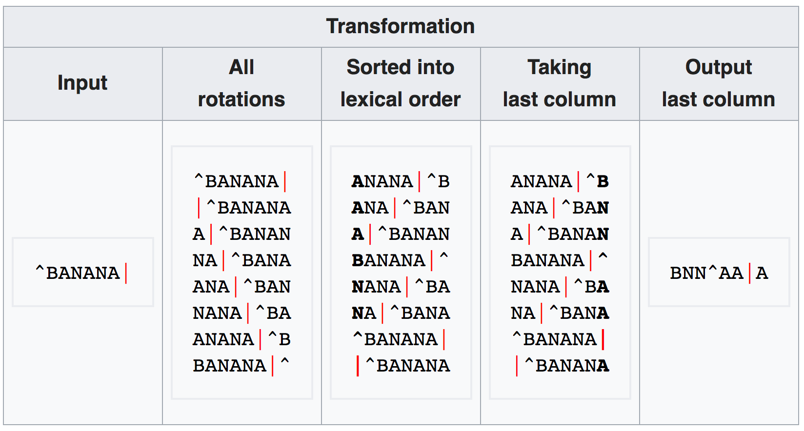
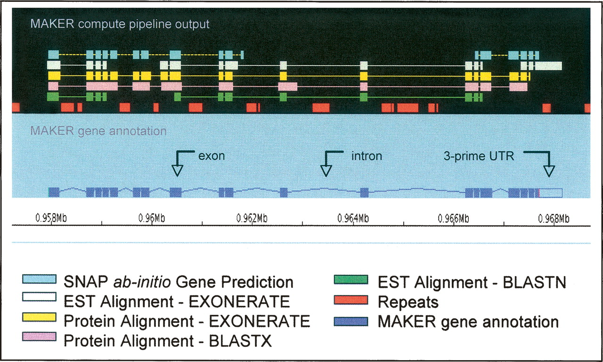

Genome HTS in biodiversity research
===================================

High-throughput sequencing
--------------------------

> What are your experiences with:
> - Any lab work, e.g. isolating DNA? PCR?
> - Any sequencing? Sanger? HTS?
> - Any HTS data analysis?
> - What have you learned in Genomic Architecture?

- At time of writing (2017) there are multiple technologies, broadly categorized as
  sequencing-by-ligation (e.g. SOLiD) and sequencing-by-synthesis (illumina, Ion Torrent,
  454). Reads are getting longer on all platforms, but especially on PacBio and MinION.
- A number of vendors have created numerous platforms for specific needs and requirements, 
  e.g. data volumes, read lengths, cost, error profile, runtime
- A fairly current review is [Goodwin et al., 2016](lecture2/goodwin2016.pdf)
- Illumina (below) is currently the largest platform



Typical workflow
----------------

1. clip any synthetic oligonucleotides (adaptors, primers)
2. trim low quality bases, filter short reads
3. _de novo_ or _mapping_ assembly
4. further annotation
5. variant calling
6. consensus sequence computation

Library preparation
-------------------


- After DNA isolation and fragmentation, _primer sequences_ may be _ligated_ to the 
  fragment as part of an amplification procedure (PCR)
- In addition, various sequencing platforms involve ligation of _adaptor sequences_ for
  various roles, e.g. to label samples and to participate in the chemistry of the 
  platform (attach to the flowcell surface, for example)

Clipping adaptors
-----------------



Depending on the sequencing platform, insert size, and additional services provided by 
the sequencing lab, the reads may already be sorted by adaptors (which are then clipped 
off) or you may have to do this yourself. 

Effect of adaptor clipping
--------------------------

**Sturm M, C Schroeder & P Bauer**, 2016. SeqPurge: highly-sensitive adapter trimming for 
paired-end NGS data. _BMC Bioinformatics._ **17**: 208.
doi:[10.1186/s12859-016-1069-7](http://doi.org/10.1186/s12859-016-1069-7)


- There are many tools available for adaptor clipping. Some are faster than others, and 
  they all affect downstream analysis time differently
- Under some circumstances, it may not be necessary to do this, depending on the 
  experimental design (for example, if there is no de-multiplexing to do and the adaptors
  are ignored in a mapping assembly)

Clipping primers
----------------



**Sidenote about amplicon sequencing**

- In _amplicon_ sequencing, the fragment will have been ligated with a primer as well as 
  an adaptor sequence. 
- This allows for more samples to be multiplexed because the number of combinations then 
  becomes _n adaptors_ * _n primers_ 
- And you probably don't need the amount of coverage on a single marker that a 
  non-multiplexed run would give you anyway
- However, platform vendors cannot de-multiplex automatically (because they know their
  own adaptors, but not _your_ primers), and with degenerate primers you'd have to do
  [fuzzy matching](https://github.com/naturalis/fastq-simple-tools/blob/master/script/splitfastq.pl#L128) 
  against their sequences

Quality assessment and trimming
-------------------------------

A convenient tool for initial quality assessment of HTS read data is 
[FastQC](https://www.bioinformatics.babraham.ac.uk/projects/fastqc/bad_sequence_fastqc.html),
whose results can indicate numerous pathologies:

- Low Phred scores overall (e.g. pacbio compared to illumina), at higher base positions 
  on the read (i.e. near the "end"), or along homopolymers, some of which can be addressed
  using read trimming
- The presence of biases (GC content) and overrepresentations of certain reads (e.g.
  adaptors) that may still need to be clipped 
- Some examples show: 
  - [good illumina data](https://www.bioinformatics.babraham.ac.uk/projects/fastqc/good_sequence_short_fastqc.html)
  - [bad illumina data](https://www.bioinformatics.babraham.ac.uk/projects/fastqc/bad_sequence_fastqc.html)
  - [adaptors still connected](https://www.bioinformatics.babraham.ac.uk/projects/fastqc/RNA-Seq_fastqc.html)
  - [pacbio](https://www.bioinformatics.babraham.ac.uk/projects/fastqc/pacbio_srr075104_fastqc.html)



Additional filtering
--------------------


- A (crude) proxy for a read possibly being chimeric is that it occurs only once, i.e. as
  a singleton, which you might therefore filter out. This is more likely the case in
  genomes than in amplicon sequencing (because the chimera might be PCR'ed)
- On platforms that have variable length reads, you might want to filter out all reads
  below a threshold length
- When paired-end sequencing, one of the two 'ends' might have been filtered out, in 
  which case you might filter out the opposite end as well

Overlap-layout-consensus assembly
---------------------------------

> What do you know about graph theory? Edges? Vertices? Degrees? Directedness?

- In _Sanger_ sequencing assembly, a 
  [graph](https://en.wikipedia.org/wiki/Graph_(discrete_mathematics)) is constructed 
  where every 
  [vertex](https://en.wikipedia.org/wiki/Vertex_(graph_theory)) is a 
  read, and 
  [edges](https://en.wikipedia.org/wiki/Edge_(graph_theory)) connect the reads that 
  overlap
- Subsequently, the [Hamiltonian path](https://en.wikipedia.org/wiki/Hamiltonian_path), 
  which visits every _vertex_ (read) exactly once is searched for, and the consensus 
  sequence along the path is computed
- However, this _overlap-layout-consensus_ approach is hard to solve (computer scientists
  call this [NP-complete](https://en.wikipedia.org/wiki/NP-completeness))



An alternative way to traverse the graph
----------------------------------------

- Computing the _Hamiltonian path_ is too computationally intensive ("NP-complete") for 
  HTS data 
- Another approach to traverse graphs is along the _Eulerian path_, where every _edge_
  (instead of vertex) is visited exactly once
- The [Eulerian path](https://en.wikipedia.org/wiki/Eulerian_path) can be traversed in 
  _linear time_ (computer scientists notate this as "_O_(|_E_|)") as opposed to 
  non-deterministic _polynomial time_ (i.e. with _n_ input _T_(_n_) = O(_n_<sup>k</sup>) 
  for some constant _k_ in [Big O notation](https://en.wikipedia.org/wiki/Big_O_notation))
- However, for this _Eulerian path_ to exist, either zero or two _vertices_ may exist with 
  odd _degree_, so the Seven Bridges of Königsberg, which Euler studied, don't form a path
  (and the overlap graph might also not)


Making the graph amenable to Eulerian traversal
-----------------------------------------------

- In a complete [De Bruijn graph](https://en.wikipedia.org/wiki/De_Bruijn_graph), all 
  vertices have even degree
- A _De Bruijn_ graph connects symbolic sequence data such that every vertex is a sequence
  string of length _k_ (a "_k-mer_") that is connected to other such vertices if the 
  the sequences are identical along the substring of length _k_-1, i.e. the sequences
  are shifted one step relative to one another, which creates _directedness_ in the
  graph
- The simplest cases, with binary sequence data, are shown for _k_ = 1..3 (imagine what
  this would look like for four symbols):


HTS sequence data and _k-mers_
------------------------------

- The _De Bruijn_ graph presupposes that for every _k-mer_ there are neighbours that 
  overlap with it along the substring _k-1_
- HTS read data does not naturally come out meeting that assumption: there are biases
  causing reads to overlap more irregularly
- However, the reads can be re-processed to a spectrum of substrings of some smaller 
  size _k_ that are shifted relative to one another (note that this collapses the 
  duplicates that are then created):


This re-processing can be achieved naively (there are faster tools than this) in python
thusly:

```python
def find_kmers(string, k):
    
      kmers = []
      n = len(string)

      for i in range(0, n-k+1):
           kmers.append(string[i:i+k])

      return kmers
```

Optimal _k-mer_ size and assembly
---------------------------------

**Chikhi R & P Medvedev**, 2014. Informed and automated k-mer size selection for genome 
assembly. _Bioinformatics_ **30**(1): 31–37 
doi:[10.1093/bioinformatics/btt310](https://doi.org/10.1093/bioinformatics/btt310)

- Smaller _k_ makes for a smaller graph, but at the cost of more duplicate _k-mers_ 
  collapsed, causing information loss and an inability to cross over repeat regions
- Higher _k_ is more memory intensive, and may increase the risk of _k-mers_ having no
  neighbours, causing short contigs
- Some tools exist that attempt to optimize this value, for example by attempting to 
  predict the value that results in the most distinct _k-mers_, which corresponds with
  certain measures of assembly quality:


- [Velvet](https://www.ebi.ac.uk/~zerbino/velvet/) is often used as benchmark / gold 
  standard for _de novo_ assembly, but it is limited in data set size. 
- [SOAPdenovo2](http://soap.genomics.org.cn/soapdenovo.html) is an efficient, commonly 
  used assembler for larger genomes.
- [NG50](https://en.wikipedia.org/wiki/N50,_L50,_and_related_statistics#NG50) gives the 
  length of the contig (when sorted by descending length) that is the mid point along the
  way to covering the length of the reference genome (compare with N50, which is the mid
  point along the way to the total length of the assembly).

Scaffolding
-----------

- _De novo_ assembly results in _contigs_, stretches of contiguous read data, which then
  may be scaffolded
- [Paired-end and mate-pair](https://era7bioinformatics.com/en/page.cfm?id=1626) read 
  data (with larger insert sizes) can help span a gap and help orient and approximate
  the distance between reads
- Other ways to scaffold include using [optical mapping](https://en.wikipedia.org/wiki/Optical_mapping)
  or sequencing longer reads (e.g. pacbio) as well


Mapping assembly
----------------


- In a mapping assembly, a reference genome is scanned for the best place to map a read
- Hence, the reference genome needs to be indexed in order for this to be efficient

The Burrows-Wheeler transform
-----------------------------



1. All rotations for a given input string are generated
2. These are sorted alphabetically
3. The final column is the transformed string, i.e. [BWT(T)](https://en.wikipedia.org/wiki/Burrows%E2%80%93Wheeler_transform)

This string has the following properties:

- Almost incomprehensibly, the input string can be recovered from BWT(T) by a reverse
  function
- But, in the transformed string, the same character now occurs multiple times in 
  sequence, which can be compressed (e.g. by counting the number of repetitions)
- By computing an additional index (FM), substring locations can quickly be found,
  and thus reads be mapped
- [Here](lecture2/bwt_fm.pdf) is a good tutorial with code samples for all the steps
  in Python

BWT mapping assembly tools
--------------------------

Commonly used BWT mapping tools are:

- [bwa](https://dx.doi.org/10.1093%2Fbioinformatics%2Fbtp324)
- [bowtie](https://dx.doi.org/10.1186%2Fgb-2009-10-3-r25)
- [SOAP2](https://doi.org/10.1093/bioinformatics/btp336)

Genome annotation
-----------------



Genomes are annotated using multiple lines of evidence, such as:

- gene prediction, e.g. with [SNAP](https://doi.org/10.1186/1471-2105-5-59)
- [EST](https://en.wikipedia.org/wiki/Expressed_sequence_tag) mappings, e.g. with
  [blastn](https://blast.ncbi.nlm.nih.gov/Blast.cgi?PAGE_TYPE=BlastDocs&DOC_TYPE=Download) 
  or [exonerate](https://doi.org/10.1186/1471-2105-6-31)
- protein mappings, e.g. with blastx (protein blast) or exonerate
- repeat masking data

Variant calling
---------------


Variants are called with a variety of methods:

- Allele counting 
- Probabilistic/Bayesian: build a model of the expected number of variants and use that
  to quantify support for any given call
- Heuristic techniques: based on filtering / thresholding for read depth, base quality,
  frequency