Case studies of genome sequencing in biodiversity research
==========================================================

Genetic diversity: tomato relatives
-----------------------------------
**Aflitos et al.**, 2014. Exploring genetic variation in the tomato (Solanum section 
Lycopersicon) clade by whole-genome sequencing _The Plant Journal_ **80**(1): 136–148
doi:[10.1111/tpj.12616](http://doi.org/10.1111/tpj.12616)

- 84 [accessions](http://www.tomatogenome.net/accessions.html), 2.9 × 1012 
  base pairs sequenced
- coverage of 36.7 ± 2.3-fold per accession (32.5 ± 2.1-fold for Phred (Q) ≥ 30)
- paired end sequencing (Illumina HiSeq 2000, read length 100 bp) with insert size 500 bp 
- 4 accessions additional mate pair sequencing (Illumina and 454) with larger insert sizes

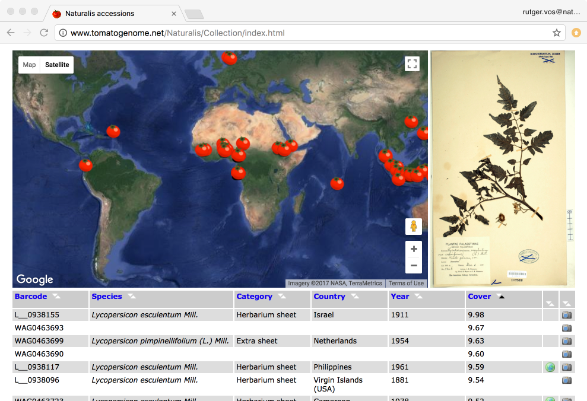

This project includes the sequencing of ancient 
[herbarium specimens](http://www.tomatogenome.net/Naturalis/Collection/index.html) from
the Naturalis collection.

De novo assembly
----------------

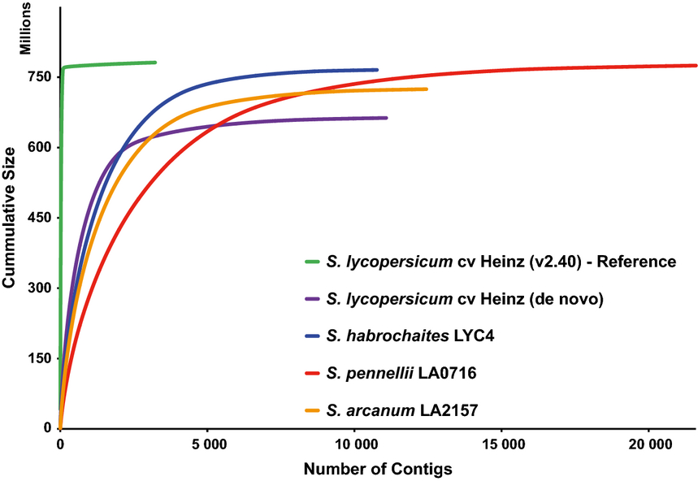

- 3 genomes of species in **Solanum section Lycopersicon** assembled _de novo_ with
  [AllPaths-LG](http://software.broadinstitute.org/allpaths-lg/blog/)
- 1 genome both with [CLC](http://www.clcbio.com/) and AllPaths-LG (to compare)
- contigs from AllPaths-LG were then scaffolded using the 454 data and the
  [scarpa](http://compbio.cs.toronto.edu/hapsembler/scarpa.html) scaffolder

Mapping to multiple reference genomes
-------------------------------------

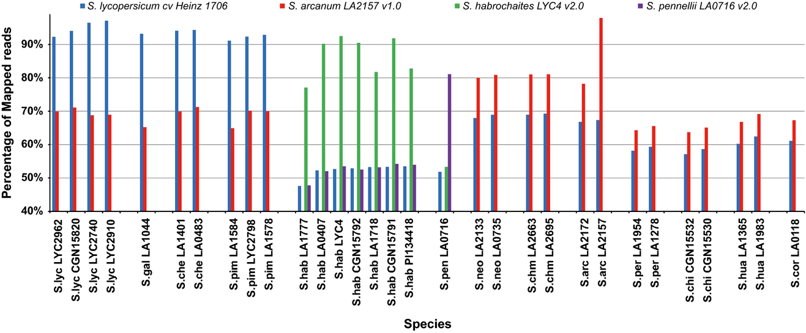

- reads were mapped against assemblies of _S. lycopersicum_, _S. arcanum_, 
  _S. habrochaites_ and _S. pennellii_ and against the reference 
  [SL2.40](https://www.ebi.ac.uk/ena/data/view/GCA_000188115.1) of _S. lycopersicum_ cv. 
  Heinz
- the shifts in the percentages of reads mapped depending on the reference indicates an
  abundance of genetic diversity outside of _S. lycopersicum_ cultivars
- mapping assemblies were done using the Burrows-Wheeler Aligner
  [BWA](http://bio-bwa.sourceforge.net/)

Variant calling
---------------

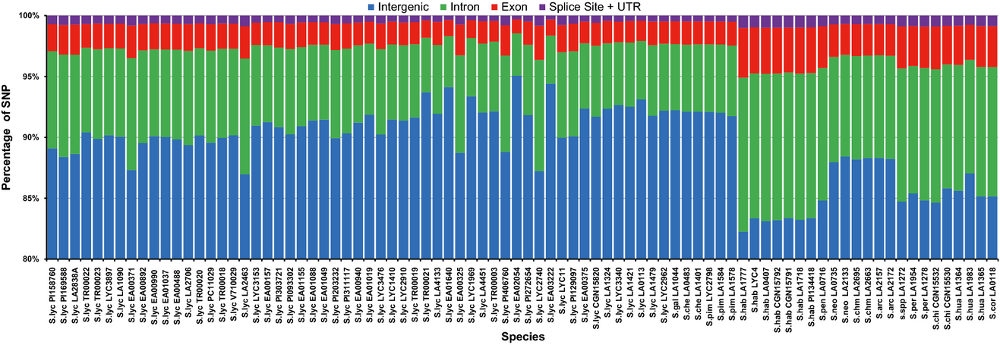

- variants (SNPs) were called using [samtools](http://www.htslib.org/doc/samtools.html)
- location (intergenic, intro, exon, splicing sites and UTRs) was determined with 
  reference to the [ITAG3.0](ftp://ftp.solgenomics.net/tomato_genome/annotation/ITAG3.2_release/)
- 89.47 ± 3.03% of the polymorphisms fall into intergenic regions
- 7.55 ± 2.19% map to introns 
- 2.33 ± 0.68% map to exons, of which:
  - 55.17 ± 11.54% are synonymous 
  - 44.83 ± 21.03% are non-synonymous

Phylogenetic relationships
--------------------------

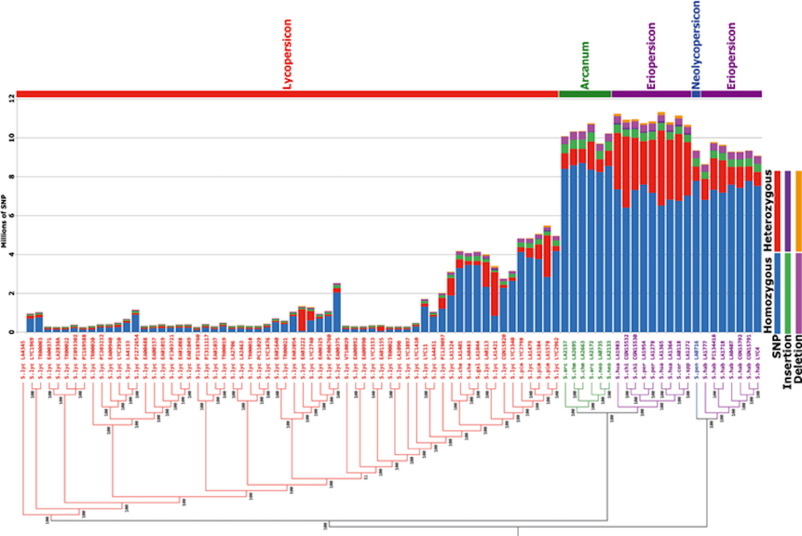

- SNPs with Q > 20 were concatenated and analyzed using
  [FastTree](https://doi.org/10.1371/journal.pone.0009490)
- [bootstrapped](https://en.wikipedia.org/wiki/Bootstrapping_(statistics)) 
  [NJ](https://en.wikipedia.org/wiki/Neighbor_joining) under the 
  [Jukes & Cantor (1969)](https://en.wikipedia.org/wiki/Models_of_DNA_evolution#JC69_model_.28Jukes_and_Cantor.2C_1969.29.5B2.5D)
  substitution model
- SNP numbers for _Arcanum_, _Eriopersicon_ and _Neolycopersicon_ groups increase sharply,
  which correlates with their more distant position in the phylogenetic tree in the tomato 
  clade

Functional diversity: snake venom
---------------------------------

**Vonk, FJ et al.**, 2013. The king cobra genome reveals dynamic gene evolution and 
adaptation in the snake venom system. _PNAS_ **110**(51): 20651–20656
doi:[10.1073/pnas.1314702110](http://doi.org/10.1073/pnas.1314702110)

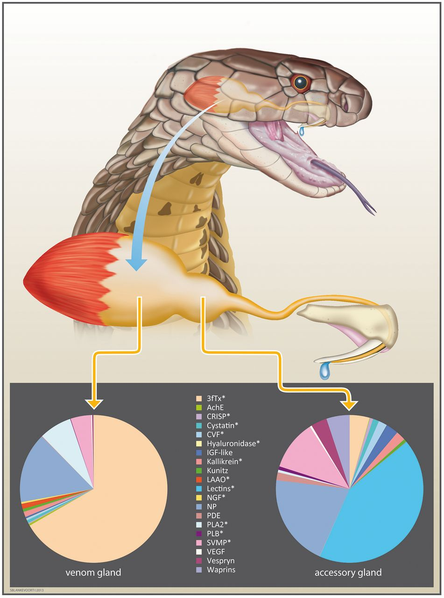

The king cobra venom system with venom and accessory gland expression profiles. Pie 
charts display the normalized percentage abundance of toxin transcripts recovered from 
each tissue transcriptome. Three-finger toxins are the most abundant toxin family in the 
venom gland (66.73% of all toxin transcripts and 4.37% in the accessory gland)

Sequencing and assembling the King Cobra genome
-----------------------------------------------

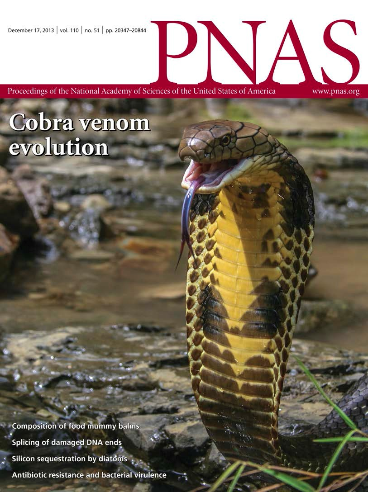

- paired end (insert size: 200-500 bp) and mate pair (insert size: 2-5 Kbp) sequencing 
  (Illumina GAIIx, read length 36–151 bp) 
- data processing including adaptor clipping
- _de novo_ assembly using [CLC](http://www.clcbio.com/), resulting in N50=3,982 bp
- scaffolding using [SSPACE](https://doi.org/10.1093/bioinformatics/btq683), resulting
  in an N50=225,511 bp

Venom gene analysis
-------------------

- the [genome](https://www.ncbi.nlm.nih.gov/bioproject/PRJNA201683) was annotated using 
  [MAKER](http://www.yandell-lab.org/software/maker.html), using protein data from 
  [Uniprot/Swiss-Prot](http://www.uniprot.org/uniprot/?query=reviewed:yes)
  and the annotated genome of _Anolis carolinensis_ (brief side note: the work on 
  Caribbean Anoles by the [Losos lab](https://lososlab.oeb.harvard.edu/research))
- on the basis of the MAKER genes and by BLAST searching the genome using known venom
  query sequences, gene copies were collected and aligned with 
  [MUSCLE](https://www.drive5.com/muscle/)
- trees were constructed with [MrBayes v3.2](http://mrbayes.sourceforge.net/) (for 
  support values) and [PHYML](http://www.atgc-montpellier.fr/phyml/) (for bifurcating
  point estimates)
- [MP](https://en.wikipedia.org/wiki/Maximum_parsimony_(phylogenetics)) reconstruction of
  transitions between venomous and non-venomous orthologs and paralogs allowed branches
  on the PHYML tree to be assigned to venomous or non-venomous in the estimation of 
  branch-specific dN/dS ratios (ωvenomous and ωnonvenomous) using
  [codeml](http://abacus.gene.ucl.ac.uk/software/paml.html)

Venom gene duplication
----------------------

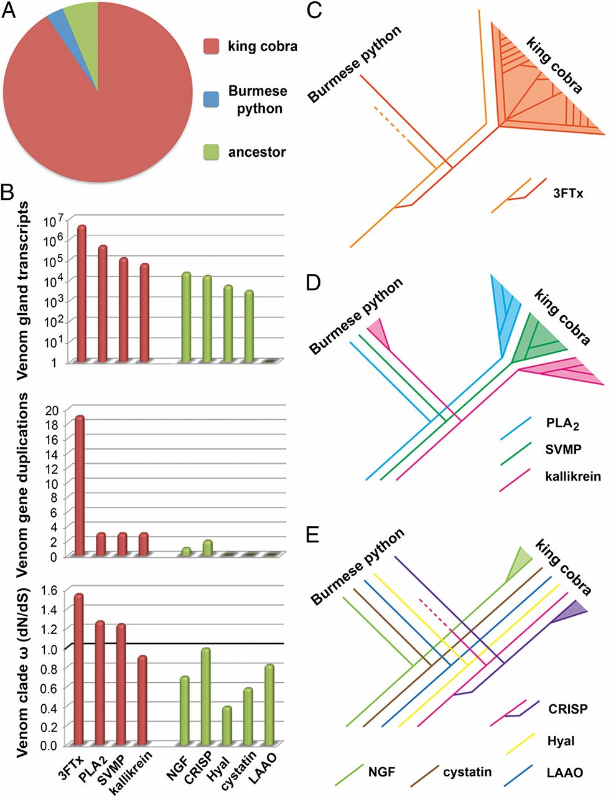

- **A** The vast majority of toxin family gene duplication events occurred in the king 
  cobra lineage compared with the Burmese python and their common ancestor
- **B** Comparisons of venom gland expression (log-transformed), venom-related gene 
  duplication events, and rate of evolution of main toxin families (red) and ancillary 
  toxin families (green). ω represents the dN/dS ratio identified for venomous gene 
  clades. The boundary for directional selection is indicated by a bold line.
- **C** Massive expansion of the 
  [three-finger toxin](https://en.wikipedia.org/wiki/Three-finger_toxin) gene family
- **D** Moderate expansion of other pathogenic toxin families
- **E** Ancillary toxin families show reduced evidence of gene duplication

_Gene duplication coupled with positive selection is the mechanism underlying venom 
protein neofunctionalization. Our results are, therefore, consistent with a prominent 
role for prey-driven natural selection in generating the genetic diversity of the most 
pathogenic toxin families._

An invasive plant among native insect herbivores
------------------------------------------------

**Schilthuizen M et al.** 2016. Incorporation of an invasive plant into a native insect 
herbivore food web. _PeerJ_ **4**:e1954 
doi:[10.7717/peerj.1954](https://doi.org/10.7717/peerj.1954)

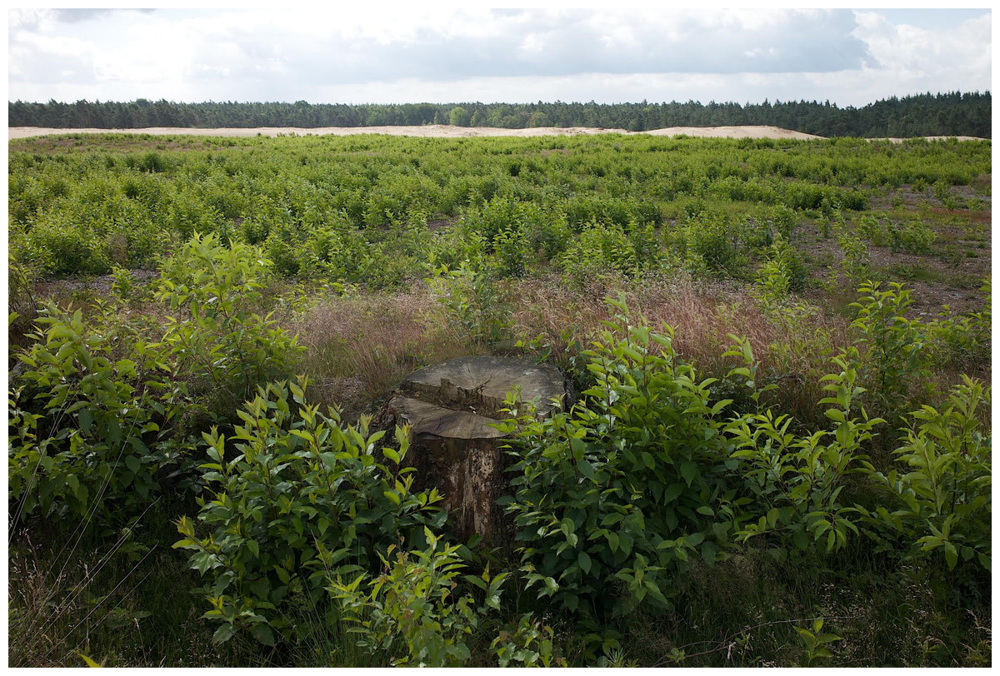

In open habitats, such as this moorland in the Netherlands, the exotic 
[_Prunus serotina_](https://en.wikipedia.org/wiki/Prunus_serotina) (black cherry) may 
spread invasively, as this carpet of seedlings shows. Understanding how phytophagous 
insects colonize such invasives is therefore of scientific as well as practical interest.

Herbivores switch to the new invasive
-------------------------------------

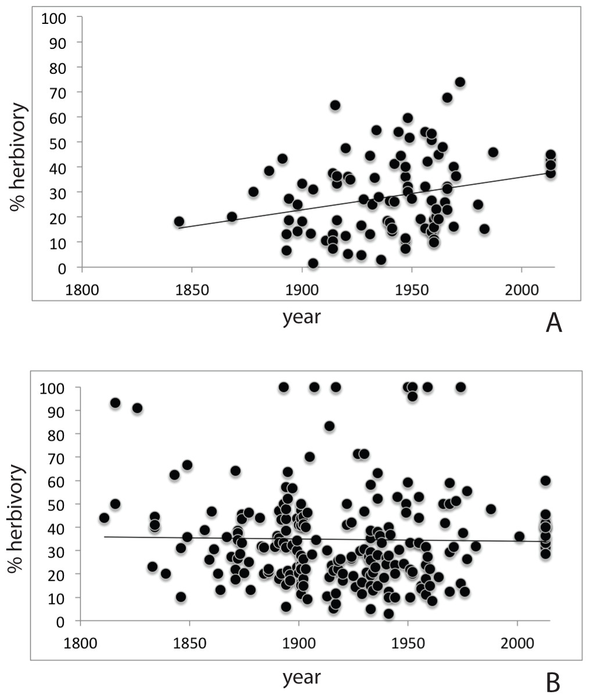

- Assessment of herbarium specimens through time shows increasing herbivory on the 
  new invasive (A) compared to the native _P. padus_ (B)
- _G. quinquepunctata_ is a model specialist, originally found only on 
  [_Sorbus aucuparia_](https://en.wikipedia.org/wiki/Sorbus_aucuparia), but
  recently also observed on _P. serotina_
- host choice experiments on collected beetles showed that individuals from Sorbus 
  preferred Sorbus, while those from Prunus showed no significant preference

Sequencing _G. quinquepunctata_
-------------------------------

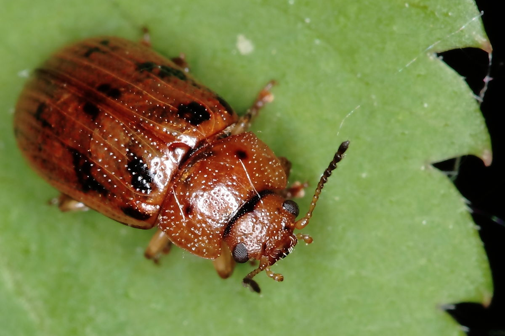

- [2 individuals (one from each host)](https://www.ncbi.nlm.nih.gov/bioproject/PRJNA277307) 
  were paired-end sequenced (Illumina HiSeq 2000)
- reads from the individuals were pooled to create a pseudo-reference, assembled with
  [ABySS](http://doi.org/10.1101/gr.089532.108), (_k-mer_ length=23, obtained with
  [KmerGenie](https://doi.org/10.1093/bioinformatics/btt310))
- reads from the two individuals were then mapped back against the pseudo-reference
  using [BWA](http://bio-bwa.sourceforge.net/)

SNP calling and selection
-------------------------

- SNPs were called using [samtools](http://www.htslib.org/doc/samtools.html) according to 
  the following criteria:
  - the positions were both homozygous for different alleles between the samples
  - had a coverage of at least 10×in each sample
  - had flanking regions that were at least 100 bp long with a minimum combined coverage 
    of at least 15x with a maximum of 2 heterozygous positions
- contigs containing candidate SNPs were validated by BLAST and removing all 
  non-arthropod contigs

Genotyping host populations
---------------------------

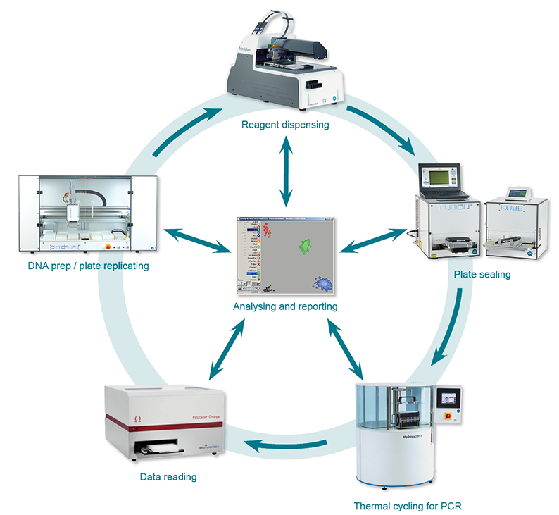

- for a random sample (n=128) of the filtered SNPs, primers were designed using
  [kraken](https://www.lgcgroup.com/products/genotyping-software/kraken/)
- an additional 206 beetles from _S. aucuparia_, and 173 from _P. serotina_ were
  collected and genotyped with the 
  [LGC SNPline](https://www.lgcgroup.com/products/genotyping-instruments/snpline)

Analysis of Molecular Variance 
------------------------------

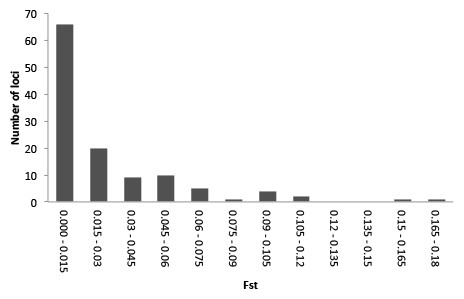

- SNPs were analyzed using Analysis of Molecular Variance 
  ([AMOVA](https://www.ncbi.nlm.nih.gov/pmc/articles/PMC1205020/)), which is implemented
  in [Arlequin](http://cmpg.unibe.ch/software/arlequin3/) and the R package
  [ade4](https://cran.r-project.org/web/packages/ade4/index.html)
- The AMOVA produces estimates of variance components and F-statistic analogs, 
  reflecting the correlation of haplotypic diversity _at different levels of hierarchical 
  subdivision_ (in this case, of host plants nested within sampling localities).
- The hierarchical AMOVA with host plants nested within localities, showed significant 
  (P < 0.01) differentiation between host plants in each locality

What was FST again?
------------------------------

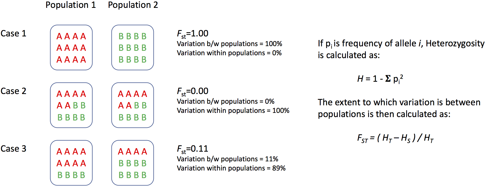

STRUCTURE analysis
------------------

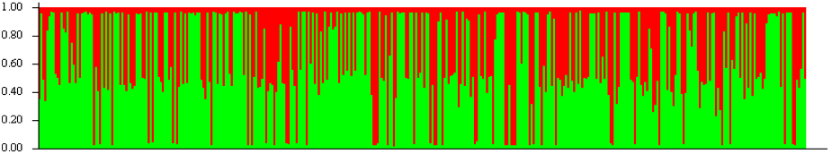

- [STRUCTURE](http://www.genetics.org/content/155/2/945) analysis attempts to find the
  optimal number of populations (_K_) to explain the population genetic patterns
- the highest posterior probability was for _K_=2, but these two groups did not 
  correspond with host plant nor with locality  
- Genotype assignments under _K_=2. Groups of individuals have been ordered by locality 
  and then host. In other words, the first half of the individuals are from one host, the 
  second half from the other. We conclude that host does not affect population stucture.