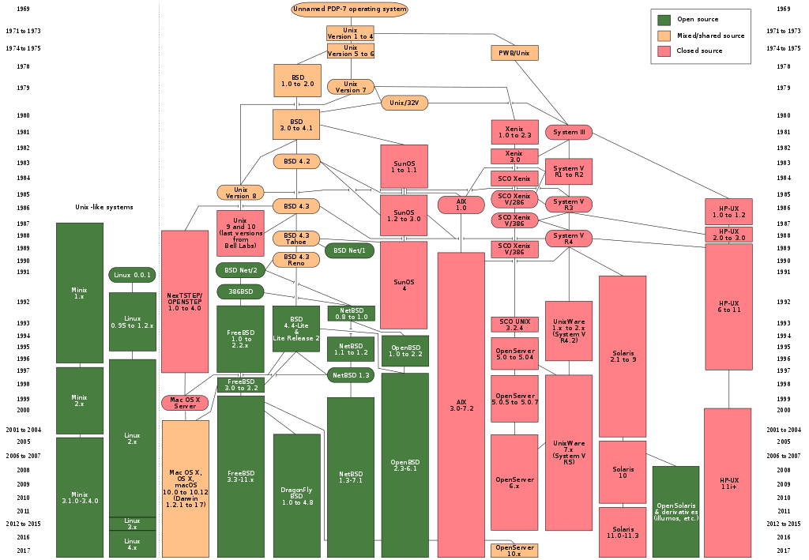
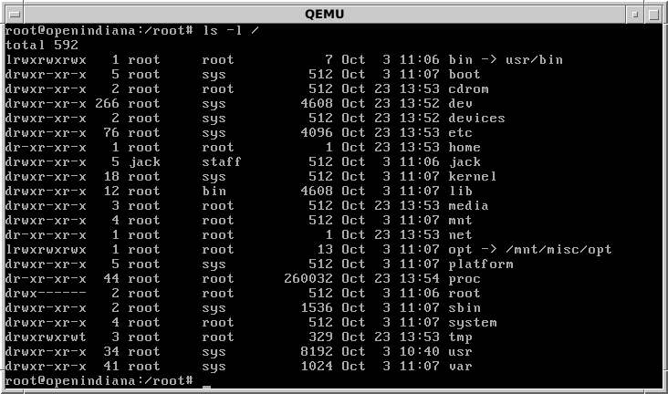

Data science tools
==================

The BlackBoard contains instructions and login [keys](https://github.com/naturalis/mebioda/tree/master/doc/week1/w1p1/keys) for getting into the cloud environment. Once logged in, you will be able to run some of the commands that will be introduced here.

UNIX/Linux operating systems: why do we care?
---------------------------------------------



- Have better facilities for automation (shell scripting)
  - More scripting languages pre-installed (
    [python](https://www.python.org/), 
    [perl](https://www.perl.org/), 
    [ruby](https://www.ruby-lang.org/en/))
  - The [shell](http://tldp.org/LDP/abs/html/) is more powerful
- A lot of scientific software is (only) written for them
- Linux is free, so analytical environments can be copied and instantiated in
  virtualization environments with few restrictions
  
UNIX file system conventions
----------------------------



UNIX-like file systems:
- start at the root: `/`
- are hierarchical trees navigated with paths:
  - **absolute** paths start from the root, e.g. `/home/mebioda`
  - **relative** paths go from one location to another, e.g. `../../tmp`
- consider everything a “file”
- consider files simple byte arrays (and text)
- follow some organizational conventions

| Directory | Description          |
|-----------|----------------------|
|`/bin`     | Single user binaries |
|`/dev`     | Hardware devices     |
|`/etc`     | Configuration files  |
|`/home`    | User home dirs       |
|`/lib`     | Libraries            |
|`/sbin`    | System binaries      |
|`/tmp`     | Temporary files      |
|`/usr`     | Multi user utilities |
|`/var`     | Variable files       |

File access
-----------
- Access to files is granted at user and group level
- Files can be read (r), written (w) and/or executed (x)
- To read from or write to a file, a file handle is opened
- File extensions don’t matter

Commonly-used file operations
-----------------------------

| Command | Function                | Command | Function                |
|---------|-------------------------|---------|-------------------------|
| `ls`    | List files              | `mv`    | Rename/move files       |
| `cd`    | Change directory        | `mkdir` | Make directory          |
| `pwd`   | Print working directory | `rmdir` | Remove directory        |
| `rm`    | Remove files            | `chmod` | Change file mode        |
| `cp`    | Copy files              | `chown` | Change file owner       |

```bash
# file listing
$ ls

# long (-l) listing of all (-a) files, sizes in (-h) human readable format:
$ ls -lah

# manual pages of ls
$ man ls
```

File modes
----------

- Files can be **r**eadable, **w**ritable, and/or e**x**ecutable
- Files belong to **u**sers, who belong to a **g**roup but not to the **o**thers

`chmod` permission bits:

| bits | code | value | 2<sup>n</sup> |
|------|------|-------|---------------|
| 001  | x    | 1     | 2<sup>0</sup> |
| 010  | w    | 2     | 2<sup>1</sup> |
| 100  | r    | 4     | 2<sup>2</sup> |

Hence: 

- rwx = 111 = 1+2+4 = 7
- rw = 110 = 2+4 = 6 
- r = 100 = 4

```
# set text file rw for user, r for others:
$ chmod 644 file.txt

# set script rwx for user, rx for others:
$ chmod 755 script.sh
```

Commonly-used text operations
-----------------------------

| Command | Function                |
|---------|-------------------------|
| `more`  | Page through text       |
| `head`  | View first lines        |
| `tail`  | View last lines         |
| `grep`  | Search for pattern      |
| `sed`   | Search and replace      |
| `sort`  | Sort lines              |
| `uniq`  | Filter duplicate lines  |
| `cut`   | Cut columns from table  |
| `paste` | Concatenate columns     |
| `join`  | Join matching columns   |
| `cat`   | Print file contents     |
| `wc`    | Word count              |
| `awk`   | Tabular data processing |

UNIX pipes
----------
- UNIX programs by default write to STDOUT and read from STDIN
- The defaults can be re-directed with “> outfile” and “< infile”, respectively
- The output from one program can be piped into the input from the next:

      cat file | sort | uniq > sorted_no_dups

UNIX programming
----------------
- UNIX provides a standardized environment for developing applications (historically in C)
- Many pieces of re-useable code (headers and libraries)
- Standard powerful text editors (vi, emacs)
- Standard toolchain for building binaries (e.g. autotools, make, gcc, ld, etc.)
- Standard support for scripting languages (perl, python, ruby, etc.)

Compiling
---------
Source code can be compiled into binary following standard (optional) steps:

    tar -xzf prog.tar.gz
    cd prog
    (autoconf)
    (./configure)
    make
    sudo make install

