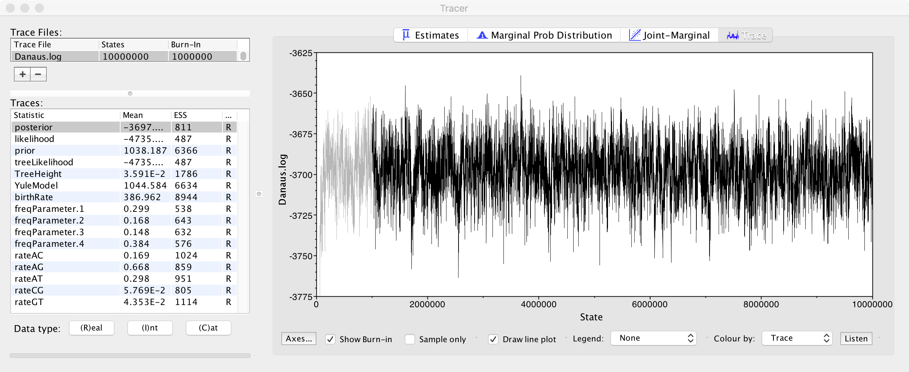

Barcoding workflow and MSA data
===============================

Barcoding
---------


Barcode Of Life Data Systems ([BOLDSYSTEMS](http://www.boldsystems.org/))
-------------------------------------------------------------------------

- Stores records about [specimens](http://www.boldsystems.org/index.php/Public_RecordView?processid=AANIC001-10)
- Includes marker sequence [data](fasta.fas), images, lat/lon coordinates, etc.
- Can query [taxonomically](http://www.boldsystems.org/index.php/Public_SearchTerms?query=Danaus[tax])
  and download [all sequences](Danaus.fas)
- Identification services:
  - COI for animals
  - ITS for fungi
  - rbcL and matK for plants
  
Fetching taxon data through the [URL API](http://www.boldsystems.org/index.php/api_home)
----------------------------------------------------------------------------------------

```bash
# Fetch taxon data for Danaus as JSON
$ curl -o Danaus.json http://www.boldsystems.org/index.php/API_Tax/TaxonSearch?taxName=Danaus
```

Returned [taxon data](Danaus.json) is encoded as JSON (e.g. do `python -m json.tool Danaus.json`):

```json
{
  "top_matched_names": [
    {
      "taxid": 6926,
      "taxon": "Danaus",
      "tax_rank": "genus",
      "tax_division": "Animals",
      "parentid": 3681,
      "parentname": "Danainae",
      "representitive_image": {
        "image": "JAGWI/WIJAG1191+1445394342.JPG",
        "apectratio": 1.333
      },
      "specimenrecords": "517"
    }
  ],
  "total_matched_names": 1
}
```

Let's say we wanted to figure out what the image location was, we can then read this
JSON in a little [script](json.py):

```python
import urllib
import simplejson as json # sudo pip install simplejson
url = "http://www.boldsystems.org/index.php/API_Tax/TaxonSearch?taxName=Danaus"
response = urllib.urlopen(url)
data = json.loads(response.read())

if data['top_matched_names']:
	for name in data['top_matched_names']:
		if name['representitive_image']:
			print name['representitive_image']['image']

```

Fetching sequences 
------------------

Data from URLs can be downloaded on the command line using [curl](https://curl.haxx.se/):

```bash
# Fetch all sequences for Danaus as FASTA
$ curl -o Danaus.fas http://www.boldsystems.org/index.php/API_Public/sequence?taxon=Danaus
```

The BOLD sequence data service API returns a [FASTA file](Danaus.fas), which holds 
multiple sequences, unaligned. The 
[definition line](https://en.wikipedia.org/wiki/FASTA_format#Description_line) is 
formatted as:

```
>ID|Scientific binomial|marker|...
``` 

With this we can use standard UNIX command line tools 
[grep, cut, sort and uniq](http://www.tldp.org/LDP/abs/html/textproc.html) to do some 
basic checks, e.g.:

```bash
$ grep '>' Danaus.fas | cut -f 3 -d '|' | sort | uniq
ArgKin
CAD
COI-3P
COI-5P
COI-5P
EF1-alpha
GAPDH
IDH
MDH
RpS2
RpS5
Wnt1
```

Filtering out markers
---------------------
It turns out there are multiple markers for this genus. Unfortunately, because FASTA 
records are multiple lines (and the exact number is unpredictable), we can't easily use
command line tools (like `grep`). Instead, we might write a little script, e.g. in 
[biopython](http://biopython.org):

```python
from Bio import SeqIO # sudo pip install biopython
with open("Danaus.fas", "rU") as handle:
    
    # Example: retain COI
    for record in SeqIO.parse(handle, "fasta"):
        fields = record.description.split('|')
        if fields[2] == 'COI-5P':
        	print '>' + record.description
        	print record.seq
```

Run as:

```shell
$ python fasta.py > Danaus.COI-5P.fas
```

Multiple sequence alignment
---------------------------

FASTA files can be aligned, for example, with [muscle](https://www.drive5.com/muscle/):

```shell
$ muscle -in Danaus.COI-5P.fas -out Danaus.muscle.fas
```

Resulting in an [alignment](Danaus.muscle.fas), which is also a FASTA file. 

Alternatively, you might align with [mafft](https://mafft.cbrc.jp/alignment/software/), 
(or one of the many other multiple sequence alignment tools) which has additional 
functionality for more difficult markers (such as ITS):

```shell
$ mafft Danaus.COI-5P.fas > Danaus.mafft.fas
```

Resulting in this [file](Danaus.mafft.fas). You can view both, for example, with this 
[web viewer](http://msa.biojs.net/app/). Are they different?

```shell
$ ls -la Danaus.m*
-rw-r--r--  1 rutger.vos  staff  329801  4 nov 21:50 Danaus.mafft.fas
-rw-r--r--  1 rutger.vos  staff  329801  4 nov 21:50 Danaus.muscle.fas
```

Same number of bytes (so, same number of inserted gaps) but with different contents. Could
be capitalization, could be line folding, could be sequence order, or 
_actual differences in the alignment algorithms_. 
[Checksums](https://en.wikipedia.org/wiki/Checksum) are different:

```shell
$ md5 Danaus.mafft.fas
MD5 (Danaus.mafft.fas) = 47e8d36d43a68f11c131badf75adcc3a

$ md5 Danaus.mafft.nex
MD5 (Danaus.mafft.nex) = e604e23ab1c39ecf54f755a0c882ded8
```

**How might we verify this further?**

Comparing different alignment results
-------------------------------------
Because the FASTA records in the files produced by `mafft` and `muscle` are in a different
order and the sequence data is capitalized differently, we can't easily compare the two
files. Here we sort the records, and capitalize the sequences, then write out to a
specified file format (e.g. `phylip`).

```python
import sys
from Bio import SeqIO
from Bio import AlignIO
from Bio.Align import MultipleSeqAlignment

with open(sys.argv[1], "rU") as handle:
    
    records = {}
    for seq in SeqIO.parse(handle, "fasta"):
        fields  = seq.description.split('|')
        seq.seq = seq.seq.upper()
        records[fields[0]] = seq
    
    aln = MultipleSeqAlignment([ records[key] for key in sorted(records.keys()) ])
    AlignIO.write(aln, sys.argv[2], sys.argv[3])
```

Usage:

```bash
$ python convert.py <infile> <outfile> <format>
```

Now we can compare the two alignments, e.g. with a 
[diff](https://github.com/naturalis/mebioda/commit/93090e4ac2f80bb0e1bd9a63d40b73987631b3fd?diff=split).
It seems that there are only minor differences. 

Detecting non-overlapping sequences
-----------------------------------

One quick way to compute a pairwise distance matrix is with PHYLIP's program `dnadist`, so
let's install it:

```bash
# let's install phylip
$ curl -O http://evolution.gs.washington.edu/phylip/download/phylip-3.697.tar.gz
$ gunzip phylip-3.697.tar.gz
$ tar xvf phylip-3.697.tar
$ cd phylip-3.697/src
$ make -f Makefile.unx install
$ cd -
$ sudo mv phylip-3.697 /usr/local
```

(And add `/usr/local/phylip-3.696/exe` to the $PATH)

When we compute a distance matrix we receive warnings that for some pairs of sequences 
there is no sequence overlap at all:

```
WARNING: NO OVERLAP BETWEEN SEQUENCES 145 AND 200; -1.0 WAS WRITTEN
WARNING: NO OVERLAP BETWEEN SEQUENCES 145 AND 202; -1.0 WAS WRITTEN
WARNING: NO OVERLAP BETWEEN SEQUENCES 153 AND 200; -1.0 WAS WRITTEN
WARNING: NO OVERLAP BETWEEN SEQUENCES 153 AND 202; -1.0 WAS WRITTEN
WARNING: NO OVERLAP BETWEEN SEQUENCES 154 AND 200; -1.0 WAS WRITTEN
WARNING: NO OVERLAP BETWEEN SEQUENCES 154 AND 202; -1.0 WAS WRITTEN
WARNING: NO OVERLAP BETWEEN SEQUENCES 162 AND 200; -1.0 WAS WRITTEN
WARNING: NO OVERLAP BETWEEN SEQUENCES 162 AND 202; -1.0 WAS WRITTEN
WARNING: NO OVERLAP BETWEEN SEQUENCES 198 AND 200; -1.0 WAS WRITTEN
WARNING: NO OVERLAP BETWEEN SEQUENCES 198 AND 202; -1.0 WAS WRITTEN
```

In a text editor we can see that 200 and 202 are `SETIU001-1` and `SETIU032-1`.
Let's [remove](https://github.com/naturalis/mebioda/commit/681e9750b32612b59b2953a6b3a042f6c2ee47f0?diff=unified)
these.

Bayesian evolutionary analysis by sampling trees (BEAST)
--------------------------------------------------------

[BEAST2](http://www.beast2.org/) is a modular system that can run many different types of 
analyses. The typical workflow usually goes:

1. Import data (e.g. a  FASTA alignment) into `beauti`, set up the analysis parameters, 
   possibly using a template
2. Start `beast filename.xml`, numerous output files (a.o. are log and tree files)
3. Inspect the log in `tracer` and run the analysis until the parameters all reach ESS>200
4. Summarize and interpret the results, e.g. build a consensus tree with `treeannotator`
   and visualize it with `figtree`

BEAST can read FASTA files, but it would be nice if the definition lines came out better
in trees, so we might relabel these:

```python
import sys
from Bio import SeqIO # sudo pip install biopython
with open(sys.argv[1], "rU") as handle:
    
    # Example: relabel sequences as Genus_species-ID
    for record in SeqIO.parse(handle, "fasta"):
        fields = record.description.split('|')
        name = fields[1].replace(' ', '_')
        print '>' + name + '-' + fields[0]
        print record.seq
```

Which gives us [this version](https://github.com/naturalis/mebioda/commit/76e9562db3f5ce1a8140f73f0b57d34e56e63b42)
to import in `beauti`, resulting in the [input file](BEAST/Danaus.mafft.xml).

Running a BEAST analysis
------------------------



If we run the [input file](BEAST/Danaus.mafft.xml) for 10*10^6 generations, the 
[log](BEAST/Danaus.log) file shows in tracer that all the parameters have been 
sufficiently sampled. If we compute a consensus, this is the result:


