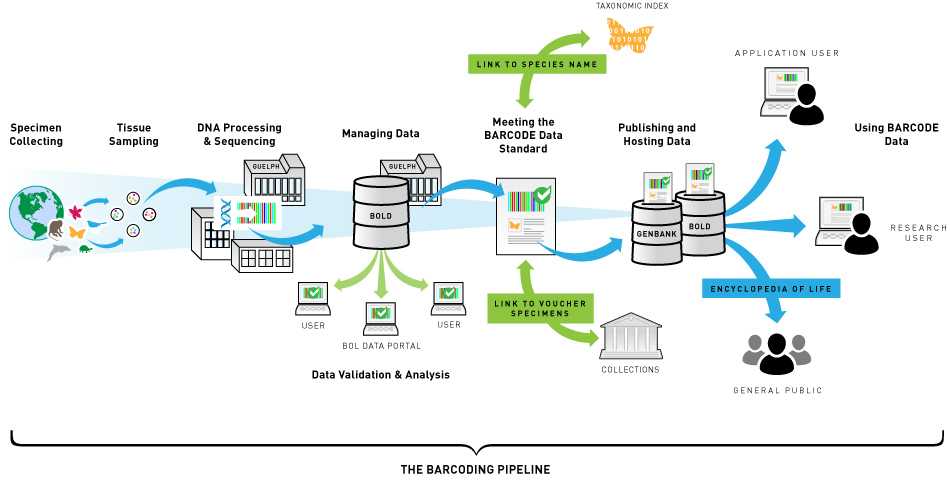

Barcoding workflow and MSA data
===============================

Barcoding
---------



Barcode Of Life Data Systems ([BOLDSYSTEMS](http://www.boldsystems.org/))
-------------------------------------------------------------------------

- Stores records about [specimens](http://www.boldsystems.org/index.php/Public_RecordView?processid=AANIC001-10)
- Includes marker sequence [data](fasta.fas), images, lat/lon coordinates, etc.
- Can query [taxonomically](http://www.boldsystems.org/index.php/Public_SearchTerms?query=Danaus[tax])
  and download [all sequences](Danaus.fas)
- Identification services:
  - COI for animals
  - ITS for fungi
  - rbcL and matK for plants
  
Fetching taxon data through the [URL API](http://www.boldsystems.org/index.php/api_home)
----------------------------------------------------------------------------------------

```bash
# Fetch taxon data for Danaus as JSON
$ curl -o Danaus.json http://www.boldsystems.org/index.php/API_Tax/TaxonSearch?taxName=Danaus
```

Returned [taxon data](Danaus.json) is encoded as JSON (e.g. do `python -m json.tool Danaus.json`):

```json
{
  "top_matched_names": [
    {
      "taxid": 6926,
      "taxon": "Danaus",
      "tax_rank": "genus",
      "tax_division": "Animals",
      "parentid": 3681,
      "parentname": "Danainae",
      "representitive_image": {
        "image": "JAGWI/WIJAG1191+1445394342.JPG",
        "apectratio": 1.333
      },
      "specimenrecords": "517"
    }
  ],
  "total_matched_names": 1
}
```

Let's say we wanted to figure out what the image location was, we can then read this
JSON in a little [script](json.py):

```python
import urllib
import simplejson as json # sudo pip install simplejson
url = "http://www.boldsystems.org/index.php/API_Tax/TaxonSearch?taxName=Danaus"
response = urllib.urlopen(url)
data = json.loads(response.read())

if data['top_matched_names']:
	for name in data['top_matched_names']:
		if name['representitive_image']:
			print name['representitive_image']['image']

```

Fetching sequences 
------------------

Data from URLs can be downloaded on the command line using [curl](https://curl.haxx.se/):

```bash
# Fetch all sequences for Danaus as FASTA
$ curl -o Danaus.fas http://www.boldsystems.org/index.php/API_Public/sequence?taxon=Danaus
```

The BOLD sequence data service API returns a FASTA file `Danaus.fas`, which holds 
multiple sequences, unaligned. The 
[definition line](https://en.wikipedia.org/wiki/FASTA_format#Description_line) is 
formatted as:

```
>ID|Scientific binomial|marker|...
``` 

With this we can use standard UNIX command line tools 
[grep, cut, sort and uniq](http://www.tldp.org/LDP/abs/html/textproc.html) to do some 
basic checks, e.g.:

```bash
$ grep '>' Danaus.fas | cut -f 3 -d '|' | sort | uniq
ArgKin
CAD
COI-3P
COI-5P
COI-5P
COII
COXIII
CYTB
EF1-alpha
GAPDH
IDH
MDH
ND1
ND2
ND3
ND4
ND4L
ND5-0
ND6
RpS2
RpS5
Wnt1
```

Filtering out markers
---------------------
It turns out there are multiple markers for this genus. Unfortunately, because FASTA 
records are multiple lines (and the exact number is unpredictable), we can't easily use
command line tools (like `grep`). Instead, we might write a little script, e.g. in 
[biopython](http://biopython.org):

```python
from Bio import SeqIO # sudo pip install biopython
with open("Danaus.fas", "rU") as handle:
    
    # Example: retain COI
    for record in SeqIO.parse(handle, "fasta"):
        fields = record.description.split('|')
        if fields[2] == 'COI-5P' and len(record.seq) == 1246:
        	print '>' + record.description
        	print record.seq
```

Run as:

```shell
$ python fasta.py > Danaus.COI-5P.fas
```

Multiple sequence alignment
---------------------------

FASTA files can be aligned, for example, with [muscle](https://www.drive5.com/muscle/):

```shell
$ muscle -in Danaus.COI-5P.fas -out Danaus.muscle.fas
```

Resulting in a file `Danaus.muscle.fas`, which is also a FASTA file. 

Alternatively, you might align with [mafft](https://mafft.cbrc.jp/alignment/software/), 
(or one of the many other multiple sequence alignment tools) which has additional 
functionality for more difficult markers (such as ITS):

```shell
$ mafft Danaus.COI-5P.fas > Danaus.mafft.fas
```

Resulting in a file `Danaus.mafft.fas`. You can view both, for example, with this 
[web viewer](http://msa.biojs.net/app/). Are they different?

```shell
$ ls -la Danaus.m*
-rw-r--r-- 1 root root 157414 Nov 25 20:56 Danaus.mafft.fas
-rw-r--r-- 1 root root 157414 Nov 25 20:56 Danaus.muscle.fas
```

Same number of bytes (so, same number of inserted gaps) but with different contents. Could
be capitalization, could be line folding, could be sequence order, or 
_actual differences in the alignment algorithms_. 
[Checksums](https://en.wikipedia.org/wiki/Checksum) are different:

```shell
$ md5sum Danaus.mafft.fas
821e4e986131bbdbc19571c4c5456020  Danaus.mafft.fas

$ md5sum Danaus.muscle.fas
c165c5776e2cf6c72e2b18264ea13b34  Danaus.muscle.fas
```

**How might we verify this further?**

Comparing different alignment results
-------------------------------------
Because the FASTA records in the files produced by `mafft` and `muscle` are in a different
order and the sequence data is capitalized differently, we can't easily compare the two
files. Here we sort the records, and capitalize the sequences, then write out to a
specified file format (e.g. `phylip`).

```python
import sys
from Bio import SeqIO
from Bio import AlignIO
from Bio.Align import MultipleSeqAlignment

with open(sys.argv[1], "rU") as handle:
    
    records = {}
    for seq in SeqIO.parse(handle, "fasta"):
        fields  = seq.description.split('|')
        seq.seq = seq.seq.upper()
        records[fields[0]] = seq
    
    aln = MultipleSeqAlignment([ records[key] for key in sorted(records.keys()) ])
    AlignIO.write(aln, sys.argv[2], sys.argv[3])
```

Usage:

```bash
$ python convert.py <infile> <outfile> <format>
```

Now we can compare the two alignments, e.g. with a `diff <file1> <file2>`.
They appear to be identical.

Building a phylogeny
--------------------

We can build a quick phylogeny from one of the PHYLIP files using raxml, e.g.
as follows: `raxmlHPC -m GTRGAMMA -n Danaus.phylo -s Danaus.mafft.phy -p 123`

The resulting tree file (`RAxML_bestTree.Danaus.phylo`) can then be 
viewed in http://etetoolkit.org/treeview/
