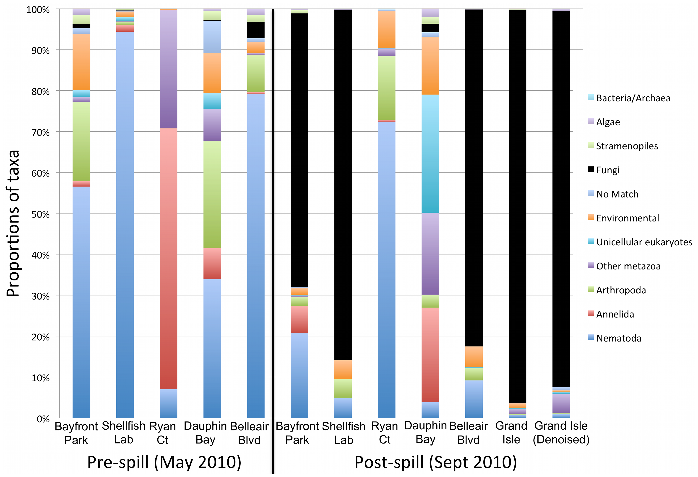
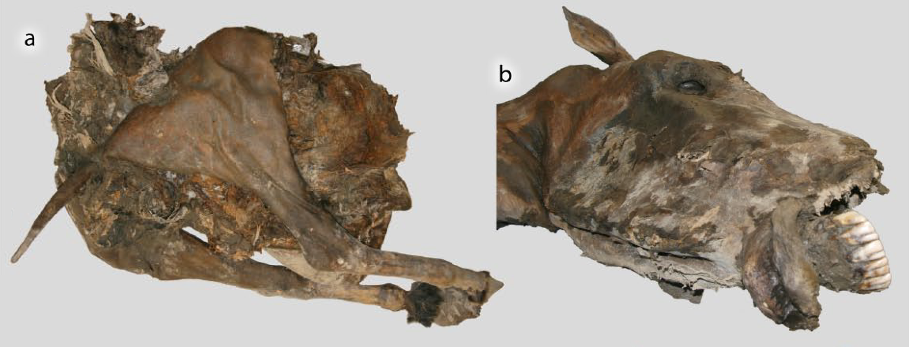
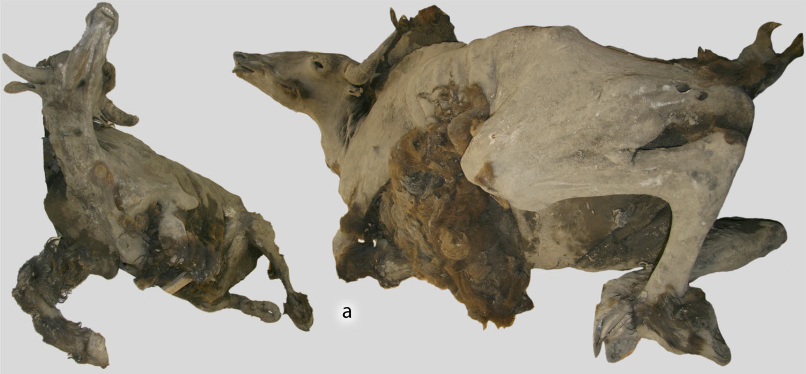
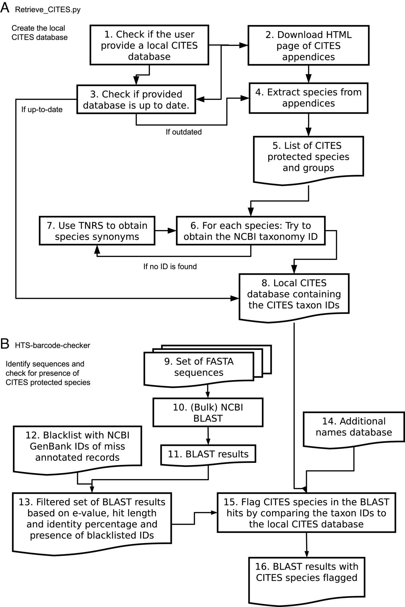

Metabarcoding
=============

Introduction
------------

Metabarcoding analysis
----------------------
General workflow
- data cleaning
- read pairing
- associating reads with samples
- clustering
- OTU picking
- taxonomic assignment
- rarefaction

Data types
- reads from markers
- OTU tables

Command-line tools and toolkits
- QIIME
- Mothur
- OBITools
- usearch
- BLAST

Impact assessment
-----------------
**HM Bik, KM Halanych, J Sharma & WK Thomas**. 2012. Dramatic Shifts in Benthic Microbial 
Eukaryote Communities following the Deepwater Horizon Oil Spill. _PLoS ONE_ 
**7**(6): e38550 
doi:[10.1371/journal.pone.0038550](https://doi.org/10.1371/journal.pone.0038550)

Interaction networks (example: gut contents)
--------------------------------------------
**B Gravendeel, A Protopopov, I Bull, E Duijm, F Gill, A Nieman, N Rudaya, A N Tikhonov, 
S Trofimova, GBA van Reenen, R Vos, S Zhilich & B van Geel**. 2014. Multiproxy study of 
the last meal of a mid-Holocene Oyogos Yar horse, Sakha Republic, Russia. 
_The Holocene_ **24**(10): 1288-1296
doi:[10.1177/0959683614540953](https://doi.org/10.1177/0959683614540953)

**B van Geel, A Protopopov, I Bull, E Duijm, F Gill, Y Lammers, A Nieman, N Rudaya, 
S Trofimova, A N Tikhonov, R Vos, S Zhilich, B Gravendeel**. Multiproxy diet analysis of 
the last meal of an early Holocene Yakutian bison. _Journal of Quaternary Science_
**29**(3): 261-268
doi:[10.1002/jqs.2698](http://doi.org/10.1002/jqs.2698)

Species detection
-----------------
**Y Lammers, T Peelen, R A Vos & B Gravendeel**. 2014. The _HTS barcode checker_ pipeline, 
a tool for automated detection of illegally traded species from high-throughput 
sequencing data. _BMC Bioinformatics_ **15**:44 
doi:[10.1186/1471-2105-15-44](https://doi.org/10.1186/1471-2105-15-44)

Adaptive management and environmental quality assessment
--------------------------------------------------------

Phylogenetic placement algorithms
---------------------------------