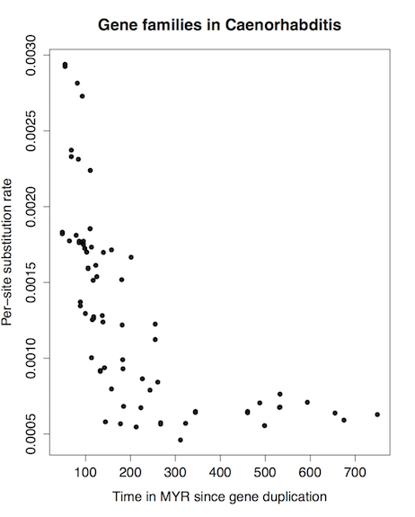
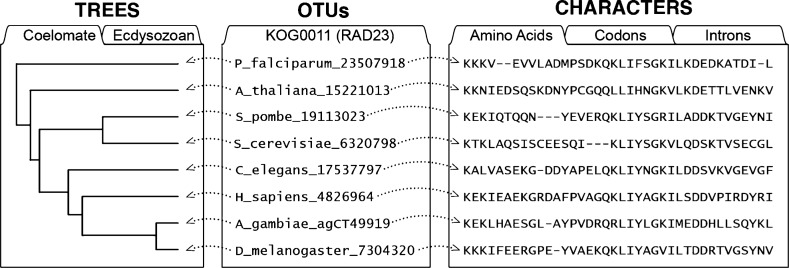
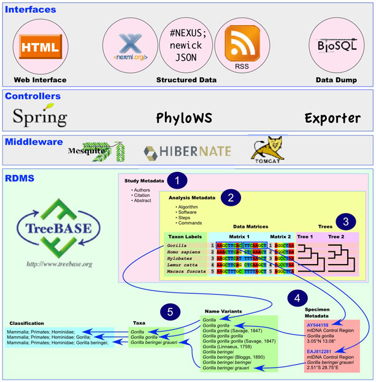

Big data phylogenetics
======================

Outline
-------
- Overview of the characteristics of phylogenetic data
- About representation formats
- Review of common data formats:
  - Newick / New Hampshire
  - New Hampshire eXtended (w. example analysis of TreeFam)
  - PhyloXML
  - Nexus
  - NeXML (w. example analysis of TreeBASE)
  - CDAO and RDF
  - JSON

Phylogenetic data
-----------------
- Plays a role in a variety of different contexts within biodiversity research, e.g.:
  - Taxonomy and systematics 
  - Diversification analysis
  - Comparative analysis
- Variety of different input data, e.g.:
  - Multiple sequence alignments
  - Morphological characters
  - Computed distances (e.g. niche overlap?)
  - Input trees (e.g. supertree methods)
- Variety of different methods, e.g.:
  - Distance based, such as NJ
  - Optimality criterion-based, such as MP and ML
  - Bayesian, Markov chains
- Variety of different interpretations of output, e.g.:
  - Tips are species, individuals, or sequences
  - Branches are evolutionary change, time, or rates
  - Nodes are speciations or duplications
  - Topology represents evolutionary hypothesis or clustering

About representation formats
----------------------------
- Phylogenetic data is less 'big' than NGS data
- Often plain text-based, web standards ([XML](https://www.w3.org/XML/), 
  [JSON](http://www.json.org/), [RDF](https://www.w3.org/RDF/))
- More amenable to relational databases ([SQL](https://en.wikipedia.org/wiki/SQL))
- Rarely represented in binary format (but see the [examl](ExaML.pdf) parser for an
  application specific example)


The Newick / New Hampshire format
---------------------------------


Newick representation:

```
(((A,B),(C,D)),E)Root;
```

- Optionally has branch lengths after each tip or node, as `:0.002321`
- Optionally has comments inside square brackets, e.g. `[comment]`
- ['Invented' on a napkin at Newick's Lobster House in Durham, New Hampshire, in 1986.](http://evolution.genetics.washington.edu/phylip/newicktree.html)
- Concise, but lacking all metadata

New Hampshire eXtended
----------------------

- [Format](https://sites.google.com/site/cmzmasek/home/software/forester/nhx) developed 
  primarily for gene trees
- Additional data is embedded inside square brackets (i.e. should be backward compatible
  with Newick format), which start with `&&NHX`, followed by `:key=value` pairs 
- Keys allowed:
  - `GN` - a text string, used for gene names
  - `AC` - a text name, for sequence accession numbers
  - `B`  - a decimal number, for branch support values (e.g. bootstrap)
  - `T`  - taxon identifier, a number
  - `S`  - species name, a text string 
  - `D`  - flag to indicate whether node is a gene duplication (T), a speciation (F), or
    unknown (?)

Example:

```
(
	(
		( A[&&NHX:S=Homo sapiens], B[&&NHX:S=Homo sapiens] )[&&NHX:D=T],
		( C[&&NHX:S=Pan paniscus], D[&&NHX:S=Pan troglodytes] )[&&NHX:D=F],	
	) , E
);
```
The technique to 'overload' comments in square brackets to embed data is also used in 
other contexts, such as:

- To store summary statistics of Bayesian analyses, as done by treeannotator
- To store branch and node decorations (e.g. color, line thickness), as done by Mesquite

Example of gene tree research: TreeFam data mining
--------------------------------------------------



1. [Download the TreeFam data dump](https://github.com/rvosa/bh15/blob/master/pipeline.sh)
2. [Extract and clean up NHX trees and FASTA data](https://github.com/rvosa/bh15/blob/master/script/treefammer.pl)
3. [Perform fossil calibration on NHX trees](https://github.com/rvosa/bh15/blob/master/script/ratogrammer.pl)
   (using a [template](https://github.com/rvosa/bh15/blob/master/data/r8s.tmpl) command file for
   [r8s](r8s1.7.manual.pdf))
4. [Extract rate as function of distance from duplication](https://github.com/rvosa/bh15/blob/master/script/ratebydist.pl)
5. [Draw a plot](https://github.com/rvosa/bh15/blob/master/script/scatterplt.R)

PhyloXML
--------

- Successor [format](phyloxml.pdf) to NHX
- Deals with the same concepts as NHX but in XML

```xml
<?xml version="1.0" encoding="UTF-8"?>
<phyloxml xmlns="http://www.phyloxml.org" xmlns:xsi="http://www.w3.org/2001/XMLSchema-instance" xsi:schemaLocation="http://www.phyloxml.org http://www.phyloxml.org/1.10/phyloxml.xsd">
  <phylogeny rooted="true">
    <clade>
      <clade>
        <clade>
          <events><duplications>1</duplications></events>
          <clade>
            <name>A</name>
            <taxonomy><scientific_name>Homo sapiens</scientific_name></taxonomy>
          </clade>
          <clade>
            <name>B</name>
            <taxonomy><scientific_name>Homo sapiens</scientific_name></taxonomy>            
          </clade>
        </clade>
        <clade>
          <events><speciations>1</speciations></events>
          <clade>
            <name>C</name>
            <taxonomy><scientific_name>Pan paniscus</scientific_name></taxonomy>            
          </clade>
          <clade>
            <name>D</name>
            <taxonomy><scientific_name>Pan troglodytes</scientific_name></taxonomy>            
          </clade>
        </clade>
      </clade>
      <clade>
        <name>E</name>
      </clade>
    </clade>
  </phylogeny>
</phyloxml>
```

The Nexus format
----------------


Nexus representation:

```
#NEXUS
begin taxa;
	dimensions ntax=5;
	taxlabels
		A
		B
		C
		D
		E
	;		
end;
begin trees;
	translate
		1 A,
		2 B,
		3 C,
		4 D,
		5 E;
	tree t1 = (((1,2),(3,4)),5);
end;
```

- Uses an extensible block structure that can also include character data (and other 
  things, such as command blocks)
- Many different, mutually incompatible dialects that deviate from the original 
  [standard](NEXUS_final.pdf)
- More facilities for metadata (e.g. names of things, annotations for taxa)

NeXML
-----



- Representation of [Nexus as XML](nexml.pdf) ([example](tree.xml))
- The format in which [TreeBASE](http://treebase.org)'s data 
  [dump](https://github.com/TreeBASE/supertreebase) is made available
- Easily translatable, e.g. in [R](https://cran.r-project.org/web/packages/RNeXML/index.html),
  [python](https://www.dendropy.org/), [perl](https://doi.org/10.1101/211334):

```perl
#!/usr/bin/perl
use Bio::Phylo::IO qw'parse';

print parse(
	-format     => 'nexus',
	-file       => 'tree.nex',
	-as_project => 1,
)->to_xml; 
```

Example of species tree research: TreeBASE data mining
------------------------------------------------------



1. Fetch the [treebase sitemap.xml](https://github.com/TreeBASE/supertreebase/blob/master/data/treebase/sitemap.xml)
2. Download [studies as nexml](https://github.com/TreeBASE/supertreebase/tree/master/data/treebase)
   through the treebase [API](https://github.com/TreeBASE/treebase/wiki/API)
3. Convert trees to MRP matrices ([Baum, 1992](http://www.jstor.org/pss/1222480),
   [Ragan, 1992](http://dx.doi.org/10.1016/1055-7903%2892%2990035-F)) using a 
   [script](https://github.com/TreeBASE/supertreebase/blob/master/script/supertree/make_tb2_mrp.pl)
4. [Extract all species](https://github.com/TreeBASE/supertreebase/blob/master/script/supertree/make_species_list.pl),
   and [normalize the taxa](https://github.com/TreeBASE/supertreebase/blob/master/script/supertree/normalize_tb2_mrp.pl)
5. [Partition](https://github.com/TreeBASE/supertreebase/blob/master/script/supertree/make_partitions_mrp.py) the
   data by taxonomic [class](https://en.wikipedia.org/wiki/Class_%28biology%29)
6. Perform MP analyses with [PAUP*](http://paup.scs.fsu.edu/) and visualize the result
   (example: [Arachnida](https://aiblaauw.github.io/Arachnida.html))

This workflow was [scripted](https://github.com/TreeBASE/supertreebase/blob/master/script/supertree/Makefile)
using [make](https://www.gnu.org/software/make/) for parallelization.

RDF and CDAO
------------


- Facts can be represented as [RDF](https://www.w3.org/RDF/) triples
- Subjects and predicates are anchored on [ontologies](https://en.wikipedia.org/wiki/Ontology_%28information_science%29)
- An example of this is the [CDAO](https://bioportal.bioontology.org/ontologies/CDAO)
- TreeBASE NeXML also has RDF statements in it, such as taxon IDs
- RDF can be queried with [SPARQL](https://www.w3.org/TR/rdf-sparql-query/)

Tabular representations
-----------------------

- Unlike sequence data, trees are hierarchical data structures, which 
  complicates tabular representation
- A simple table with child ID and parent ID columns works fine for small-ish trees, such
  as the [Arachnida.csv](Arachnida.csv) that was the back end for the TreeBASE tree
- However, more general cases (such as networks) will require a node and an edge table
- Traversals require recursive queries, although some common queries (e.g. node 
  descendants, ancestors, MRCA) can be implemented with additional, pre-computed indexes
  
```js
// load the external data
d3.csv("Arachnida.csv", function(error, data) {

	// create a name: node map
	var dataMap = data.reduce(function(map, node) {
		map[node.name] = node;
		return map;
	}, {});

	// populate the tree structure
	var root;
	data.forEach(function(node) {	
		var parent = dataMap[node.parent];		
		if ( parent ) {			
			( parent.children || ( parent.children = [] ) ).push(node);
		} 
		else {
			root = node;
		}
	});	
});
```
