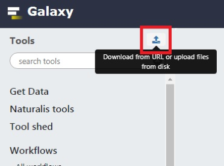
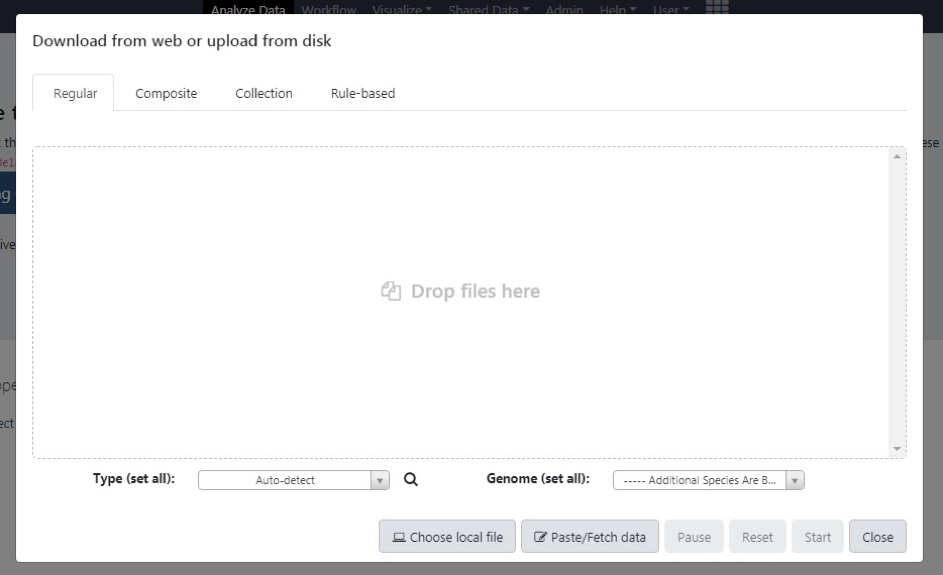
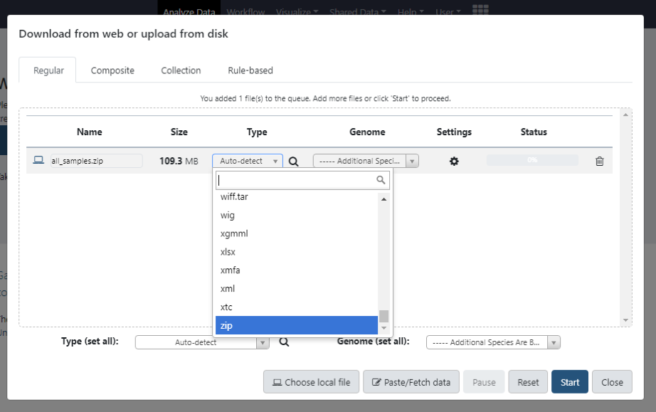
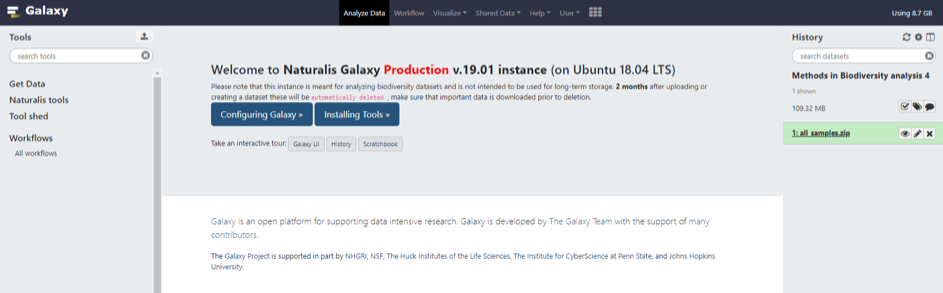
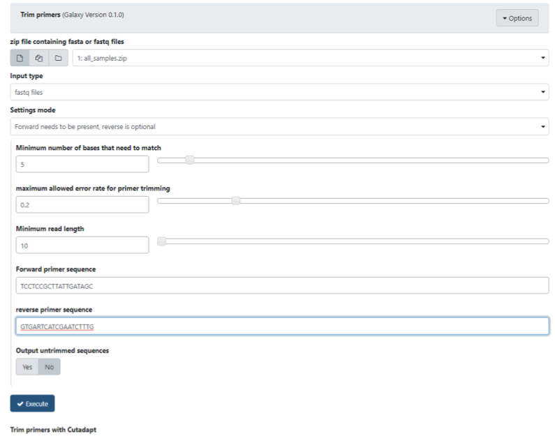
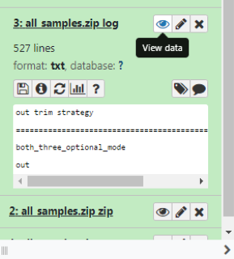
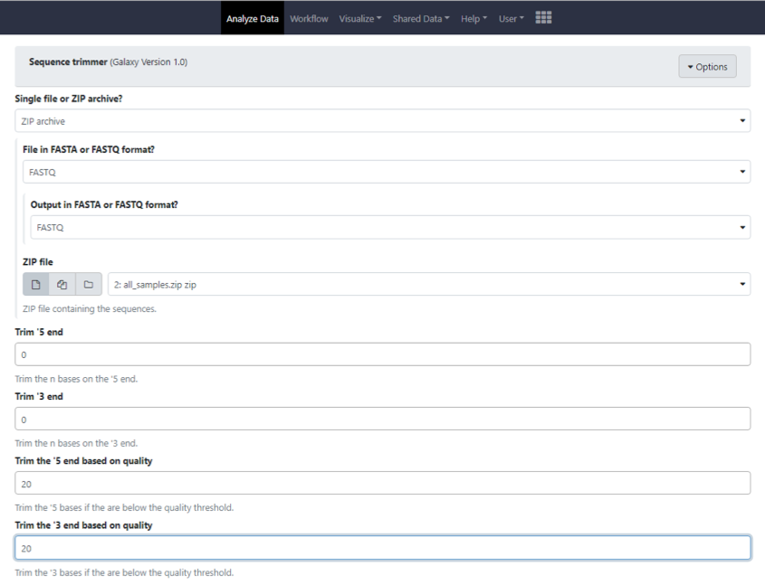
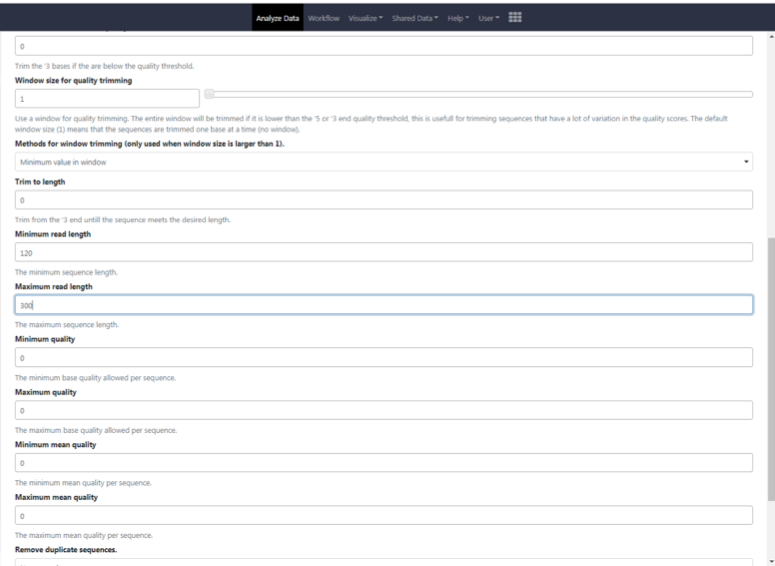
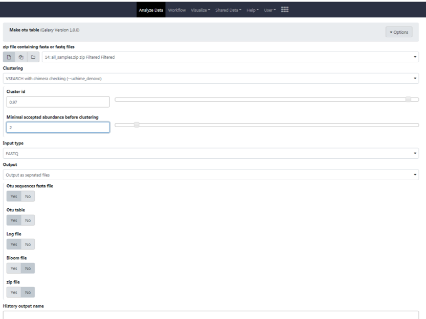
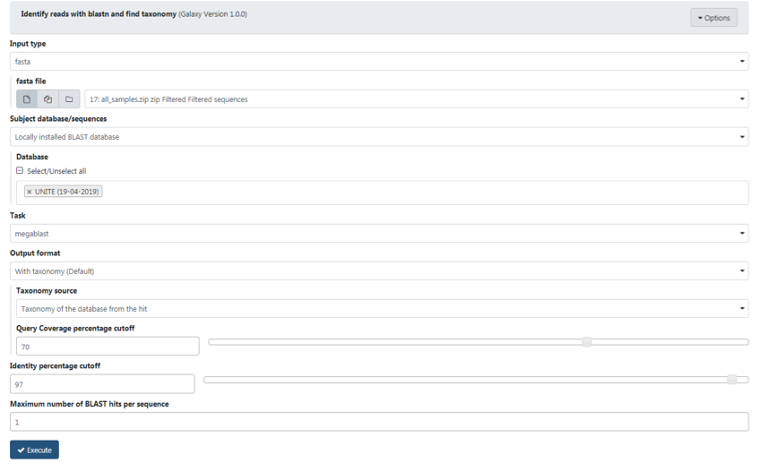

Step-by-step analysis of fungal diversity in Galaxy
===================================================

In this practical, we are going to analyse some HTS data sets (Ion Torrent) for soil 
fungi in samples taken at different locations along a mountain slope in Argentina. 
Published papers making use of this data set: Geml et al 2014 (doi: 10.1111/mec.12765) 
and Nouhra et al 2018 (doi.org/10.1007/s10531-018-1512-3).

The Yungas, a system of tropical and subtropical montane forests on the eastern slopes of 
the Andes, are extremely diverse and severely threatened by anthropogenic pressure and 
climate change. We carried out Ion Torrent sequencing of ITS2 rDNA from soil samples 
taken at multiple sites along the entire latitudinal extent of the Yungas in Argentina. 
The sampled sites represent the three altitudinal forest types: the piedmont (400–700 m 
a.s.l.), montane (700–1500 m a.s.l.) and montane cloud (1500–3000 m a.s.l.) forests.

We will work on the Galaxy server of Naturalis Biodiversity Center. Galaxy is a 
scientific workflow, data integration, and data and analysis persistence and publishing 
platform that aims to make computational biology accessible to research scientists that 
do not have computer programming or systems administration experience. It was originally 
written for biological data analysis, particularly genomics. Naturalis has a personal 
Galaxy-server through which frequently used scripts (sequence trimming, filtering, 
clustering, Blast-identification etc.) are made available.

## 1. Log in on Naturalis Galaxy

Go to [http://galaxy.naturalis.nl/](http://galaxy.naturalis.nl/)

- If you are a guest user who is using Galaxy as part of a course or collaboration as
  an outsider of Naturalis, you should have received an invite by email to participate
  in a Galaxy project via SRAM. Accepting the invite should have led you to a site
  where you needed to login with your institution's 2FA system. Once you have done that,
  SRAM authentication for Galaxy has been activated. You can then log in on Galaxy
  by clicking 'Sign in with SRAM'.
- If, instead, you have a Naturalis account, you can simply click 'Sign in with Naturalis
  account', which functions in the same way as the other web applications Naturalis uses
  (e.g. the Google tools, AFAS, TopDesk, and so on).

## 2. Upload sequence data to Galaxy 

The data files (a zip archive of ±122MB) can be downloaded 
[here](https://ndownloader.figshare.com/files/20019950).

Make sure to upload this file *unaltered* in the next step (ie. prevent your operating
system from automatically unarchiving zip files, because rearchiving these files can change
the compression method or add hidden files; even though the extension still is .zip).

In Galaxy open the upload window by clicking on the upload icon on the right top of the 
tool panel.



The upload window will look like the following screenshot.



Drag the all_samples.zip archive in to this window or click on the "Choose local file" 
button. Change the file type to zip by opening the dropdown menu (Auto detection will not 
recognize zip files!). Then select Start and when the upload is complete, close the 
window.



You now have a window similar to the one below with the tools we will use in the left 
panel and the files on the right.



## 3. Trimming the primers

Our sequencing reads still have primer sequences on both ends (i.e. 5' and 3'), which 
have to be removed. We will use a tool called 
[cutadapt](https://cutadapt.readthedocs.io/en/v1.10/index.html), which is available in 
Galaxy under the Naturalis tools menu as the "Trim primers" tool. The following primers 
were used:

- **Forward (5') primer** - `TCCTCCGCTTATTGATAGC`
- **Reverse (3') primer** - `GTGARTCATCGAATCTTTG`

We are going to use the option where the 5’ primer needs to be present, while the 3’ 
primer is optional. Your window with settings should look like this:



The following briefly explains the different parameters:

- **input type** - Does your zip contain .gz or fastq files
- **Settings mode** - This parameter determines the output and which settings you need to 
  fill in later.
  - Trim forward primers only, look only for the forward primers and trim it off. Only if 
    the primer is found the read will be written to the output file
  - Trim reverse primers only, look only for the forward primers and trim it off. Only if 
    the primer is found the read will be written to the output file
  - Both need to be present, check the forward and reverse primer are present and trim it 
    off. Only if both primers are found the read will be written to the output file
  - Both need to be present and are anchored, check if the forward and reverse primer are 
    present on the very outside of the read and trim it off. Only if both primers are 
    found the read will be written to the output file
  - Forward needs to be present, reverse is optional. This first checks if the forward 
    primer is present and trims it off. If the forward primer is found the reverse primer 
    will be checked. The read is written to the output file if the forward primer is found
- **Minimum number of bases that need to match** - Since Cutadapt allows partial matches 
  between the read and the adapter sequence, short matches can occur by chance, leading 
  to erroneously trimmed bases. To reduce the number of falsely trimmed bases, the 
  alignment algorithm requires that, by default, at least five bases match between 
  adapter and read    
- **Minimum** - All searches for adapter sequences are error tolerant. Allowed errors are 
  mismatches, insertions and deletions. The level of error tolerance is adjusted by 
  specifying a maximum error rate, which is 0.1 (=10%) by default.  
- **Minimum read length** - Discard processed reads that are shorter than this length
- **Output untrimmed sequences** - When this is set to yes you will get an extra output
  file containing the untrimmed reads

The resulting output zip archive contains the fastq files with trimmed primers. Check the 
corresponding log file by clicking on View data to see how many sequences were retained 
for each input file.  



## 4. Trimming the low quality ends

Our reads may also contain base calls with low support. These typically occur on the ends 
of the reads. We are going to remove them. Use the “Sequence Trimmer” tool. Select the 
zip archive from the previous step as the input file. Set FASTQ as the format for the 
input and output.



Phred values are log-scaled, where a quality score of 10 represents a 1 in 10 chance of 
an incorrect base call and a quality score of 20 represents a 1 in 100 chance of an 
incorrect base call. Enter 20 as the quality value to trim the sequences from both the 5’
and 3’end. Execute this tool and check the percentage of removed, low quality sequences 
and bases from each fastq file in the log file.

## 5. Check length distribution

A good and easy way to check if the primers worked and amplified the target region is to 
look at the length distribution of the reads. This shows the length of the sequences in 
your FASTQ files. Beforehand you mostly know the length or range of lengths of your 
target. The ITS2 region in fungi is about 250 bp long. Check this with the "Sequence 
analyzer" tool. As input for this tool you use the output of step 4. After executing this 
tool you will get more information then only the length distribution. Take a look at the 
Base quality distribution graph as well.

## 6. Filter on length

As you can see in the output of step 5 there are many short reads. We want to delete very 
short and very long fragments since they are less reliable. We will again use the 
"Sequence trimmer" tool. The input file is the zip archive of step 4 (all_samples.zip zip 
Filtered). Set FASTQ as the format for the input and output and set Minimum read 
length=120 and Maximum read length=300.



Again, check the log file to see how many sequences were deleted in each of the soil 
samples by filtering on length.

## 7. Create an OTU table

We are going to use the tool “vsearch”, first described in a paper by Rognes et al., 2016 
(https://peerj.com/articles/2584/). Select “Make otu table” in the left panel. The tool 
“VSEARCH with chimera checking” performs a series of steps. There is first a 
deduplication of the reads. All duplicates will be removed and the amount (abundance) of 
the duplicates will be added to the fasta header. This abundance is needed for the other 
steps. Then the sequences will be sorted on abundance, and the read IDs are given 
additional labels to identify the different soil samples. This is because all the data 
are merged and the sequences are clustered across all samples - but we still want to be 
able to recognize where the sequences came from originally, and that information would 
otherwise be lost.

Subsequently, the sequences are going to be clustered: the ones that are at least 97% 
similar are all going to end up in the same putative taxon (OTU – Operational Taxonomic 
Unit – a proxy for species in this case). Set Cluster id to 0.97.  Once the clustering is 
done, we can also figure out which of the sequences are weird singletons. Those are 
probably artefacts of the sequencing process (chimeras), which we will remove. We will 
set the minimum abundance before clustering to 2.



Three output files have now been generated. Check the log file to see how many unique 
sequences this analysis contains and how many clusters at 97% identity were formed (= how 
many OTUs are present in this dataset). In the sequences file these OTU sequences are 
displayed in the fasta format. In the OTU table the abundance of each sequence in each of 
the soil samples is shown. Scroll through these outputs to familiarize yourself with the 
results.

## 8. Identify OTUs

We will now compare the OTUs with a reference database to see if we can identify and 
classify the OTUs. This step will produce the biologically relevant information that we 
need (though we will process the output a bit more so that we can easily interpret it in 
a spreadsheet program).

The newly generated sequences file (all_samples.zip zip Filtered Filtered sequences) 
contains a representative read for every clustered OTU. Select the "Identify reads with 
blastn and find taxonomy" tool under "Naturalis Tools". Select the sequences file (fasta 
format) as input and UNITE (19-04-2019) under Database. The Query Coverage percentage 
cutoff can be set to 70.



[UNITE](https://unite.ut.ee/) is a web-based database and sequence management environment 
for the molecular identification of fungi. It targets the formal fungal barcode—the 
nuclear ribosomal internal transcribed spacer (ITS) region—and offers all ∼1 000 000 
public fungal ITS sequences (from GenBank and other public databases) for reference. 
Fungal metabarcoding struggles with very large numbers of OTUs that cannot be identified 
to any meaningful taxonomic lineage beyond e.g. the kingdom or phylum level. UNITE 
regularly clusters all ITS sequences at several sequence similarity thresholds to obtain 
approximate species-level OTUs referred to as species hypotheses (SHs). These ∼459 000 
species hypotheses have been assigned digital object identifiers (DOIs) to promote 
unambiguous reference across studies. In-house and web-based third-party sequence 
curation and annotation (to reflect recent nomenclatural and taxonomic changes and to 
correct the often-suboptimal state of taxonomic annotation in GenBank) have resulted in 
more than 275 000 improvements to the data over the past 15 years.

The resulting BLAST original taxonomy file now lists all the OTU’s that could be 
identified to at least kingdom level at the specified settings. Scroll through this list 
and pay attention to the Identity percentage, Coverage and Taxonomy column. Notice how 
many fungi remain unidentified.

## 9. Merging BLAST table and OTU table

The representative OTU sequences have been identified. They can be merged with the OTU 
table in order to create one final file. Select the "Add metadata to otutable" tool to 
unite the BLAST original taxonomy output with the OTU table. Other settings can remain 
default.

After visually inspecting the resulting file, you can now download it (format is 
tabular). It can be imported in a spreadsheet program such as Excel as a tab-separated 
file and forms the starting point for ecological interpretation of the data.

## 10. Interpretation

For the final step we need to do some custom data processing. Download the TSV table
that represents OTU table joined with the BLAST results against UNITE and load it into
R with the following code (note where the input file name is specified as the first
argument for the `read_tsv()` function).

```r
library(tidyverse)
library(readr)

# Function to process column names
clean_colnames <- function(x) {
  x %>%
    # Remove leading hash
    str_remove("^#") %>%
    # For columns matching C\d+P\d+, keep only that part
    str_replace("^(C\\d+P\\d+)_.*$", "\\1")
}

# Read and process the data
df <- read_tsv("../data/Galaxy.tabular.tsv", 
               na = "N/A",
               col_types = cols(
                 `#OTU ID` = col_character(),
                 `#Query ID` = col_character(),
                 `#Subject` = col_character(),
                 `#Subject accession` = col_character(),
                 `#Subject Taxonomy ID` = col_character(),
                 `#Source` = col_character(),
                 `#Taxonomy` = col_character(),
                 `#Identity percentage` = col_double(),
                 `#Coverage` = col_integer(),
                 `#evalue` = col_double(),
                 `#bitscore` = col_integer(),
                 .default = col_integer()
               )) %>%
  rename_with(clean_colnames) %>%
  # Set OTU ID as row names and remove the column
  column_to_rownames(var = "OTU ID") %>%
  # Filter for Fungi only
  filter(str_detect(Taxonomy, "^Fungi")) %>%
  # Ensure C\d+P\d+ columns are integers
  mutate(across(matches("^C\\d+P\\d+$"), as.integer)) %>%
  # Create sum columns for each altitude
  mutate(
    C1_total = C1P1 + C1P2 + C1P3,
    C3_total = C3P1 + C3P2 + C3P3,
    C5_total = C5P1 + C5P2 + C5P3,
    C7_total = C7P1 + C7P2 + C7P3
  ) %>%
  # Create presence/absence columns (1 if total > 0, 0 otherwise)
  mutate(
    C1_presence = if_else(C1_total > 0, 1L, 0L),
    C3_presence = if_else(C3_total > 0, 1L, 0L),
    C5_presence = if_else(C5_total > 0, 1L, 0L),
    C7_presence = if_else(C7_total > 0, 1L, 0L)
  )

# Calculate species diversity for each altitude
diversity <- data.frame(
  Altitude = c("C1", "C3", "C5", "C7"),
  Species_Diversity = c(
    sum(df$C1_presence),
    sum(df$C3_presence),
    sum(df$C5_presence),
    sum(df$C7_presence)
  )
)

# Display results
print("Species diversity by altitude:")
print(diversity)
```

The deep sequence data in the full data set (we used only a subset for this practical) 
indicate that fungal community composition correlates most strongly with elevation, with 
many fungi showing preference for a certain altitudinal forest type. For example, 
ectomycorrhizal and root endophytic fungi were most diverse in the montane cloud forests, 
particularly at sites dominated by Alnus acuminata, while the diversity values of various 
saprobic groups were highest at lower elevations. Despite the strong altitudinal 
community turnover, fungal diversity was comparable across the different zonal forest 
types. Besides elevation, soil pH, N, P, and organic matter contents correlated with 
fungal community structure as well, although most of these variables were co-correlated 
with elevation. Our data provide an unprecedented insight into the high diversity and 
spatial distribution of fungi in the Yungas forests.
