Common workflows in geospatial analysis and SDM
===============================================

During this part of the course we introduce you to a variety of tools for working with geospatial
data and species occurrences. During the practicals, we go into some depth with the usage of 
[ArcGIS](https://www.arcgis.com/index.html) because it is the standard in a lot of institutes 
(research, government, NGOs, etc.) and companies. In some of the supplementary readings, you
may come across [DIVA-GIS](http://www.diva-gis.org/), which is a slimmed down GIS application
for Windows with features that are most useful to biologists. As an open source alternative that
is broadly similar (though a bit less user-friendly and a bit more sloppy looking in its interface)
to ArcGIS, there is [QGIS](https://www.qgis.org).

Clicking around in a graphical user interface (GUI) such as provided by the aforementioned programs
is all well and good if you are tailoring an analysis to a single species (for example), but
surely there are situations where you might find yourself doing the same thing over and over 
again. Maybe because you are analyzing a set of species. Or a range of scenarios. In other words,
you are repeating a common workflow, and probably one that can be performed in most of these
GUI applications. In fact, you can probably also do it in code, as a script.

In this document, we are going to show you how to this. We will assume a very simple but very
common workflow that prepares bioclimatic GIS layers (such as those from
[worldclim](http://www.worldclim.org/bioclim)) for SDM in
[MAXENT](https://biodiversityinformatics.amnh.org/open_source/maxent/). The workflow consists of
just two steps, which don't necessarily have to be taken in any particular order:

- convert the layers from binary image format (\*.tif) to ASCII text (\*.asc)
- crop the layers to an extent that matches that of the species (slightly bigger, but not the
  whole world, let's say)
  
Hence, we take as a given that we already have downloaded and unzipped our  [layers](http://biogeo.ucdavis.edu/data/worldclim/v2.0/tif/base/wc2.0_10m_bio.zip). For this example
we use a very, very coarse resolution of 10 arc minutes, just to keep file sizes small. And we have
a set of [occurrences](occurrences.csv). These are also just for the sake of argument, do not use
them elsewhere for your own analyses.

The geographic extent of the occurrences is between 46.81686 and 58.7162728 degrees latitude (i.e.
a high latitude, far away from the equator) and between -133.2153004 and -83.10261 longitude (that is,
on the western hemisphere). Let's say we want the extent of the layers to be that of the occurrences 
±5%. You can come up with these values yourself by, for example, importing the tab-separated 
occurrences file in Excel and sorting the columns. This would give us a box of:

```
xmin = -133.2153004 * 1.05 = -139.8760655
xmax = -83.10261    * 0.95 = -78.9474795
ymin = 46.81686     * 0.95 = 44.476017
ymax = 58.7162728   * 1.05 = 61.65208644
```

ArcGIS, the _model builder_, and python
---------------------------------------

### Importing layers in ArcGIS

In ArcGIS, navigate to 'Add data...':

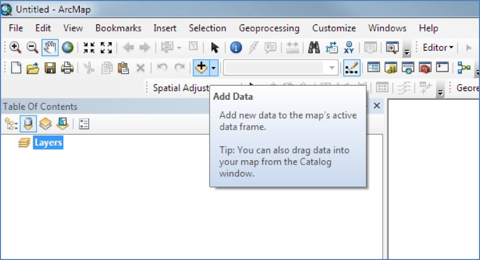

Then use the file choose to select your layer file(s):

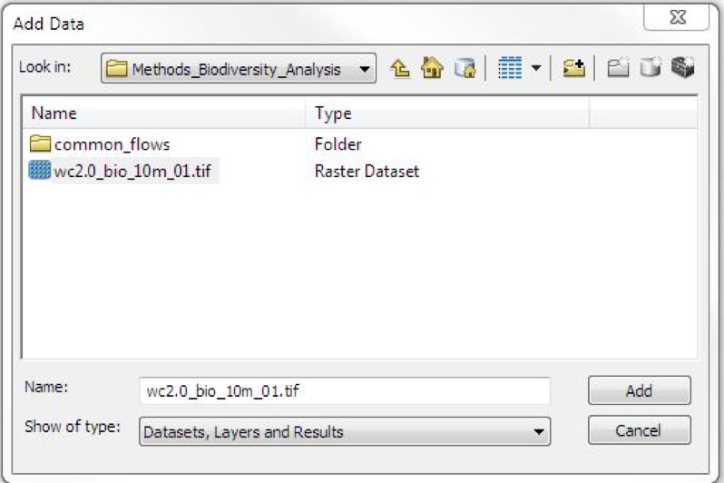

And allow any data pre-processing to take place:

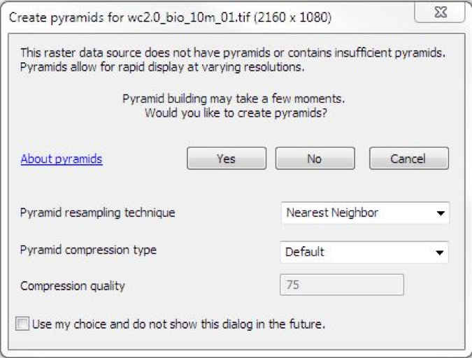

### Converting layers from raster to ASCII

In the toolbox, under 'Conversion Tools', select 'Raster to ASCII':

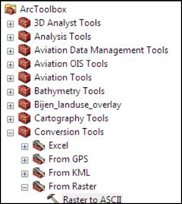

In the popup, provide the input and output files / layers, and click the 'Environments...' button:

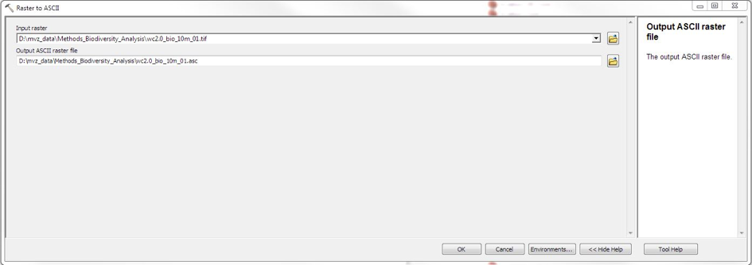

In the Environments, provide the extent to which you want to clip the output layer:

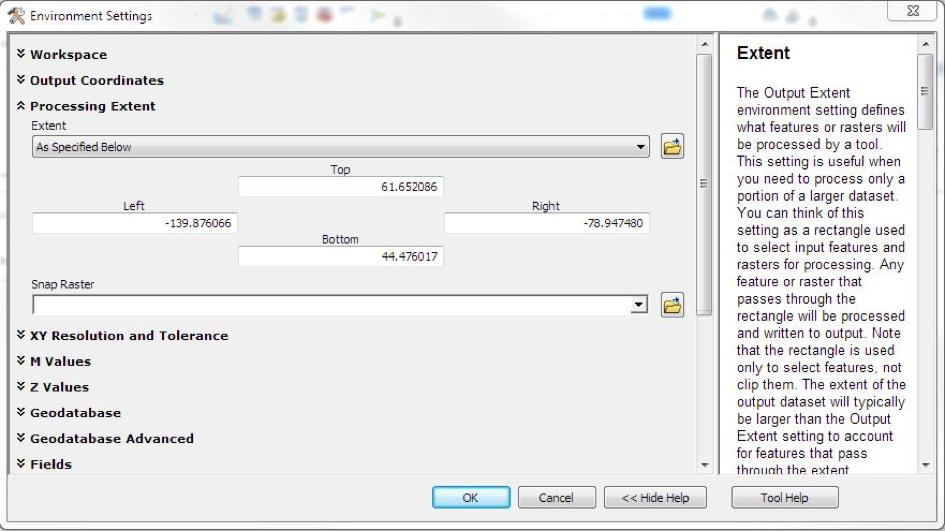

Once you've entered these settings, run the conversion:

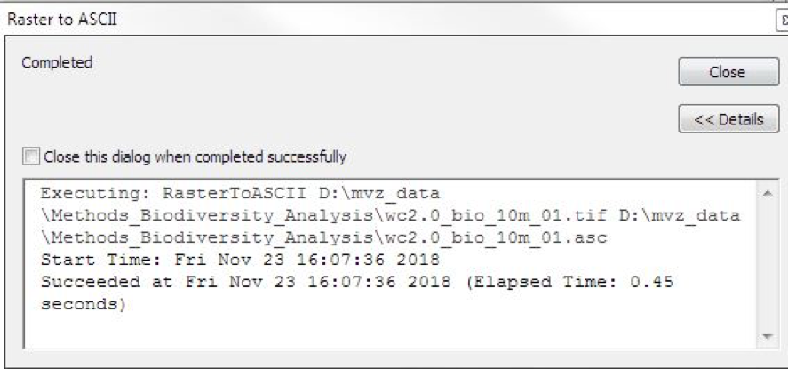

### Automating the conversion in python

ArcGIS has a facility that generates python scripts for any particular workflow. This facility
is called the ModelBuilder, and it allows you to chain together the steps of a workflow, then
output a script that can be run on the command line. Here's the ModelBuilder for our
present workflow:

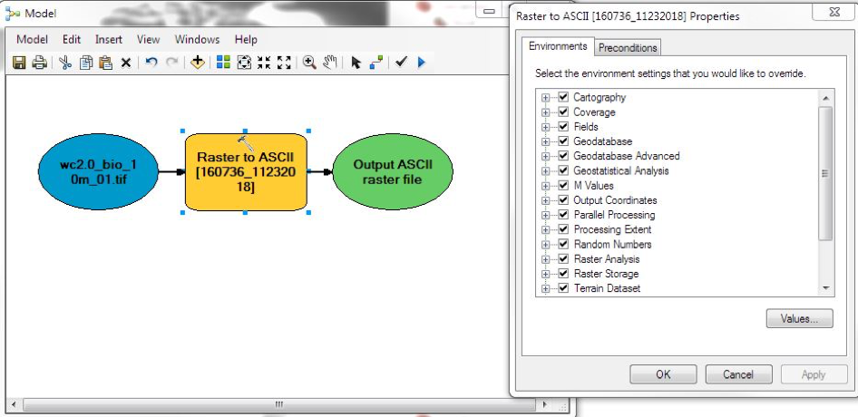

The script that it produced looks like this (after some cleaning up):

```python

# -*- coding: utf-8 -*-
# ---------------------------------------------------------------------------
# common_flows.py
# Created on: 2018-11-23 16:11:48.00000
#   (generated partly by ArcGIS/ModelBuilder)
# Description: Example for Methods in Biodiversity Analyss course in Python
# Creator:  Maarten van 't Zelfde - 22 November 2018
# ---------------------------------------------------------------------------

# Import modules
import arcpy, zipfile

# Local variables:
wc2_0_bio_10m_zip= "D:\\mvz_data\\Methods_Biodiversity_Analysis\\wc2.0_10m_bio.zip"
wc2_0_bio_10m_01d_asc = "D:\\mvz_data\\Methods_Biodiversity_Analysis\\wc2.0_bio_10m_01d.asc"

# Extract first layer from zip file
archive = zipfile.ZipFile(wc2_0_bio_10m_zip, 'r')
wc2_0_bio_10m_01_tif = archive.extract('wc2.0_bio_10m_01.tif')

# Process: Raster to ASCII with specific extent
arcpy.env.extent = "-139.876066 44.476017 -78.94748 61.652086"
arcpy.RasterToASCII_conversion(wc2_0_bio_10m_01_tif, wc2_0_bio_10m_01d_asc)
```

QGIS, the command line, and GDAL
--------------------------------

### Importing layers in QGIS

In QGIS, navigate to 'Layer > Add Layer > Add Raster Layer...', here:

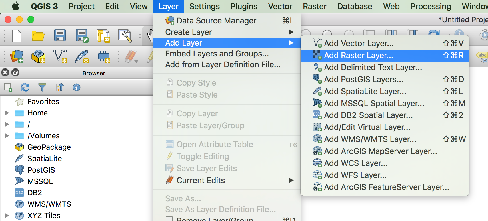

This opens a popup window that should already have the option 'Raster' selected on the lefthand side, 
as well as the 'Source type' switched to 'File'. Click the file selector button under 'Source', 
navigate to the folder with the unzipped \*.tif files and select the first file, 'wc2.0_bio_10m_01.tif'. 
Confirm the selection and click 'Add':

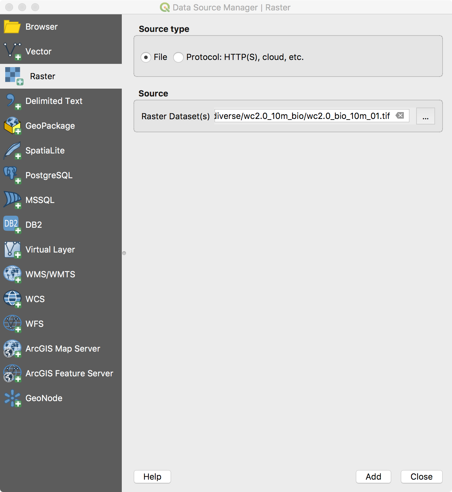

The layer should now be listed in the bottom left:

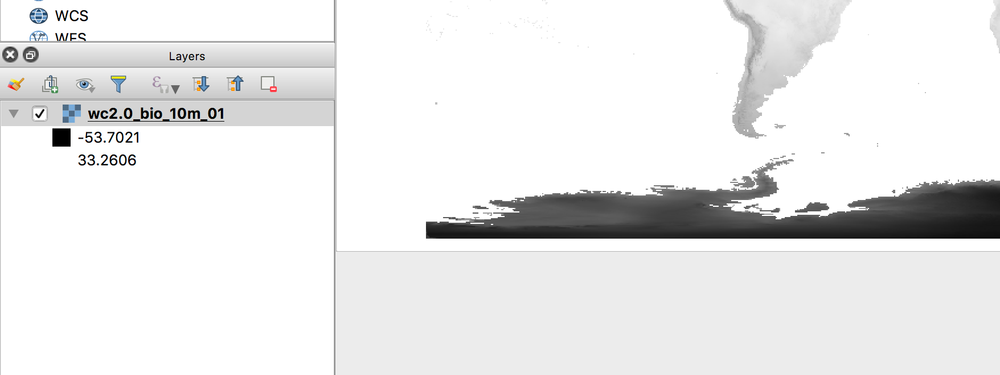

### Clipping the extent of the layers

We can both clip to this extent and export the result to an ASCII file in one go. Go to
'Raster > Extraction > Clip Raster by Extent...'. 

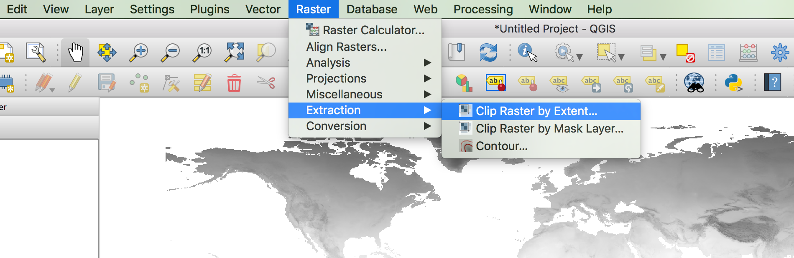

- In the 'Clipping extent' field, enter the coordinates of the box, separated by commas. 
- In the 'nodata' field, enter -9999 (this is for missing data)
- Under 'Clipped extent', select the output file name, and select ASCII as the type. It should have
  the \*.asc file extension
  
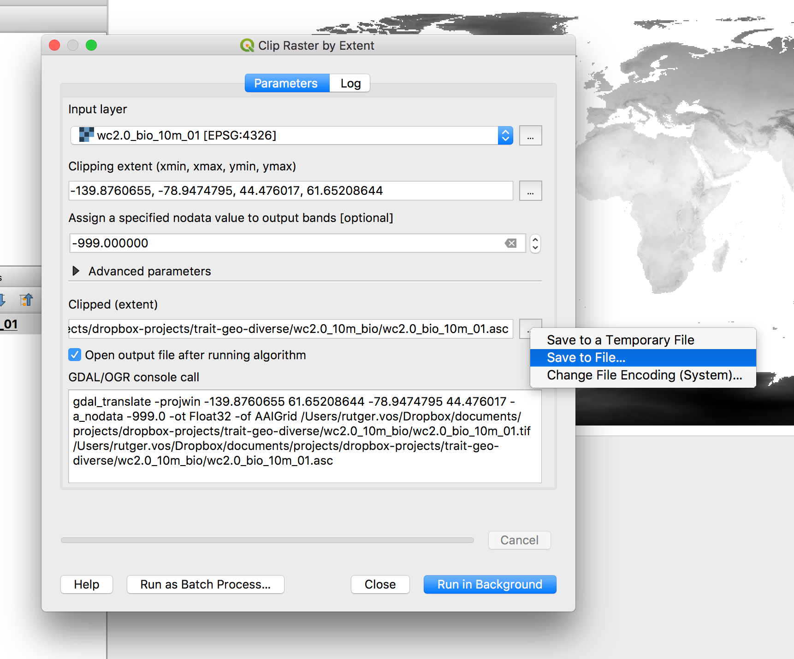
  
Click 'Run in background'. If you go to the output folder, there should now be an \*.asc file that
is fairly small (895kB), which you should be able to open in a plain text editor:

```
ncols        366
nrows        103
xllcorner    -140.000000000000
yllcorner    44.500000000000
cellsize     0.166666666667
NODATA_value  -9999
[...lots of numbers go here...]
```

### Automating the process on the Linux shell

Now that we know how to do the clipping and conversion, are we going to do the same thing 18 more times, like robots? I 
think not. It's boring and error prone. When we look back at the popup window that did the 
clipping and conversion, we saw a text box that composed a long command string, eventually looking like this:

```
gdal_translate -projwin -139.8760655 61.65208644 -78.9474795 44.476017 -a_nodata -9999.0 -ot Float32 -of AAIGrid
/Users/rutger.vos/Dropbox/documents/projects/dropbox-projects/trait-geo-diverse/wc2.0_10m_bio/wc2.0_bio_10m_01.tif
/Users/rutger.vos/Dropbox/documents/projects/dropbox-projects/trait-geo-diverse/wc2.0_10m_bio/wc2.0_bio_10m_01.asc
```

This shows that QGIS actually delegates the operation to a command line tool called `gdal_translate`, which belongs
to the [Geospatial Data Abstraction Library](https://www.gdal.org/), a set of programming tools that a variety
of programming languages can reuse. So QGIS does that, but we can also do this ourselves in a shell script.

Here's what that would look like:

```shell
# assign the coordinates to variables
xmin=-139.8760655
xmax=-78.9474795
ymin=44.476017
ymax=61.65208644

# create a list of the tif layer files
layers=`ls /Users/rutger.vos/Dropbox/documents/projects/dropbox-projects/trait-geo-diverse/*.tif`

# iterate over the files
for infile in $layers; do

  # compose outfile name by replacing the extension
  outfile=`echo $infile | sed -e 's/.tif/.asc/'`
  
  # compose minimum and maximum pixel value, for rescaling
  pixmin=`gdalinfo $infile | grep STATISTICS_MINIMUM | cut -f2 -d '='`
  pixmax=`gdalinfo $infile | grep STATISTICS_MAXIMUM | cut -f2 -d '='`
  
  # do the conversion, note the order of the coordinates
  gdal_translate -projwin $xmin $ymax $xmax $ymin -a_nodata -9999 -ot Int16 -of AAIGrid -scale $pixmin $pixmax $infile $outfile

done
```

R and GDAL
----------

To accomplish a similar result in R, you might do something like the code below.
This example uses the [raster](https://cran.r-project.org/web/packages/raster/index.html) package,
which in turn uses the [rgdal](https://cran.r-project.org/web/packages/rgdal/index.html) package,
which uses the GDAL libraries that we saw earlier under the hood. More info on the
operations performed in the code can be found [here](https://geoscripting-wur.github.io/IntroToRaster/).

```r
# packages to load. the sp package is not necessary for this set of 
# particular operations but required upon loading raster package
library(sp)
library(raster)
 
# download worldclim data at a given resolution (e.g. 10 arcminutes)
w.stack = getData( 'worldclim', var='bio', res=10 )
 
# alternatively, if data has already been downloaded:
w.stack = stack("path2file/filename.tif")
 
# both methods load all the bands - to make processing faster we select only one
w.raster <- raster( w.stack, layer=1 )
 
# setting the clip extent
e <- extent(-133.2153004 * 1.05, # xmin
            83.10261     * 0.95, # xmax
            46.81686     * 0.95, # ymin
            58.7162728   * 1.05) # ymax
 
# clipping command and saving to a file
w.raster.crop <- crop(w.raster,         # raster variable
                      e,                # extent variable
                      overwrite=TRUE,   # forces overwrite on the output files
                      filename="D:/wclim_b01.asc") # saves file to a given path - 
                                                   # any common file extensions can be used here. 
                                                   # Some other data types allow compression that 
                                                   # saves disk space
 
# clipping all the all the predictors in the original file
w.stack.crop <- crop(w.stack,        # raster stack variable
                     e,              # extent variable
                     bylayer=TRUE,   # creates one new raster per each layer in the stack
                     suffix="names", # keeps the original name and uses it for the name of each saved file
                     overwrite=TRUE, # forces overwrite on the output files
                     filename="D:/wclim_.asc") # saves file to a given path - 
                                               # any common file extensions can be used here. 
                                               # Some other data types allow compression that 
                                               # saves disk space
 
# optional:
# The names of each raster can be changed using the command 
# `names(w.rstack)` which will in turn change the output filenames

```
