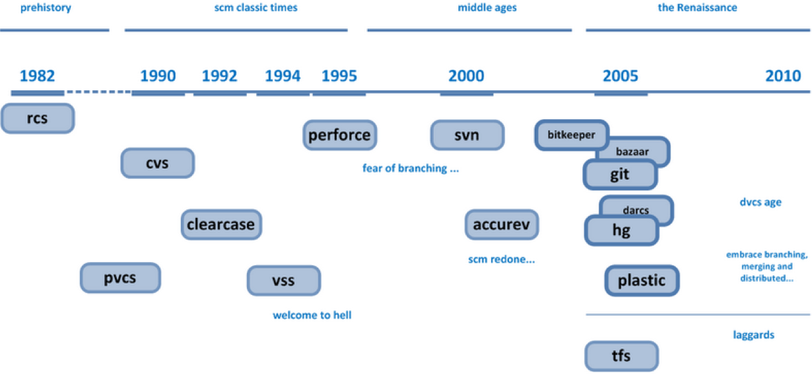
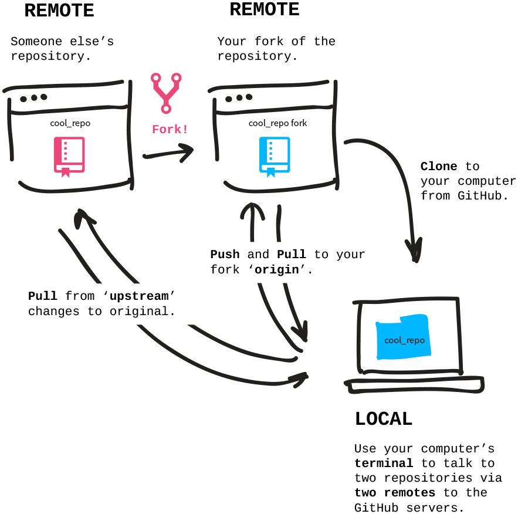

Versioning
==========

> - Version management
> - Backup 
> - History 
> - Provenance


The problem: how to manage ongoing _change_
-------------------------------------------


(source: [PhD comics](http://phdcomics.com/comics/archive.php?comicid=1531))

- Documents go through many versions, over the course of years
- Meanwhile, related files (data, scripts, figures, bibliographies, etc.) are changing as well
- You are probably collaborating with others (coauthors, reviewers, editors, etc.)
- You probably will not know ahead of time which will be the "final" document version

Part of the solution: work in a project-oriented manner
-------------------------------------------------------

**WS Noble**, 2009. A Quick Guide to Organizing Computational Biology Projects. _PLoS Computational Biology_ **5**(7): e1000424. doi:[10.1371/journal.pcbi.1000424](https://doi.org/10.1371/journal.pcbi.1000424)


- Organize your work in projects (e.g. [GTD](https://en.wikipedia.org/wiki/Getting_Things_Done) philosophy)
- Follow consistent naming schemes (e.g. [ISO-8601](https://en.wikipedia.org/wiki/ISO_8601) date format)
- This allows us to plan for open-ended change by date-stamping folders, but: 
  - How to deal with mistakes? 
  - How to "undo"?
  - How to **collaborate**?

Backing up and sharing your projects
------------------------------------


- We are doing local operations (e.g. writing, editing (code, data), analyzing) on a local copy that is
  backed up to a remote folder
- This is roughly the workflow in [dropbox](http://dropbox.com), [google drive](http://drive.google.com) (where 
  synchronization happens as a background process) as well as in centralized version control systems such as 
  [cvs](http://www.nongnu.org/cvs/) and [svn](https://subversion.apache.org/) (where synchronization happens 
  after a "_commit_").
- However, this easily results in _conflicts_: 
  - Multiple people work on their local copies of different files at the same time
  - When synchronization happens, different files (and their versions) may arrive in the wrong order
  - Relationships between files may become scrambled, [race conditions](https://en.wikipedia.org/wiki/Race_condition) may
    arise, etc.

The distributed approach
------------------------


- Everyone takes individual ownership of the consistency of the entire project
- Only after _all_ local changes have been comitted to the local repository do we push the repository "upstream"
- If the upstream repository has changed since the last time the local was synchronized, potential conflicts need to be 
  resolved first
 
`git` - distributed version control
-----------------------------------



- `git` is an approach to distributed version control that was developed to manage the contributions of thousands of 
  people to the source code of Linux.
- There is a standard [command line tool](https://git-scm.com/downloads) for all major operating systems. There are also
  graphical interfaces (which are not that useful), and plug-ins for development tools (such as 
  [RStudio](https://support.rstudio.com/hc/en-us/articles/200532077-Version-Control-with-Git-and-SVN), which is 
  _very_ useful)
- Many websites provide remote hosting for git projects. [GitHub](http://github.com) is a very popular one, but there
  are others, such as [BitBucket](https://bitbucket.org/) or [SourceForge](http://sf.net)

`git` workflow - starting a repository
--------------------------------------



- The first step is to create a repository. This can be:
  - A new repository that you start locally (e.g. `git init .`)
  - A repository you start remotely (e.g. "New repository", top-right menu on GitHub)
  - A repository that you _fork_ remotely (e.g. "Fork" button, top-right, on GitHub)
- Then, if the repository was started or forked _remotely_ you want a local _clone_, e.g.:

```bash
# using HTTPS:
$ git clone https://github.com/<user name>/<project name>.git

# using SSH:
$ git clone git@github.com:<user name>/<project name>.git
```

`git` workflow - adding a file
------------------------------


Let's say I have a file `data.tsv` that I want to add to a repository:

```bash
# I have placed my file in my local repository and check to see if git notices:
$ git status

# response:
On branch master
Your branch is up-to-date with 'origin/master'.
Untracked files:
  (use "git add <file>..." to include in what will be committed)

	data.tsv
```

Now add it:

```bash
$ git add data.tsv
$ git status

# response:
On branch master
Your branch is up-to-date with 'origin/master'.
Changes to be committed:
  (use "git reset HEAD <file>..." to unstage)

	new file:   data.tsv
```

So now the file is ready to be "committed". Let's commit it to our local repository, and
add a message (`-m 'message text goes here`):

```bash
$ git commit -m 'adding file data.tsv' data.tsv

# response:
[master d588593] adding data.tsv
 1 file changed, 0 insertions(+), 0 deletions(-)
 create mode 100644 doc/week2/w2d3/data.tsv

$ git status

# response:
On branch master
Your branch is ahead of 'origin/master' by 1 commit.
  (use "git push" to publish your local commits)
```

Now our file has been incorporated in our _local_ repository. If this is a fork of a remote 
repository we can "push" the file upstream to the remote repo:

```bash
$ git push

# response:
Counting objects: 5, done.
Delta compression using up to 8 threads.
Compressing objects: 100% (5/5), done.
Writing objects: 100% (5/5), 455 bytes | 455.00 KiB/s, done.
Total 5 (delta 4), reused 0 (delta 0)
remote: Resolving deltas: 100% (4/4), completed with 4 local objects.
To github.com:naturalis/mebioda.git
   0f031d6..d588593  master -> master
```

Distributed version control: why?
---------------------------------


- **Infinite undo**, all the way to the beginning of the project
- **Backups** on the servers of the version control host (e.g. github)
- **Explicit history** with messages explaining why files were changed and ways to tag specific versions
- **Distributed collaboration** including mechanisms for experimentation (branches) and resolving conflicts

In addition, _GitHub_ provides for a lot of functionality on top of _git_:

- Project management tools, such as an [issue tracker](https://github.com/naturalis/mebioda/issues)
- Ways to work in the browser instead of the command line (e.g. to 
  [upload](https://github.com/naturalis/mebioda/upload/master) or edit and commit without the command line)
- Ways to test code [automatically](https://travis-ci.org/rvosa/bio-phylo)
- A facility to give a [DOI](https://doi.org/10.5281/zenodo.1010138) to a specific version

Exercise: contributing to the course repository
-----------------------------------------------

> 1. Make an account on github.com if you don't have one already
> 2. Fork the `naturalis/mebioda` repository (top-right button) to your own account
> 3. In your own copy, go to the folder `<user name>/mebioda/data/<student number>` and upload your ENM results
> 4. Create a "pull request" so that your results (in your own repository) are submitted upstream to the course repository
