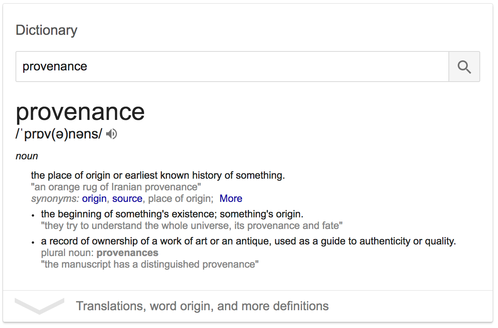
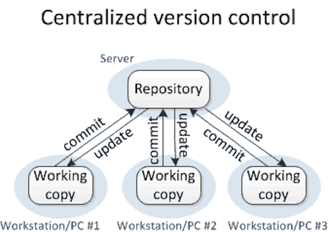
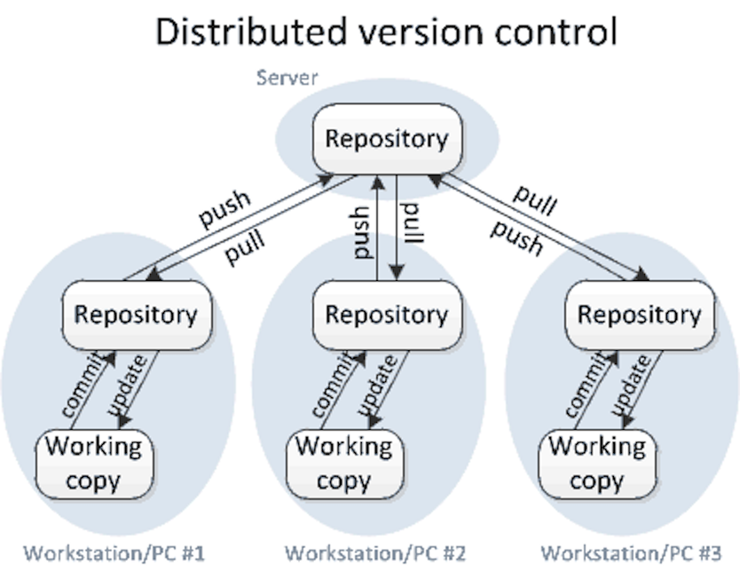
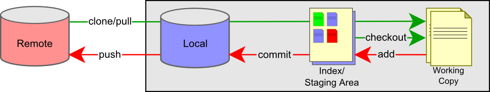

Versioning
==========

> - Version management
> - Backup 
> - History 
> - Provenance

The problem
-----------

(source: [PhD comics](http://phdcomics.com/comics/archive.php?comicid=1531))

Project organization
--------------------

**WS Noble**, 2009. A Quick Guide to Organizing Computational Biology Projects. _PLoS Computational Biology_ **5**(7): e1000424. doi:[10.1371/journal.pcbi.1000424](https://doi.org/10.1371/journal.pcbi.1000424)

- Organize your work in projects (e.g. [GTD](https://en.wikipedia.org/wiki/Getting_Things_Done) philosophy)
- Follow consistent naming schemes
- Plan for open-ended change

Naive approach: a centralized folder
------------------------------------

- Assuming we are doing local operations (e.g. writing, editing (code, data), analyzing) we have a remote 
  folder and a local copy
- This is roughly the workflow in [dropbox](http://dropbox.com), [google drive](http://drive.google.com) (where 
  synchronization happens as a background process) as well as in centralized version control systems such as 
  [cvs](http://www.nongnu.org/cvs/) and [svn](https://subversion.apache.org/) (where synchronization happens 
  after a "_commit_").
- However, this easily results in _conflicts_: 
  - Multiple people work on their local copies of different files at the same time
  - When synchronization happens, different files (and their versions) may arrive in the wrong order
  - Relationships between files may become scrambled, [race conditions](https://en.wikipedia.org/wiki/Race_condition) may
    arise, etc.

The distributed approach
------------------------

- Everyone takes individual ownership of the consistency of the entire project
- Only after _all_ local changes have been comitted to the local repository do we push the repository "upstream"
- If the upstream repository has changed since the last time the local was synchronized, potential conflicts need to be 
  resolved first
 
`git` - distributed version control
-----------------------------------

