GIS and spatial modelling
=========================
Before we start working with GIS and develop species distribution models (SDMs) it is important that 
your PC is configured to deal with international data conventions. Many PCs and laptops have Dutch 
settings, which are different from international conventions; i.e. in Dutch the decimal separator is 
a comma instead of a point (0,23 vs. 0.23). Additionally, a \*.csv (comma separated value) file in Dutch 
uses a semi-colon as record separator, where many applications expect a comma (as the name suggests!).

To ensure that your Windows computer has the correct settings you have to check the 'Region and Language' 
settings of your PC. Go to Control Panel -> Region and Language (Fig. a).

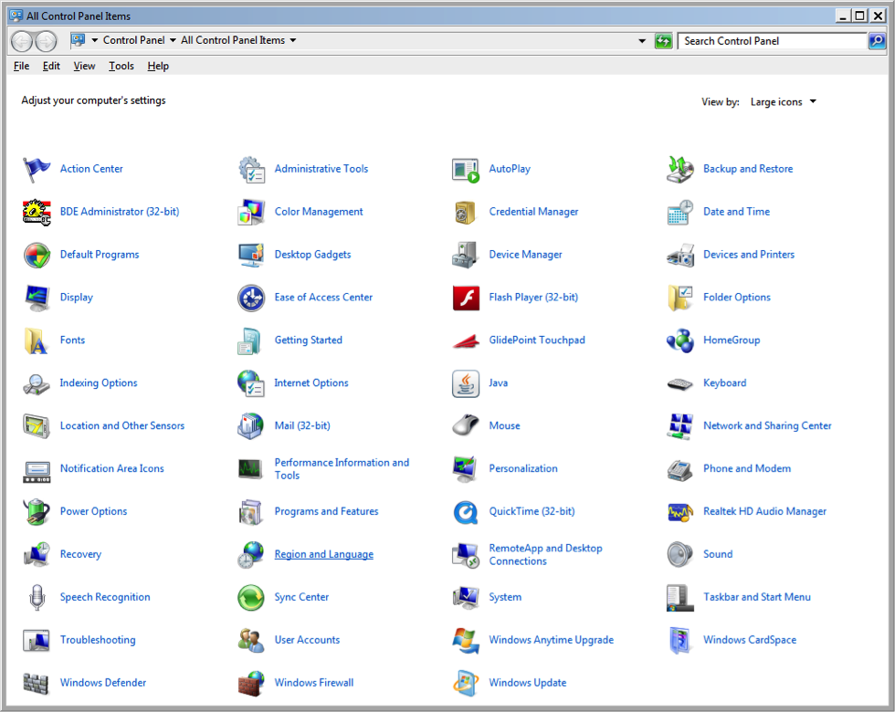

**Figure a. Control Panel with ‘Region and Language’ indicated in the red box.**

If you set the Region and Language -> Format to 'English (United Kingdom)', or you adjust the 'Additional 
settings...' for 'Decimal symbol', 'Digit grouping symbol', and 'List separator' (Fig. b) most applications 
should run correctly.

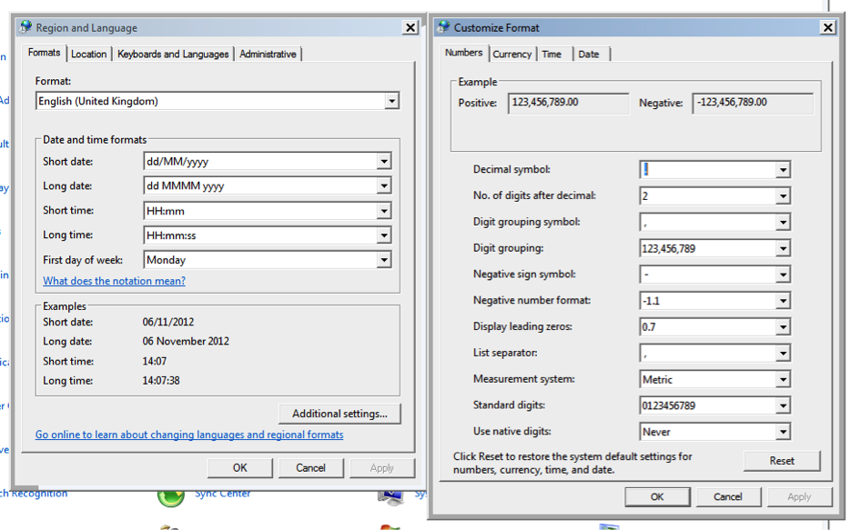

**Figure b. Region and Language settings and Customize format in the Control Panel.**

1 Creating point locality maps with DIVA-GIS
----------------------------------------------
### Developing a base map with country boundaries

1. Download DIVA-GIS from http://www.diva-gis.org/. For full functionality also download the climate 
   data http://www.diva-gis.org/climate. As an optimal trade-off between functionality and resolution 
   it is suggested to use the 5 arc-minutes dataset. This is approximately 9.3 × 9.3 km resolution at the 
   equator. Extract the environmental data to the folder 'environ' in the DIVA-GIS program folder (E.g. 
   `C:\Program Files (x86)\DIVA-GIS\environ\` on Windows).
2. Check whether the environmental data are available by opening the DIVA-GIS menu option Tools -> Options 
   -> tab 'Climate' → navigate to environ folder → Make default → restart DIVA-GIS. **NOTE:** To save 
   information on `C:\` requires administrator rights on your PC. You can achieve this by right click on 
   diva.exe or the DIVA-GIS shortcut and choose 'run as administrator' (saving on other discs in other 
   directories works as well).
   
   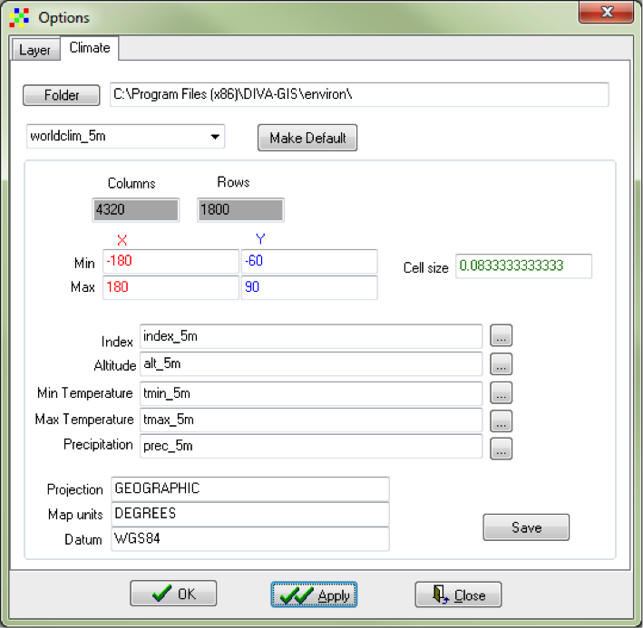
   
   **Figure 1. Options dialog window; climate tab.**
   
3. Download administrative data such as country boundaries, rivers, roads, etc. These data are freely 
   available at http://www.diva-gis.org/gdata. Several data portals provide free GIS data, e.g. 
   http://freegisdata.rtwilson.com/, http://www.fao.org/geonetwork/srv/en/main.home, 
   http://geonetwork.grid.unep.ch/geonetwork/srv/en/main.home or http://www.gadm.org/. Download the 
   Administrative areas for Indonesia, Malaysia and Brunei Darussalam.
   
   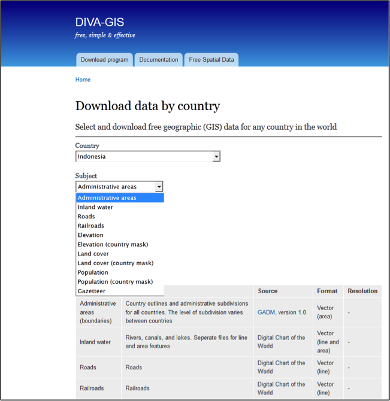
   
   **Figure 2. Snapshot from gData website - http://www.diva-gis.org/gdata.**
   
4. Extract the zip files.
5. Add the vector shape files. Open menu-option Layer → Add layer → select the level IDN0 file. 
   Repeat this action for the MYS0 and BRN0 files. (Alternatively, download all country boundaries 
   via http://biogeo.ucdavis.edu/data/world/countries_shp.zip).
   
   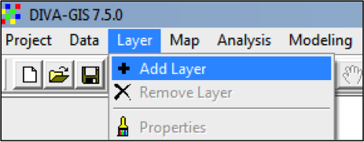
   
   **Figure 3. Add a layer to you GIS project. Left: menu-option, right: toolbar button.**
   
6. You can change the order of the layers by dragging and dropping the layers in the left panel. 
7. Right-click one of the layers and choose 'Add to overview map' to get the spatial overview in 
   the lower left corner (Fig. 4).

   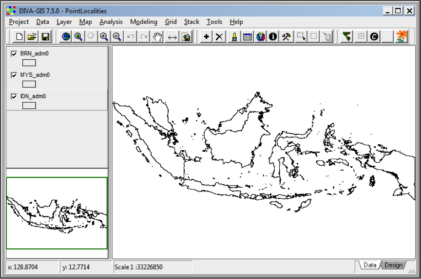
   
   **Figure 4. DIVA-GIS project with 3 shapefile layers. The lower left corner shows the overview.**
   
8. Save the project as PointLocalities.div

### Add collections as point file

One of the most straightforward uses of a GIS is to visualize geographic data. Here we are going to 
add collection localities of records of the plant genus _Macaranga_ to the island Borneo. In order to 
display the collection records they need to be georeferenced, or supplied with geographical coordinates. 
Coordinates are found in different formats such as degrees-minutes-seconds, degrees-decimal minutes, or 
decimal degrees. The required GIS format is decimal degrees because this requires only one number for 
both latitude and longitude (instead of 2 or 3). You can find the coordinates of most localities in 
printed and/or online gazetteers:

- La Tierra gazetteer - http://www.tutiempo.net/Tierra/.
- NGA GEOnet Names Server (GNS) - http://geonames.nga.mil/gns/html/.
- Google Earth and Maps - https://maps.google.com/.
- Fuzzy Gazetteer - http://isodp.hof-university.de/fuzzyg/query/.

If you only have coordinates in degrees-minutes-seconds you can convert them to decimal degrees with 
an online tool provided by Directions Magazine - http://www.directionsmag.com/site/latlong-converter/. 
It is easiest to prepare your species file in a spreadsheet programme like MS Excel or Open Office 
Calculator. Another option is to directly export from a database query.

1. Open the file Macaranga.xls
2. DIVA-GIS can open Excel 97-2003 .xls files (not Excel 2010 or .xlsx files). Thus save as Excel 
   97-2003 (.xls) if necessary.
3. Open menu option Data -> Import Points to Shapefile -> From Excel (.XLS) (Figs. 5 & 6). Press button 
   'Excel spreadsheet' and navigate to the file location. Take care that the fields longitude and 
   latitude are identified correctly. Save to Shapefile (e.g. Macaranga.shp). This takes some time. 
   Close file when finished.
   
   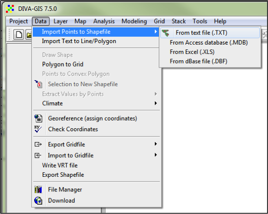
   
   **Figure 5. Import points to Shapefile.**
   
   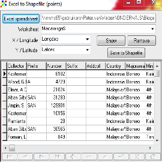
   
   **Figure 6. Create Shapefile from Excel.xls File.**
   
4. Double-click the Macaranga layer in the left panel to open the properties panel. Activate the 
   tab 'Unique' -> select the Field 'SPECIES' -> click the 'Reset Legend' button (Fig. 7) -> Apply. 
   You can also use the toolbar button in the red circle to open the properties panel.
   
   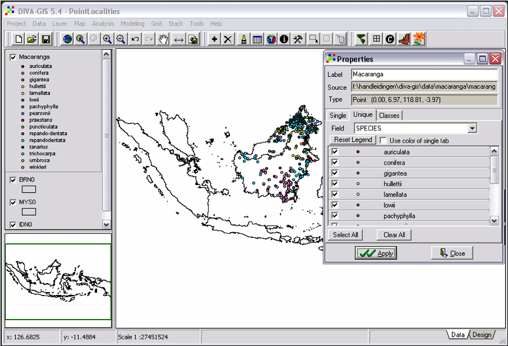
   
   **Figure 7. Change the properties of a layer.**
   
5. Click the circle symbol of one of the species in the properties panel to change the type of symbol, 
   size, colour, etc. If you want a special symbol then select character and choose a special font 
   (i.e. ESRI ArcView Cartography http://www.creamundo.com/es/e/5).

### Print image

1. To make a printable image it is first required to zoom to desired extent. In this case to the 
   island of Borneo. Select the Macaranga-layer and click the button 'Zoom To Theme' on the toolbar. 
   Experiment with this toolbar, i.e. activate different layers and use different buttons.
   
   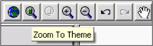
   
   **Figure 8. Zoom buttons from the toolbar.**
   
2. Click the 'Design' tab in the lower right corner of the window and click the OK-button (Fig. 9).

   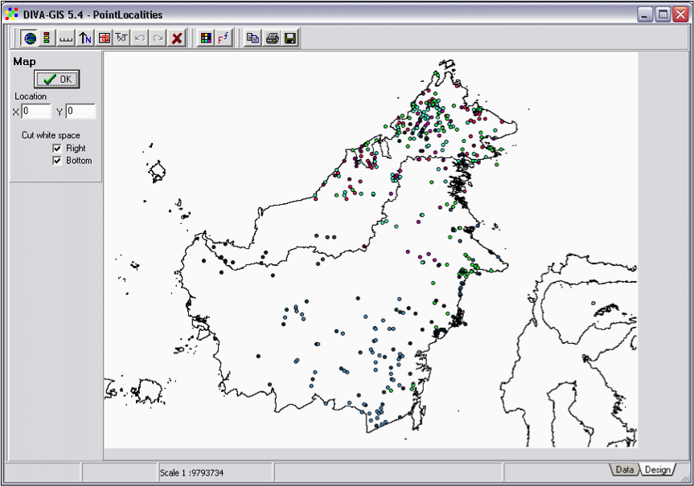
   
   **Figure 9. The ‘Design’ window, note lower right corner.**
   
3. Add a Legend, North arrow, and Scale bar. Click until the components are located at the desired 
   position. Then delete all items by clicking the delete button (red cross), and add them again. The 
   items will appear at the correct position.
4. Save the image as \*.tiff using the 'Save to file' button. 

NOTE: Additional information on DIVA-GIS can be found in the manual (http://www.diva-gis.org/docs/DIVA-GIS_manual_7.pdf).
