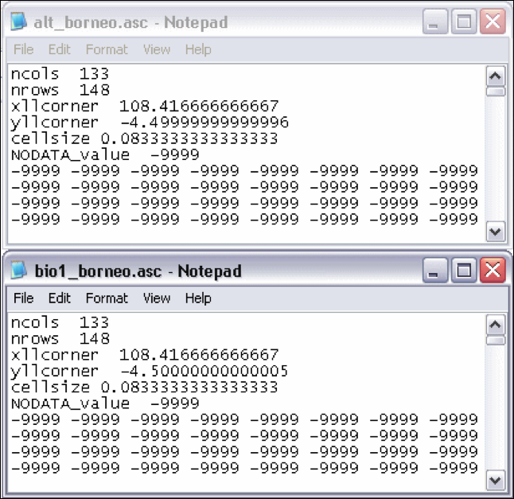
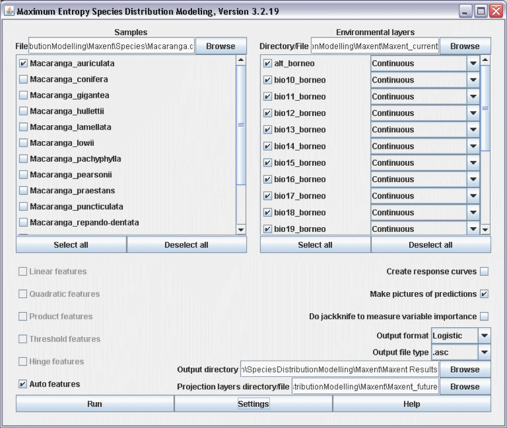
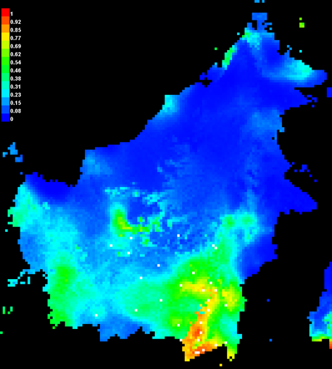
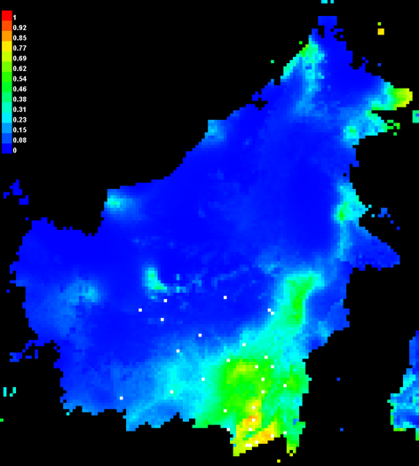

4 Projecting species distribution models to future and past climate scenarios, and to different geographical regions
====================================================================================================================
In the previous chapters you learned how to: 

1. [create the species presence file](../1_Pointdata)
2. [download and prepare your environmental datasets](../2_Data_layers), and 
3. [to develop species distribution models](../3_Modelling). 

Species distribution models identify the relationship between the presence-only species records and 
the environmental data, and interpolate these relationships to your research area. Once the 
relationships are identified they can also be projected to environmental data of other time 
periods, i.e. the last glacial maximum of future IPCC climate change scenarios. Before you can 
start using these data you'll have to download them, or construct them yourself.

### Future and past climate data

Future climate data sets are widely available nowadays. Important sources are the 
[Downscaled GCM Data Portal](http://www.ccafs-climate.org/data/) and 
[Worldclim](http://www.worldclim.org/CMIP5) data sets. Future data sets of Worldclim provide data 
as \*.tiff, which is not compatible with DIVA-GIS. For past climate scenarios, data are more scarce 
but are available from http://www.worldclim.org/past. You can also develop your own future 
climate data by assuming e.g. temperature rise of 5 degrees, as is explained below.

1. Open the DIVA-GIS file you developed in [Chapter 3](../3_Modelling).
2. Download the 19 Bioclim variables from the [Downscaled GCM Data Portal](http://www.ccafs-climate.org/data/). 
   Select, on the left under File Set, 'Delta Method IPCC AR5' (Intergovernmental Panel on Climate 
   Change fifth Assessment Report), under Scenario 'RCP 4.5' (Reprensentative Concentration Pathways 
   with 4.5 Wm2 radiative forcing, CO2 ppm 650, Temp 2.4 °C), under Model 'mohc-hadgem2-es' (Met 
   Office Hadley Centre - Hadley Global Environment Model 2 – Earth System), then above, under 
   Extent 'Global', under Format 'ASCII Grid Format', under Period '2050s', under Variable 
   'Bioclimatics', and under Resolution '5 minutes', then press Search. Select the zip file, provide 
   your details, and download via the appearing link at the bottom. These files are in ASCII format. 
3. Import the grid data layers for the future climate data from the zip file. This dataset spans the 
   entire Southeast Asian region. Also import the alt_borneo.grd from chapter 2. Make a stack of the 
   future climate data and use the alt_borneo.grd to cut the future climate data to the extent of 
   Borneo. Add the cut future climate data layers.

Now we have all data layers cut to the extent of Borneo for both current and future climatic conditions. 
The next step will be to model the _Macaranga_ species models and project them on the future data set. 
The only requirement of Maxent is that the file names for corresponding data layers need to have the 
same file names. So, we'll have to export the data layers as ESRI ASCII files and rename all future 
climate data layers to alt_borneo.asc, bio1_borneo.asc, etc.

4. Make a folder named 'Maxent_current' and copy all current climatic data layers to this folder.
5. Make a folder 'Maxent_future' and copy all future renamed climate data to this folder. Also add a 
   copy of alt_borneo.asc. Both folders should have the same file names now.
6. Check whether all headers are the same of the future climate data layers. Open the alt_borneo.asc 
   and bio1_borneo.asc. As you can see in Fig. 18 they are almost the same but not exactly. The 
   headers of all data layers in one set must be the same. Copy the header of bio01_borneo.asc to 
   alt_borneo.asc.
   
   
   
   **Figure 18. Small but important difference in the headers.**

7. Open Maxent and load the species file, the current data layers, the Output directory, and finally 
   browse to the folder 'Maxent future' with the 'Browse'-button next to the field 'Projection layers 
   directory/file'. Click 'Run' (Fig. 19).
   
   
   
   **Figure 19. Projecting a Maxent model to a future climate data set.**
   
8. Open the Macaranga_auriculata.html file and check the future distribution of _M. auriculata_ 
   (Fig. 20).
   
   
   
   
   **Figure 20. The present and future distribution of _M. auriculata_.**

