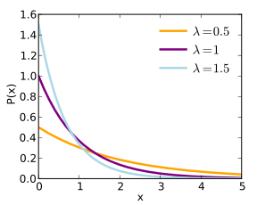
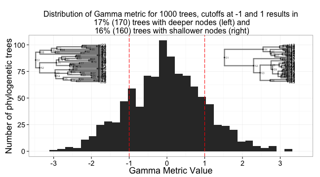
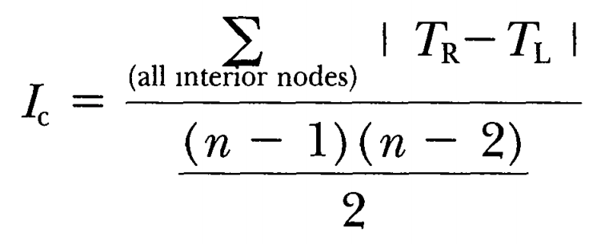
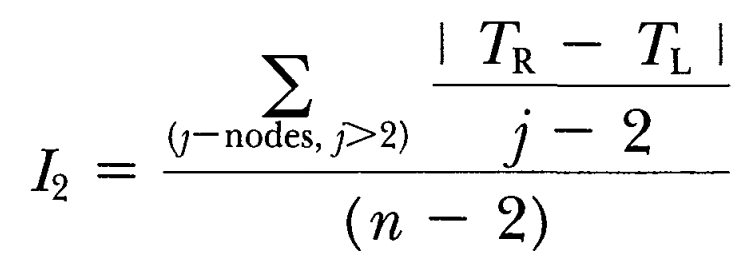
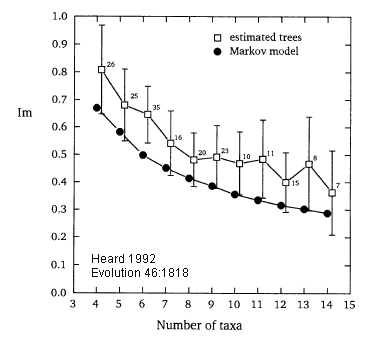

Simple tree shape metrics: imbalance, branchiness
=================================================

The Yule process revisited
--------------------------
- We've previously seen the Yule process in the context of species delimitation, where
  certain algorithms (e.g. GMYC) attempt to find the inflection point between 
  diversification (Yule) and population-genetic (Coalescent) processes.
- The process assumes that every lineage is equally likely to speciate at any given time.
- Hence, the more lineages there are, the shorter the waiting time till the next 
  speciation, because there are more lineages playing the lottery.
- The average expected waiting time will the next speciation is therefore 1/_n_ (or any
  given waiting time, when simulating, is drawn from an exponential distribution).



Birth/death processes
---------------------
- In the simplest birth/death processes, an additional parameter determines the 
  probability with which every lineage is to go extinct at any given time.
- The _net diversification rate_ is thus `speciation - extinction`.
- (In simulations this rate should obviously be positive, so the extinction rate should
  be smaller than the birth rate in order for there to 
  [grow a tree](http://naturalis.github.io/browbrow).)
  


Diversification through time
----------------------------
But, is net diversification rate (speciation-extinction) constant through time? We might
expect 
[ecological opportunities to arise, triggering adaptive radiations](https://www.nature.com/scitable/knowledge/library/ecological-opportunity-trigger-of-adaptive-radiation-84160951),
processes that we might visualize, qualitatively, as lineage-through-time plots:


- (A) Even rates through time, the null hypothesis for patterns of diversification 
  (γ = 0.05). 
- (B) Early burst of cladogenesis and species accumulation, the expected pattern under 
  Ecological Opportunity (γ = -3.39). 
- (C) Late burst of speciation or early extinction (γ = 3.20).

The tendency of nodes
---------------------
**Pybus, OG & Harvey, PH**, 2000. Testing macro-evolutionary models using incomplete 
molecular phylogenies. _Proc. R. Soc. Lond. B_ 267, 2267-2272



- A tree branching under a constant-rates model should have a balance of node depths γ 
  around the midpoint (in depth) of the tree
- This γ is normally distributed around a mean of zero. Negative values capture early
  diversification, positive values capture, either, late diversification or higher 
  extinction, especially early on.

```R
library(ape)
tree <- read.tree(text="((A:0.5,B:0.5):1,C:1.5);")
gamma <- gammaStat(tree)

# P-value for two-tailed test of deviation
2*(1 - pnorm(abs(gamma)))

# one-tailed test
1 - pnorm(abs(gamma))
```

Lineage-specific processes
--------------------------
Numerous other metrics have been developed to capture the extent to which nodes are 
concentrated near the tips or near the root, e.g.:

- **Fiala, KL and RR Sokal**, 1985. Factors determining the accuracy of cladogram 
  estimation: evaluation using computer simulation. _Evolution_, 39: 609-622
- **Rohlf, FJ, WS Chang, RR Sokal, J Kim**, 1990. Accuracy of estimated phylogenies: 
  effects of tree topology and evolutionary model. _Evolution_, 44(6): 1671-1684

However, these metrics do not capture whether there are imbalances between lineages, e.g.
because one is (heritably?) more likely to diversify:


Colless' imbalance
------------------
**Colless, DH**, 1982. The theory and practice of phylogenetic systematics. 
_Systematic Zoology_ 31(1): 100-104



Add up, for all (_n_-1) nodes in a tree with _n_ tips, the absolute difference between
the tips subtended by the child "on the left" and that of the child on the right
(i.e. | _T_<sub>R</sub> - _T_<sub>L</sub> |). Then, normalize this value by dividing
through the maximum value for a tree that size, which is ((_n_-1)*(_n_-2))/2

This value can be computed in R using `ape` and `apTreeShape` thusly:

```R
library(ape)
library(apTreeshape)
tree <- read.tree(text="((A,B),C);")
aptree <- as.treeshape(tree)
ic <- colless(aptree)
```

I2 imbalance
------------
**Mooers AO & Heard SB**, 1997. Inferring evolutionary process from phylogenetic tree 
shape. _Quarterly Review of Biology_ 72: 31–54.



A perhaps reasonable critique of the _I_<sub>C</sub> index is that it weights "deep"
nodes heavier (consider how the diff between left and right may be much higher for deep
nodes than for shallow ones). An alternative index might therefore, as in this case,
normalize each node right away using _j_ = the number of tips subtended by the focal 
node.

Which one might compute, for example, thusly:

```perl
use Bio::Phylo::IO 'parse_tree';
$ic = parse_tree(
	'-format' => 'newick',
	'-string' => '((A,B),C);',
)->calc_i2;
```

Simulating sets of trees with different topological properties
--------------------------------------------------------------
Scott Chamberlain, of [rOpenSci](http://ropensci.org) has developed a nice RMarkdown
document that demonstrates [simulating](lecture2/2012-10-10-phylogenetic-tree-balance.Rmd)
sets of trees, filtered for different tree topology metrics. See what the distributions
look like if the input trees aren't Yule but birth/death.

Empirical results for tree balance
----------------------------------
