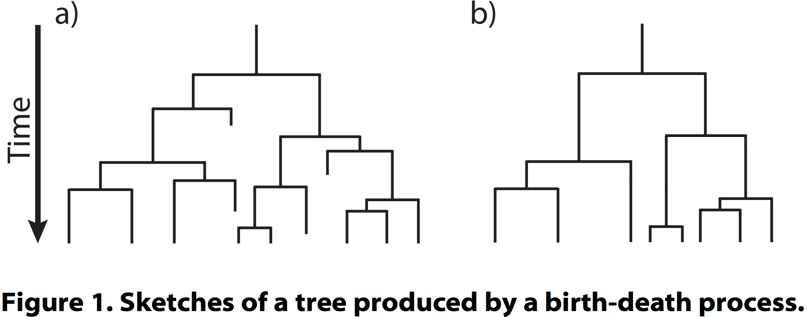

Inferences from tree shape
==========================

The birth/death process revisited
---------------------------------
**Nee, S, May, RM & Harvey, PH**, 1994. The reconstructed evolutionary process. 
_Philos Trans R Soc Lond B Biol Sci_ **344**:305-311



- In the simplest case, there are two constant parameters: speciation rate (lambda, λ) and 
  extinction rate (mu, μ)
- [Maximum likelihood estimation](https://en.wikipedia.org/wiki/Maximum_likelihood_estimation)
  using the method of Nee et al. (1994) optimizes over `μ/λ` (or `d/b`, turnover) and
  `λ-μ` (`b-d`, net diversification)

Estimating birth/death parameters in ape
----------------------------------------
MLE of λ and μ can be obtained, for example, using `ape` in R:

```r
library(ape)
phy <- read.tree(file="PhytoPhylo.tre")

# make tree binary and ultrametric
binultra <- multi2di(force.ultrametric(phy, method = "extend"))

# fit birth/death
birthdeath(binultra)
```

Resulting in:

```
Estimation of Speciation and Extinction Rates
            with Birth-Death Models

     Phylogenetic tree: binultra 
        Number of tips: 31389 
              Deviance: -392698.6 
        Log-likelihood: 196349.3 
   Parameter estimates:
      d / b = 0.9279609   StdErr = 0.001968166 
      b - d = 0.02020561   StdErr = 0.0005033052 
   (b: speciation rate, d: extinction rate)
   Profile likelihood 95% confidence intervals:
      d / b: [0.9265351, 0.9293592]
      b - d: [0.01985037, 0.02056618]
```

Estimating birth/death parameters in phytools
---------------------------------------------

```r
library(phytools)
library(ape)
phy <- read.tree(file="PhytoPhylo.tre")

# make tree binary and ultrametric
binultra <- multi2di(force.ultrametric(phy, method = "extend"))

# fit birth/death
fit.bd(binultra)
```

Resulting in:

```
Fitted birth-death model:

ML(b/lambda) = 0.2805 
ML(d/mu) = 0.2603 
log(L) = 196349.2855 

Assumed sampling fraction (rho) = 1 

R thinks it has converged.
```
