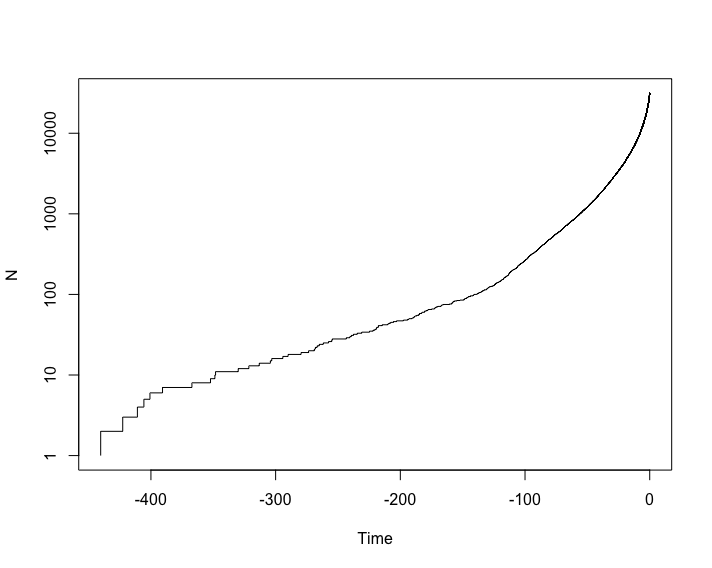
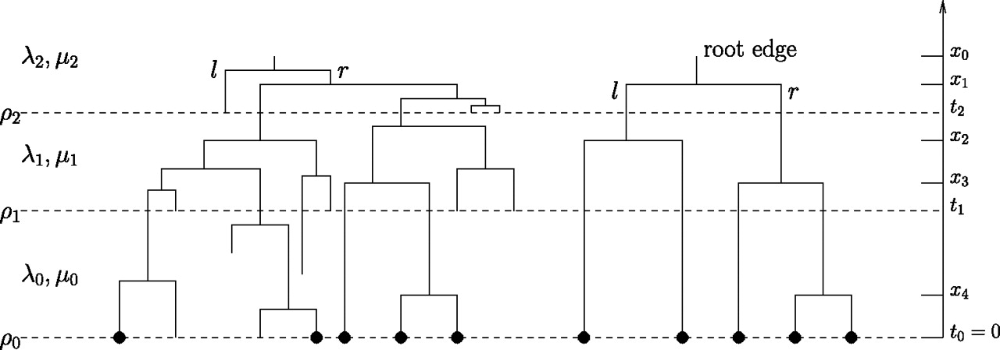
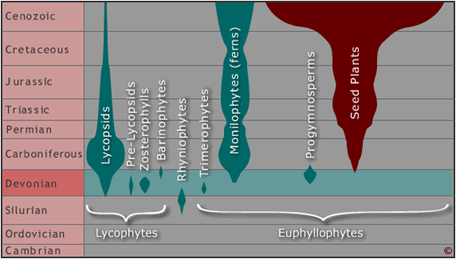
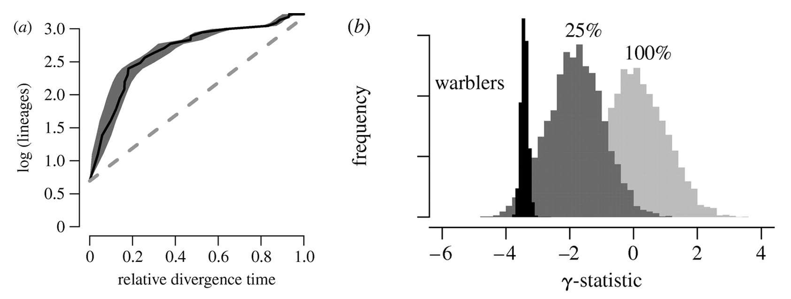

Inferences from tree shape
==========================

The birth/death process revisited
---------------------------------
**Nee, S, May, RM & Harvey, PH**, 1994. The reconstructed evolutionary process. 
_Philos Trans R Soc Lond B Biol Sci_ **344**:305-311


- In the simplest case, there are two constant parameters: speciation rate (lambda, λ) and 
  extinction rate (mu, μ)
- [Maximum likelihood estimation](https://en.wikipedia.org/wiki/Maximum_likelihood_estimation)
  using the method of Nee et al. (1994) optimizes over `μ/λ` (or `d/b`, turnover) and
  `λ-μ` (`b-d`, net diversification)

Estimating birth/death parameters in ape
----------------------------------------
MLE of λ and μ can be obtained, for example, using `ape` in R:

```r
library(ape)
phy <- read.tree(file="PhytoPhylo.tre")

# make tree binary and ultrametric
binultra <- multi2di(force.ultrametric(phy, method = "extend"))

# fit birth/death
birthdeath(binultra)
```

Resulting in:

```
Estimation of Speciation and Extinction Rates
            with Birth-Death Models

     Phylogenetic tree: binultra 
        Number of tips: 31389 
              Deviance: -392698.6 
        Log-likelihood: 196349.3 
   Parameter estimates:
      d / b = 0.9279609   StdErr = 0.001968166 
      b - d = 0.02020561   StdErr = 0.0005033052 
   (b: speciation rate, d: extinction rate)
   Profile likelihood 95% confidence intervals:
      d / b: [0.9265351, 0.9293592]
      b - d: [0.01985037, 0.02056618]
```

Estimating birth/death parameters in phytools
---------------------------------------------

```r
library(phytools)
phy <- read.tree(file="PhytoPhylo.tre")

# make tree binary and ultrametric
binultra <- multi2di(force.ultrametric(phy, method = "extend"))

# fit birth/death
fit.bd(binultra)
```

Resulting in:

```
Fitted birth-death model:

ML(b/lambda) = 0.2805 
ML(d/mu) = 0.2603 
log(L) = 196349.2855 

Assumed sampling fraction (rho) = 1 

R thinks it has converged.
```

Quick sanity check
------------------

Save for some differences in rounding, the results are identical:
- Log likelihoods are ± identical: 196349.3 (`ape`), 196349.2855 (`phytools`)
- μ/λ = 0.9279609 (`ape`), 0.2603/0.2805 = 0.927985739750446 (`phytools`)
- λ-μ = 0.02020561 (`ape`), 0.2805-0.2603 = 0.0202 (`phytools`)

```r
library(phytools)
phy <- read.tree(file="PhytoPhylo.tre")

# make tree binary and ultrametric
binultra <- multi2di(force.ultrametric(phy, method = "extend"))

ltt.plot(binultra,log="y")
```

Resulting in:



Is rate constant through time?
------------------------------
**Stadler T**, 2011. Mammalian phylogeny reveals recent diversification rate shifts.
_PNAS_ **108**(15): 6187–6192



- Maybe diversification rates globally change as a function of some environmental 
  variable, e.g. climate
- In this model, speciation (λ) and extinction (μ) can have different value within 
  different time windows
- To allow for incomplete extant taxon sampling, an additional parameter (rho, ϱ) 
  captures the completeness of the sampling

```r
library(phytools)
library(TreePar)
phy <- read.tree(file="PhytoPhylo.tre")

# make tree binary and ultrametric
binultra <- multi2di(force.ultrametric(phy, method = "extend"))

# assume a near complete tree, rho[1]=0.95
rho <- c(0.95,1)

# set windows of 100myr, starting 0, ending 400myr
grid <- 100
start <- 0
end <- 400

# estimate time, lambda, mu
res <- bd.shifts.optim(x,c(rho,1),grid,start,end)[[2]]
```

Interpreting the results
------------------------
The result object looks like this:

```r
> res
[[1]]
[1] 9.726584e+04 9.315585e-01 2.021164e-02

[[2]]
[1] 9.724484e+04 9.265107e-01 9.788873e-01 2.160713e-02 8.541232e-03 1.000000e+02

[[3]]
[1] 9.724243e+04 9.263011e-01 9.811704e-01 9.786497e-01 2.164689e-02 7.707626e-03 3.369398e-02
[8] 1.000000e+02 4.000000e+02
```

The MLE of a single rate shift is:

```r
> res[[2]][6]
[1] 100
```

The rate _before_ the shift is:

```r
> res[[2]][5]
[1] 0.008541232
```

The rate _after_ the shift is:

```r
> res[[2]][4]
[1] 0.02160713
```

Is the result significant?
--------------------------

Test if one shift explains the tree significantly better than no shifts: if test > 0.95 
then one shift is significantly better than 0 shifts at a 5% error:

```r
> i<-1
> test<-pchisq(2*(res[[i]][1]-res[[i+1]][1]),3)
> test
[1] 1
```

How about two shifts?

```r
> i<-2
> test<-pchisq(2*(res[[i]][1]-res[[i+1]][1]),3)
> test
[1] 0.8152525
```

So, we estimate a single rate shift at 100MYA, with a low net diversification rate before 
the shift, and a higher rate afterwards. This meshes with our [LTT](lecture3/ltt.png) plot
and our general understanding of the diversification of seed plants:



Density-dependent diversification
---------------------------------
**DL Rabosky & IJ Lovette**, 2008. Density-dependent diversification in North American 
wood warblers. _Proc. R. Soc. B_ **275**:2363-2371



- (a) Log-lineage through time (LTT) plot for North American wood warblers. Black line 
  indicates LTT curve for the MCC tree (figure 1), and grey shading indicates 
  95% quantiles on the number of lineages at any point in time as inferred from the 
  posterior distribution of phylogenetic trees sampled with MCMC. The dashed line 
  indicates expected rate of lineage accumulation under constant-rate diversification 
  with no extinction. Lineages accumulate quickly in the early phases of the radiation 
  relative to the constant-rate diversification model. 
- (b) Posterior distribution of the γ-statistic for wood warblers (black) in comparison 
  with the corresponding null distributions, assuming either complete (f=1) or incomplete 
  (f=0.25) sampling. Negative values of γ relative to the null distribution indicate 
  decelerating diversification through time.

More exercises with simulated data are [here](lecture3/01-Macroevolution.Rmd).