Phylogenetic comparative analysis
=================================

The problem: non-independence in comparative analysis
-----------------------------------------------------

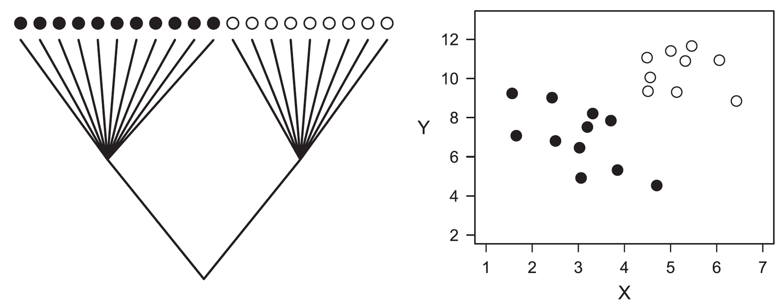

The problem of analyzing phylogenetically structured data with conventional statistical 
methods. Ignoring phylogeny, one would conclude that X and Y are positively correlated 
([Pearson _r_](https://en.wikipedia.org/wiki/Pearson_correlation_coefficient) = 0.48, 
2-tailed _P_ = 0.034), when in fact this relationship emerges primarily from the high 
divergence in X and Y between the two clades at the root of the phylogeny.

False positives (type I errors)
-------------------------------

Increased [type I error](https://en.wikipedia.org/wiki/Type_I_and_type_II_errors) rates 
of conventional statistics in analyses of interspecific data. When two traits evolve 
independently along a phylogeny according to Brownian motion, the probability of 
rejecting the null hypothesis of no correlation (type I error) increases with the amount 
of phylogenetic structure of the data.  


Simulations with a star phylogeny result in the error rates of 5%, which is the expected 
type I error rate if conventional (nonphylogenetic) analyses are used. 


The shaded area represents simulations where the resulting ordinary Pearson coefficient 
falls above the tabular critical value of +0.476 (11 degrees of freedom), which would 
incorrectly suggest that the two traits are correlated.

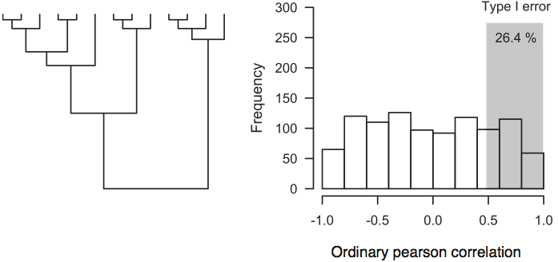

Type I error rates can be higher than 25% if the data shows a strong phylogenetic 
structure.

Brownian motion
---------------

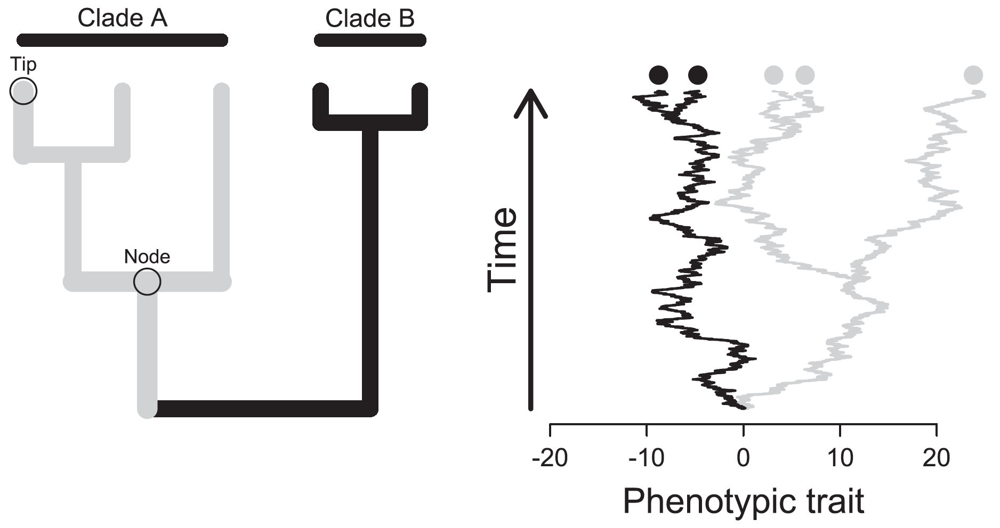

- A hypothetical phylogeny representing the evolutionary relationships among five species,
  and its consequences at the level of phenotypic variation. Given the hierarchical 
  patterns of relatedness among species, phenotypic data in comparative studies may not 
  necessarily provide independent sources of information, as shown for the two pairs of 
  closely related species that are phenotypically very similar. 
- Consequently, patterns of phenotypic resemblance may be interpreted as evidence of 
  evolutionary convergence (adaptation) when in fact they reflect common ancestry. 
- For this particular example, phenotypic evolution proceeded as a random walk (i.e., a 
  Brownian motion model of evolution).

Brownian simulation
-------------------

Here is some code to perform discrete-time (non-phylogenetic) Brownian motion simulation:

```r
# discrete time BM simulation
n<-100; t<-100; sig2<-1/t # set parameters
time<-0:t
X<-rbind(rep(0,n),matrix(rnorm(n*t,sd=sqrt(sig2)),t,n))
Y<-apply(X,2,cumsum)
plot(time,Y[,1],ylim=range(Y),xlab="time",ylab="phenotype", type="l")
apply(Y,2,lines,x=time)
```

And here is the result:

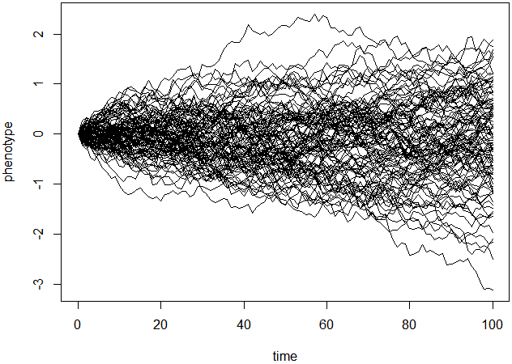

Independent contrasts
---------------------

Calculation of phylogenetic independent contrasts for two hypothetical variables X and Y.
Contrasts estimate the amount of phenotypic divergence across sister lineages 
standardized by the amount of time they had to diverge (the square root of the sum of the 
two branches).

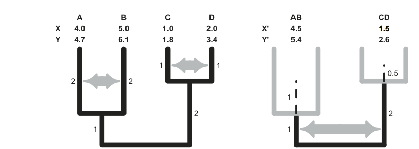

The algorithm runs iteratively from the tips to the root of the phylogeny, transforming 
_n_ phenotypic measurements that are not independent in _n_–1 contrast that are 
statistically independent. Because phenotypic estimates at intermediate nodes (X' and Y') 
are not measured, but inferred from the tip data, divergence times employed to calculate 
these contrasts include an additional component of variance that reflects the uncertainty 
associated with these estimates. In practice, this involves lengthening the branches 
(dashed lines) by an amount that, assuming Brownian motion, can be calculated as:

    (daughter branch length 1 × daughter branch length 2)
    ----------------------------------------------------- 
    (daughter branch length 1 + daughter branch length 2)

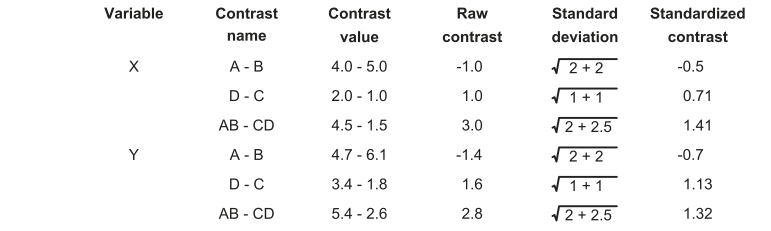

Contrasts results and statistical analysis
------------------------------------------

As a result, the association between the hypothetical phenotypic variables X and Y 
analyzed employing conventional statistics and independent contrasts may seem remarkably 
different. Because independent contrasts estimate phenotypic divergence after speciation 
and are expressed as deviations from zero (i.e., the daughter lineages were initially 
phenotypically identical), correlation and regression analyses employing contrasts do not 
include an intercept term and must be always calculated through the origin.

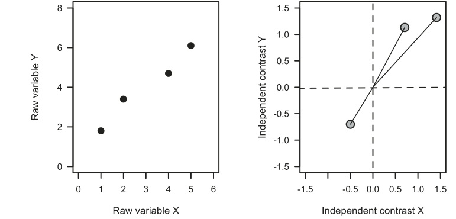

Note that the sign of each contrast is arbitrary; hence many studies have adopted the 
convention to give a positive sign to contrasts in the x-axis and invert the sign of the 
contrast in the y-axis accordingly (this procedure does not affect regression or 
correlation analyses through the origin). Even though the classic algorithm to calculate 
contrasts neglects important sources of uncertainty such as individual variation and 
measurement error, recent methods can account for these sources of error.

[R/_ape_ tutorial for independent contrasts](https://www.r-phylo.org/wiki/HowTo/Phylogenetic_Independent_Contrasts)

Independent contrasts drawbacks
-------------------------------

- Tree needs to be fully bifurcating (otherwise, which against which for the contrast?)
- Data points (_n_-1) no longer represent species, but the differences between them (so, 
  how to detect if any particular species or group is exceptional?)
- Also, how to do more complex modeling and hypothesis testing? Maybe there are better
  approaches?

An example case
---------------

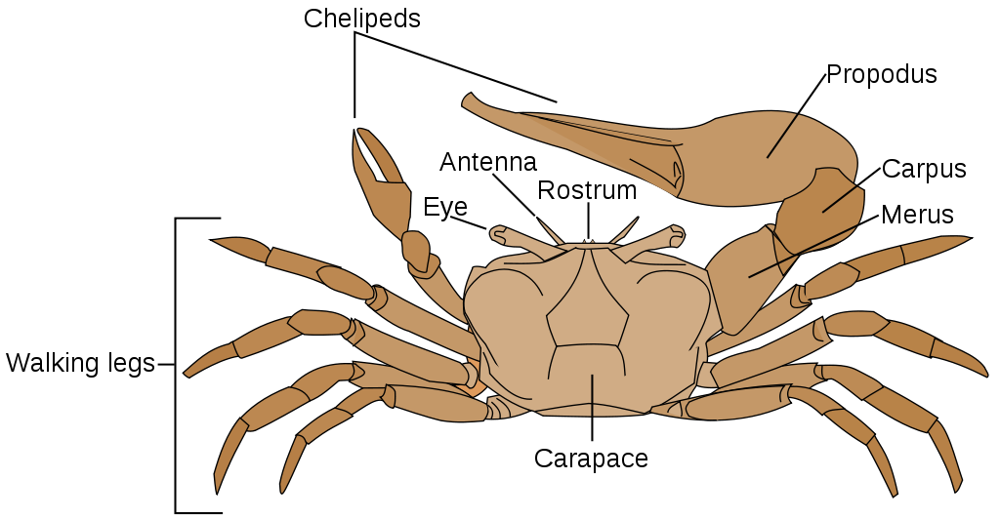

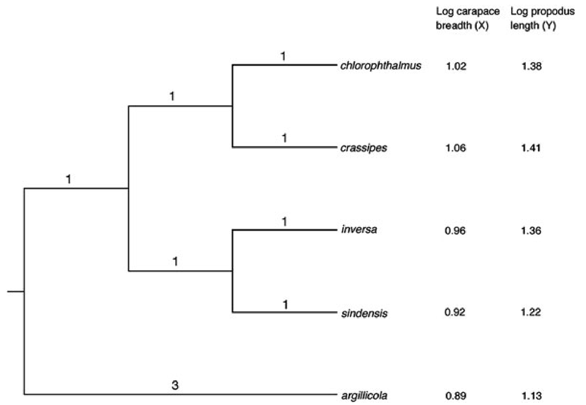

Ordinary least squares
----------------------

In an **ordinary least squares** (OLS) regression model, the relationship of a
response variable _Y_ to a predictor variable _X_<sub>1</sub> can be given using the 
regression equation:


- _b_<sub>0</sub> is the intercept value of the regression equation, 
- _b_<sub>1</sub> is the parameter estimate (the slope value) for the predictor 
- _ε_ is the residual error (i.e. for a given point, how far it falls off the regression 
  line).

For a simple regression with one predictor (_X_), the slope of the regression line
_b_<sub>1</sub> is given by:


- _n_ is the sample size
- _X<sub>i</sub>_ is the _i_ th value of _X_ (up to the last value _X<sub>n</sub>_)
- _X&#772;_ represents the mean value of _X_ (0.97)
- Likewise for _Y<sub>i</sub>_ and _Y&#772;_ (1.30)

The intercept _b_<sub>0</sub> then follows:


Generalizing the model: the variance-covariance matrix
------------------------------------------------------

In the case of OLS, the implicit assumption is that there is no covariance between 
residuals (i.e. all species are independent of each other, and residuals from closely 
related species are not more similar on average than residuals from distantly related 
species).

This (_n_ x _n_) variance–covariance matrix is denoted as **C**, and for five species 
under the assumption of no phylogenetic effects on the residuals, it looks like:


- The first row and first column represent values from comparisons with the first
  species (in our case _Uca chlorophthalmus_), the second row and column with 
  _Uca crassipes_, and so on. 
- Hence, the diagonal elements (the line of values from top left to bottom right) 
  represent the variance of the residuals, while the other off-diagonal elements equal 
  zero, meaning there is no covariation among the residuals. 
- When this variance–covariance structure is assumed, the results of GLS are the same as 
  those of OLS (the contribution of **C** to the regression calculation essentially drops 
  out).

Variance-covariance matrix from relatedness
-------------------------------------------

- The key statistical issue with cross-species analyses is that species data points are 
  non-independent because of their shared phylogenetic history.
- Consequently, the errors may also be non-independent or autocorrelated (residuals from 
  closely related species may be similar). 
- Hence, there will be covariation in residuals, which we must account for in our 
  variance–covariance matrix, **C**.


- The expected covariance will be related to the amount of shared evolutionary history 
  between the species. Hence, the diagonal elements (i.e. the variance elements) of the 
  matrix are the total length of branches from the root of the tree to the tips. 
  _This will be the same for each cell if the phylogeny is ultrametric (i.e. all tips are 
  the same distance from the root of the phylogeny), as it is in the case of our example_
- The off-diagonal covariance elements represent the total shared branch length of the
  evolutionary history of the two species being compared. Hence, for _U. chlorophthalmus_
  and _U. crassipes_, we see that each species has independent (nonshared) branch lengths 
  of 1. Conversely, the two species share 2 branch lengths in their evolutionary history 
  back to the root of the tree. Consequently, the value entered into column 1–row 2 (and 
  column 2–row 1) of the matrix is 2. 
- We can repeat this for all the other species comparisons (e.g. _U. sindensis_ and 
  _U. argillicola_ do not share any evolutionary history, so their expected covariance is 
  0) and produce the new expected variance–covariance matrix.
  
PGLS solution
-------------

When this new version of **C** is applied to the GLS calculation (e.g. with 
[geiger](https://www.r-phylo.org/wiki/HowTo/PGLS)), we eventually end with the PGLS 
solution: 

    log(propodus length) = - 0.276 + 1.616 x log(carapace breadth)

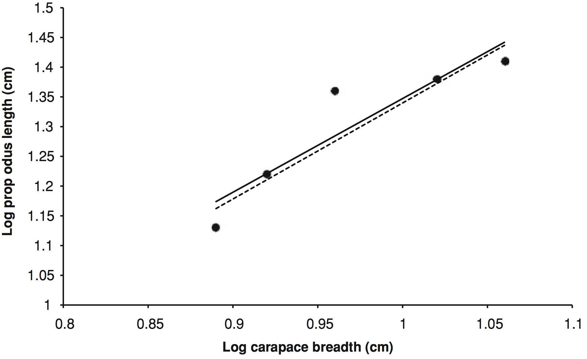

Categorical data and character analysis
---------------------------------------

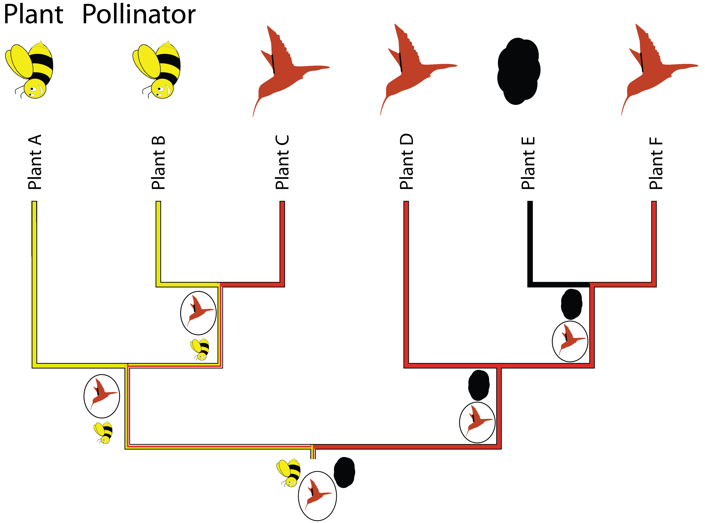

- Comparative analysis of discrete, categorical data (including biomolecular sequence
  data) requires other approaches to analyze, with implicit or explicit models for how
  discrete states change
- Under [MP](https://en.wikipedia.org/wiki/Ancestral_reconstruction#Maximum_parsimony)
  (as you might do in [mesquite](https://mesquiteproject.wikispaces.com/)) the general
  assumption is that evolutionary change should be minimized (and then there can be 
  constraints, e.g. about directionality)
- However, explicit models of state transitions allow for more kinds of hypothesis tests

Continuous-time Markov models
-----------------------------

Transitions between states can be modeled as a rate matrix (_Q_). For example, for a 
character with two states (_i_ and _j_), matrix looks like this:

|         | **_i_**             | **_j_**            |
|---------|---------------------|--------------------|
| **_i_** | 1-_q<sub>ij</sub>_  | _q<sub>ij</sub>_   |
| **_j_** | _q<sub>ji</sub>_    | 1-_q<sub>ji</sub>_ |

- The transition **rate** for _i_→_j_ is _q<sub>ij</sub>_
- A state either changes or it doesn't: the rows must sum, hence 
  _i_→_i_ = 1-_q<sub>ij</sub>_
- _P(j,i,t)_ is the **probability** that a branch beginning in state _i_ ends in state
  _j_, after time period _t_.
- For a given variable, _P(j,i,t)_ will take only two forms for branches leading to the
  tips of the tree because _j_ will be constant (it's what we observe at the tips).
- For all other branches both _j_ and _i_ can vary from 0 to 1 so four possibilities 
  arise in each variable (0→0, 0→1, 1→0, 1→1). 
- Assume that we have two characters (_X_ and _Y_), then the likelihood for this tree
  will be given by:

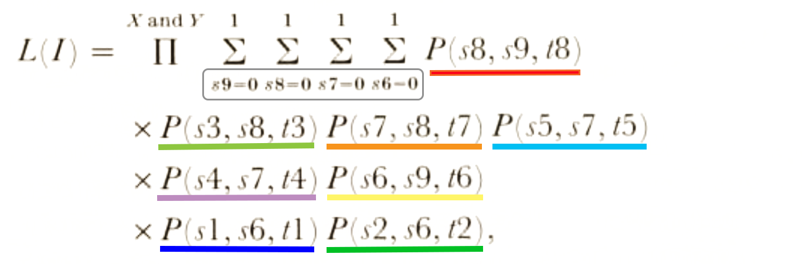

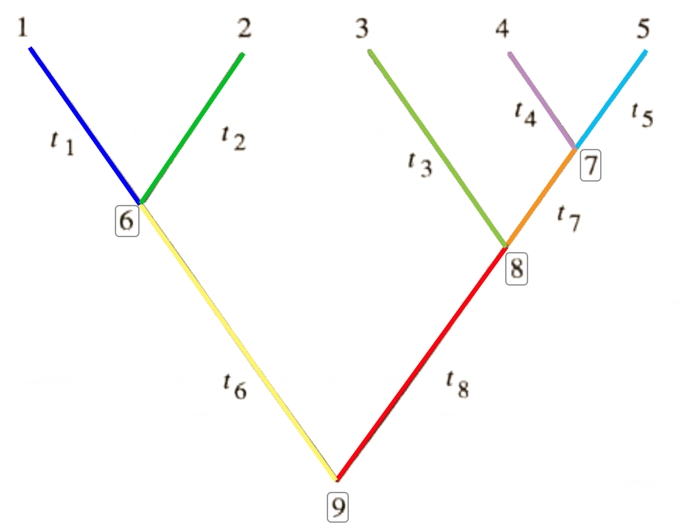

Bayesian
--------

Ornstein-Uhlenbeck models
-------------------------
