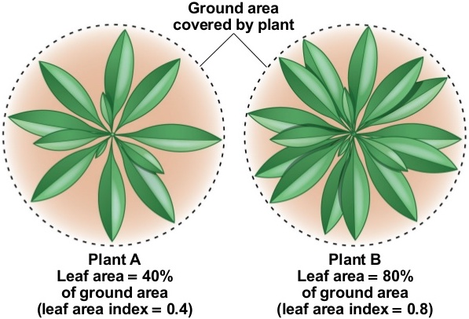
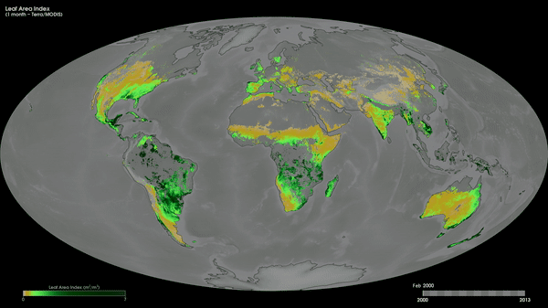
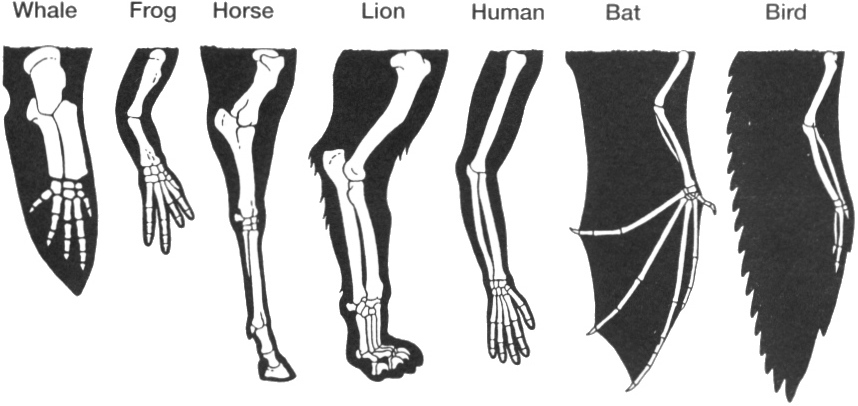
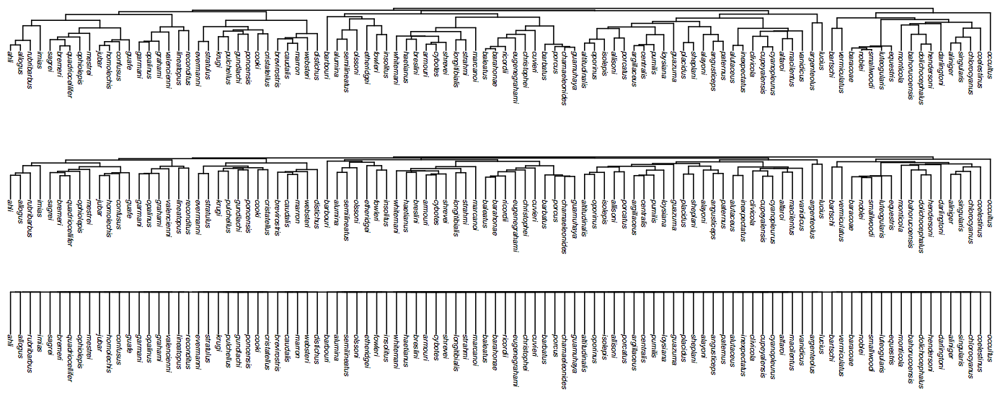
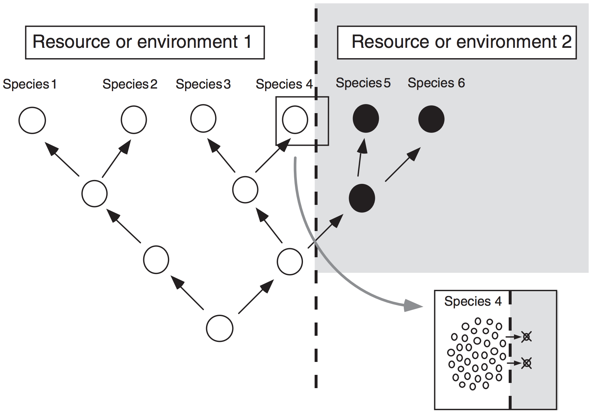
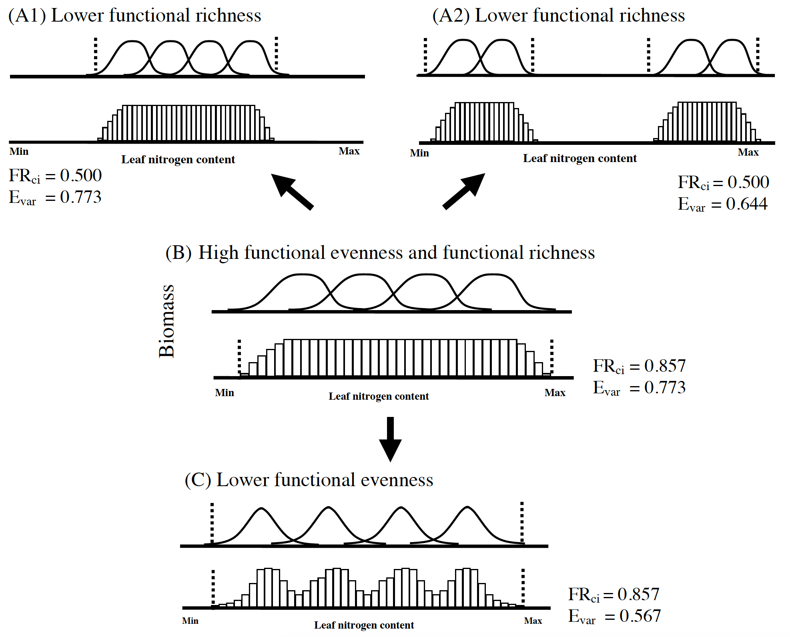
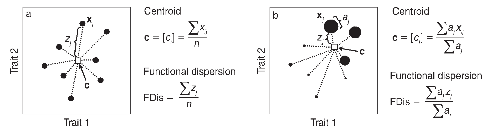
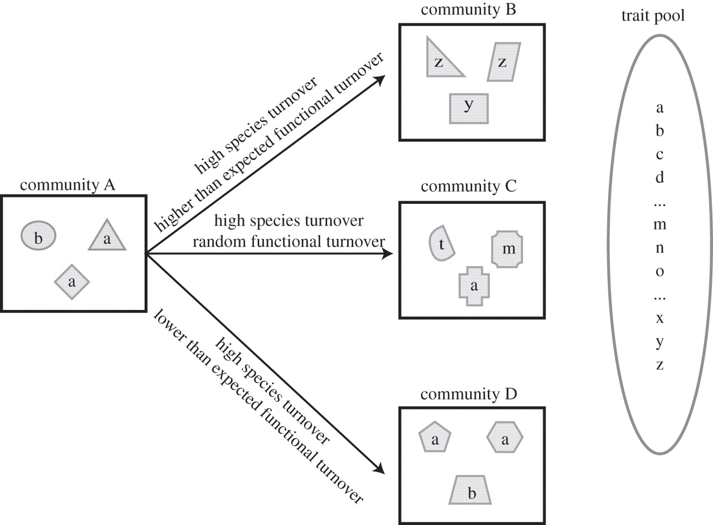

Functional diversity
====================

Functional trait example: Leaf Area Index
-----------------------------------------

Characters versus traits
------------------------

A **character** applies to a feature that is homologous across species, and so the 
distribution of states follows phylogeny. A **trait** applies to ecological function with
no strong assumption of homology.

- **Characters** are expected to have less _homoplasy_ than **traits**
- Or, conversely, **characters** usually have more _phylogenetic conservatism_ than 
  **traits**
- _Synapomorphy_, _autapomorphy_ and _symplesiomorphy_ are relevant in character analysis
  but not in functional trait analysis

Phylogenetic conservatism
-------------------------

- The strength of the phylogenetic signal (or, the amount of phylogenetic conservatism) 
  can be expressed, for example, using Pagel's λ.
- The index λ is the MLE for branch length transformation that best fits the data. If
  there is no phylogenetic signal (no covariation at all), internal branches can all be 
  collapsed, corresponding with λ=0. 
- If there is strong phylogenetic signal, internal branches must not be collapsed, so the 
  MLE for λ=1.

Niche conservatism
------------------

> What is a "niche"? What's the difference between _potential_ and _realized_ niche? What
> processes maintain the dimensions of a species' niche?

**JJ Wiens et al.,** 2010. Niche conservatism as an emerging principle in ecology and 
conservation biology. _Ecology Letters_ **13**(10): 1310–1324
doi:[10.1111/j.1461-0248.2010.01515.x](http://doi.org/10.1111/j.1461-0248.2010.01515.x)

Whereas characters are selected based on the general assumption that evolutionary change
is inherently rare (i.e. "maximum parsimony"), conservatism in functional traits related
to the niche is thought to be actively maintained by natural selection.

Functional diversity of communities
-----------------------------------

**NWH Mason et al.** 2005. Functional richness, functional evenness and functional 
divergence: the primary components of functional diversity. _Oikos_ **111**(1): 112–118
doi:[10.1111/j.0030-1299.2005.13886.x](http://doi.org/10.1111/j.0030-1299.2005.13886.x)

- The vertical axes represent abundance (e.g. biomass). 
- The bell-shaped curves indicate the distribution of the abundance of individual species 
  in niche space. 
- The histograms indicate the summed abundance of the species occurring in each functional
  character category (i.e. equal-width sections of the functional character range). 
- The vertical dotted lines indicate the amount of niche space filled by the species 
  together. 
- Functional richness can decrease without a change in functional evenness if the 
  evenness of abundance within the niche space is unchanged (going from B to A1). 
- Similarly, functional evenness can decrease without a change in functional richness if 
  the amount of niche space filled is unchanged (going from B to C).
  
Functional dispersion
---------------------

**E Laliberté & P Legendre**, 2010. A distance-based framework for measuring functional 
diversity from multiple traits. _Ecology_ **91**:299-305
doi:[10.1890/08-2244.1](http://doi.org/10.1890/08-2244.1)

_An example showing how the functional dispersion (FDis), i.e. the functional "spread" of
species, is computed._

- The _n_ individual species in a two-dimensional trait space are represented by black 
  circles whose sizes are proportional to their abundances. 
- Vector **x**_j_ represents the position of species _j_, 
- Vector **c** is the centroid of the _n_ species (white square) 
- _z__j_ is the distance of species j to centroid **c** 
- _aj_ is the abundance of species _j_ 

**Panel (a)**
- All species have equal abundances (i.e., presence–absence data). In that 
  case, **c** = [_ci_], where _ci_ is the mean value of trait _i_
- FDis is the mean of distances _z_ of individual species to **c**. 

**Panel (b)**
- Species have different abundances. In that case, the position of c is 
  weighted by the species relative abundances, such that it shifts toward the more 
  abundant species. 
- Individual distances _z_ of species to **c** are weighted by their relative abundances 
  to compute FDis.

Functional turnover between communities
---------------------------------------

> What are α, β, and γ diversity in this context?

**NG Swenson, et al.,** 2011. Deterministic tropical tree community turnover: evidence 
from patterns of functional beta diversity along an elevational gradient.
_Proc. R. Soc. B_ **278**(1707):877-884 
doi:[10.1098/rspb.2010.1369](http://doi.org/10.1098/rspb.2010.1369)

_A cartoon depicting the species and functional turnover between a set of four 
hypothetical communities. The shapes indicate species identity and the letters indicate 
the functional strategy of the species. The trait pool represents all of the functional 
strategies that could potentially colonize a community._

_The figure illustrates that three different ecological processes can be determined by 
examining the functional and species turnover between communities simultaneously, while 
analyses of species turnover alone could provide erroneous ecological inferences._

- **Community A** shares no species with any of the other communities and therefore 
  has the same species turnover from **A** ⟶ **B**, **A** ⟶ **C** and **A** ⟶ **D**. 
- **Community A** and **community B** share no functional strategies. Further, the 
  strategies present in **B** are significantly more dissimilar from those in **A** than 
  expected if one were to randomly pull three strategies from trait pool. This might be 
  seen if an underlying environmental gradient determines species turnover and community 
  assembly. 
- **Community A** and **community C** share some functional strategies, but the functional 
  turnover is indistinguishable from a random pull of three functional strategies from 
  the trait pool. This would be expected under a stochastic model of species turnover and 
  community assembly. 
- **Community A** and **community D** are functionally analogous and there is less 
  functional turnover than expected given a random pull of three strategies from the 
  trait pool. This would be expected where dispersal is limited but community assembly is 
  deterministic with respect to the environment. 
