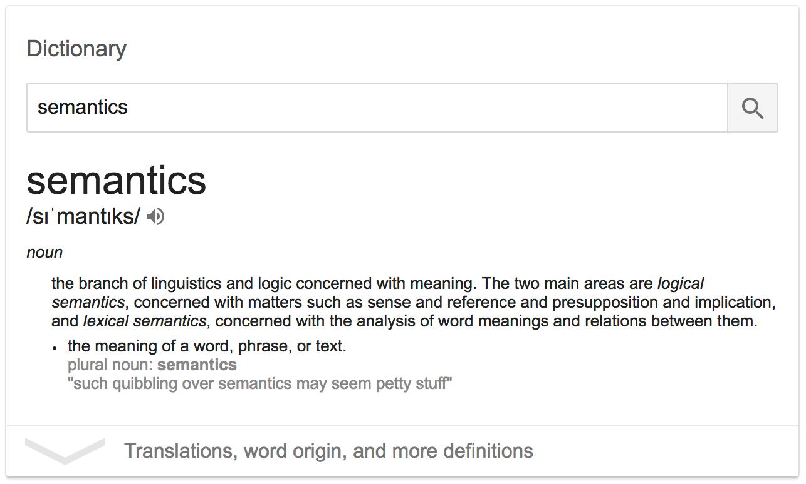
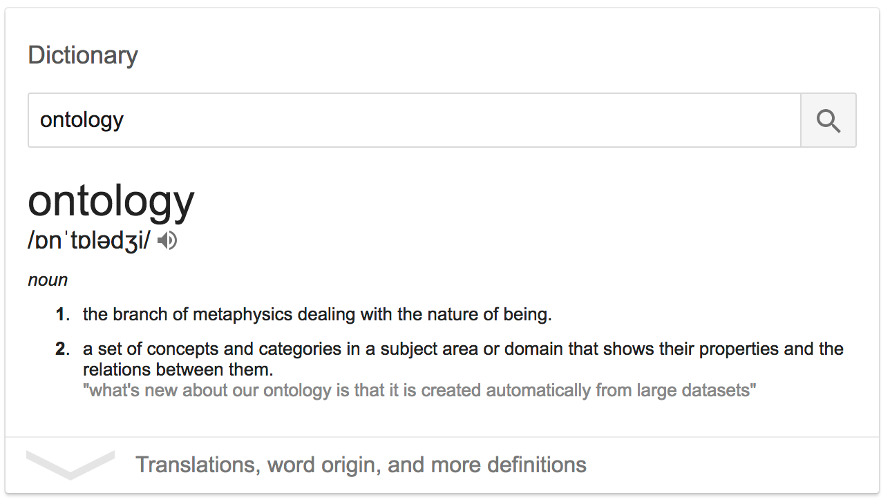
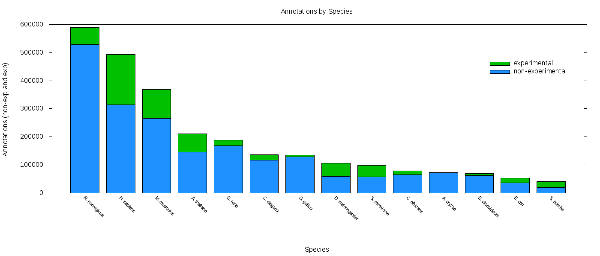
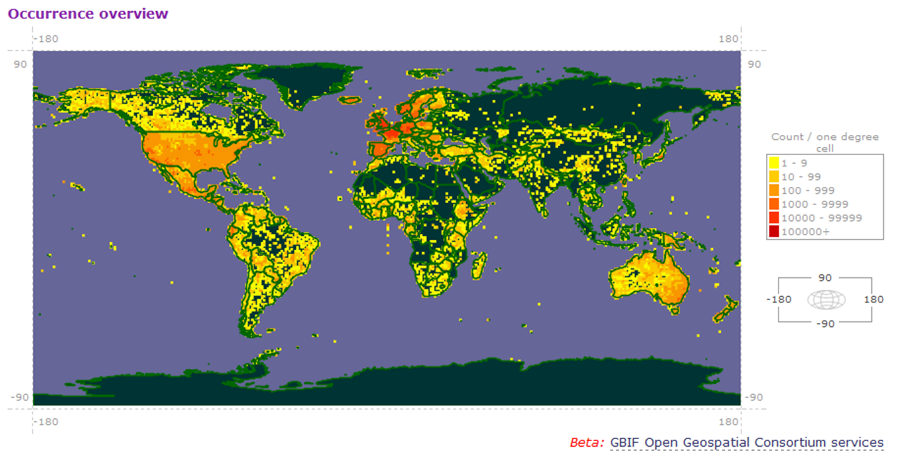
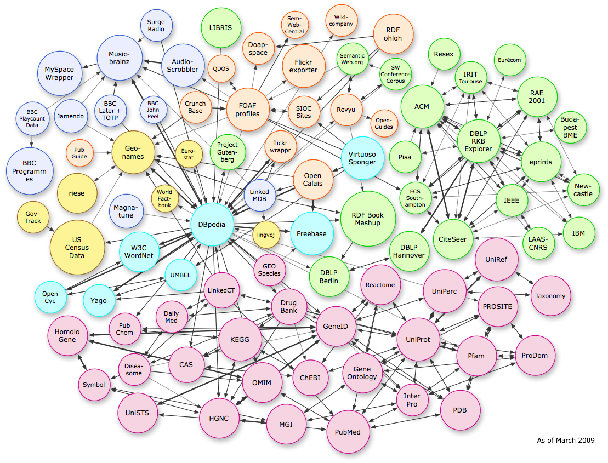
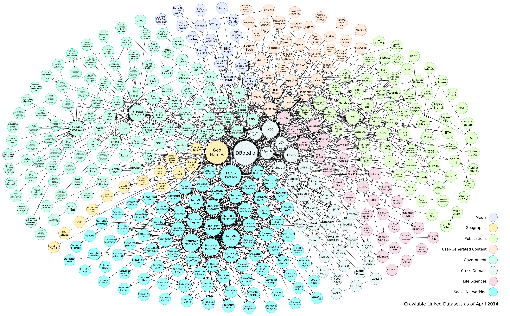

Semantics
=========

More especially: _lexical semantics_:



Examples of ambiguity in trait databases
----------------------------------------

When is the plant in bloom?

- BIEN: `plant flowering begin`
- TR8: `age_first_flowering`
- LEDA: `age_first_flowering`
- USDA: `Bloom_Period`

How much do the seeds weigh?

- BIEN: `seed mass`
- TR8: `seed_mass`, `SeedMass`, `Seed.per.Pound`
- LEDA: `seed_mass`
- USDA `Seeds_per_Pound`

The databases appear to have the same information - or close enough so that one type of
record (`Seed.per.Pound`) can be converted to another (perhaps 
`seed mass` = 1lb. / `Seed.per.pound`). However, there are at least two challenges:

1. Do we mean exactly the same? How do you define "flowering"?
2. Are the units the same? If one observation is in "imperial" (pounds and ounces) and the
   other is in "metric" we have to know this if we are going to merge data.

We have an ontological problem
------------------------------



In computer science and information science, an ontology is a formal naming and 
definition of the types, properties, and interrelationships of the entities that really 
exist in a particular domain of discourse. Thus, it is basically a **taxonomy**.

An ontology compartmentalizes the variables needed for some set of computations and 
establishes the relationships between them.

The fields of artificial intelligence, the Semantic Web, systems engineering, software 
engineering, **biomedical informatics**, library science, enterprise bookmarking, and 
information architecture all create ontologies to limit complexity and organize 
information. The ontology can then be applied to problem solving.

What are some types of ontologies?
----------------------------------



**Data-driven** ontologies have very many classes, which are (semi-)automatically generated
from activities such as expression analyses (GO) or text-mining (FLOPO):
- The [gene ontology](http://www.geneontology.org/)
- The [flora ontology](https://bioportal.bioontology.org/ontologies/FLOPO)

These types of ontologies can be used to do analyses such as
[enrichment tests](https://bioconductor.org/packages/release/bioc/html/topGO.html), which
assess whether a data set (for example, a list of genes that was expressed in a 
transcriptome) is significantly biased towards part of the ontology, such as a gene 
functional group (such as _immune response_).



Vocabularies to describe the essential concepts within a domain, such as:
- [Darwin Core](http://rs.tdwg.org/dwc/)
- The [sequence ontology (SO)](http://www.sequenceontology.org/)

Terms from such vocabularies are used to structure and annotate data. For example, the
tabular occurrence records from GBIF use Darwin Core terms as column names. GenBank
records use SO terms to label features on the sequence (such as exons, introns, CDSs).

Semantically annotated trait data
---------------------------------

Data from the [EoL trait bank](http://eol.org/info/516) is annotated with terms from the
Darwin Core. We can query the database as follows:

```R
library(traits)
library(taxize)
library(dplyr)

# example...
species <- "Cocos nucifera"

# For EoL traitbank data we need to provide the EoL taxon ID as input parameter. Hence,
# we first need to do a TNRS lookup of these, as follows:
sources <- gnr_datasources() # frame with global names sources
eol_id <- sources[sources$title == "EOL", "id"] # lookup the id of the EOL source
eol_tnrs <- gnr_resolve(species, data_source_ids = c(eol_id), fields = "all") # resolve species
eol_taxon_id <- eol_tnrs[eol_tnrs$matched_name == species,]$local_id # lookup integer id

# Now that we have the taxon id, we query the traitbank
eol_results <- traitbank(eol_taxon_id)
eol_graph <- eol_results[["graph"]] # the interesting bit in the results is the graph

# Here we select the fields with Darwin Core terms
eol_triples <- select( eol_graph, 'dwc:scientificname', 'dwc:measurementtype', 'dwc:measurementvalue', 'units' )

# Write to file
write.csv(eol_triples, file = "eol_triples.csv")
```

Which produces this [csv file](semantics/eol_triples.csv)

Any fact can be expressed in three parts
----------------------------------------

_"A [coconut](http://eol.org/1091712) will [not](http://eol.org/schema/terms/ResproutNo)  
[resprout](http://eol.org/schema/terms/ResproutAbility) following top (above ground 
biomass) removal"_

The three links can be viewed as the semantic anchors of this fact:

1. the **subject** is coconuts: http://eol.org/1091712
2. the **predicate** (think of this as the trait) is the ability to resprout: 
   http://eol.org/schema/terms/ResproutAbility
3. the **object** (in this case, the trait value) is the negation, the inability to
   resprout: http://eol.org/schema/terms/ResproutNo

Together, they form a triple:


RDF
---

Our statement about coconuts, and all the other rows in our 
[csv file](semantics/eol_triples.csv)
can be reformatted in this 
[simple RDF representation](https://www.w3.org/TR/turtle/#simple-triples):

```
<http://eol.org/1091712> <http://eol.org/schema/terms/ResproutAbility> <http://eol.org/schema/terms/ResproutNo> .
```

By doing so, we integrate our data set in a [web](https://en.wikipedia.org/wiki/Semantic_Web) 
of knowledge representations, linking us to, for example:
- the [plant trait ontology concept of 'drought tolerance'](http://purl.obolibrary.org/obo/TO_0000276)
- the [concept of 'life span' from the phenotypic quality ontology](http://purl.obolibrary.org/obo/PATO_0000050)
- [NASA's understanding of human agriculture](http://sweet.jpl.nasa.gov/2.3/humanAgriculture.owl#Horticulture)

All these triples together form a graph that, when published, can participate in the 
linked data graph:



