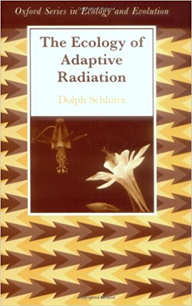

Teach the controversy!
======================

> [_The Ecology of Adaptive Radiation_](https://global.oup.com/academic/product/the-ecology-of-adaptive-radiation-9780198505235)
> is an important synthesis on the interplay between the selective environment and diversification

Wouldn't it be nice if we could detect _diversification rate shifts_ (so, changes in the net difference
between speciation, `λ`, and extinction, `μ`) in relation to state shifts? This would be our ticket to
detecting _adaptive ratiations_ and _key innovations_.

What are some of the options?
-----------------------------

**Maddison WP, Midford PE, Otto SP**, 2007. Estimating a binary character's effect on speciation and extinction.
_Syst Biol_ **56**(5):701-10

- The **Bi**nary-**S**tate **S**peciation and **E**xtinction model (**BiSSE**)
- Six parameters: 
  - The instantaneous rates of speciation `λ` and extinction `μ` when the lineage is in state `0` (e.g., _herbivory_)
  - The rates (`λ`, `μ`) when the lineage is in state `1` (e.g., _carnivory_)
  - The instantaneous rates of character state change (0 ⟶ 1 and 1 ⟶ 0)

The BAMM situation
------------------
