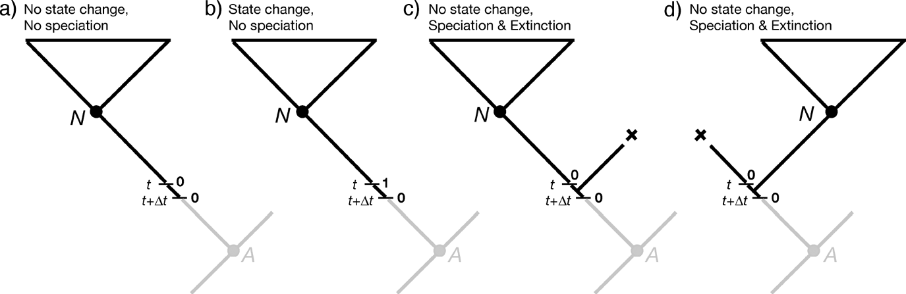
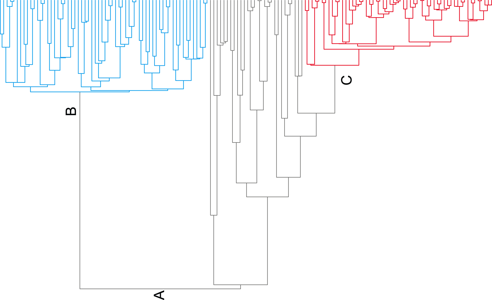
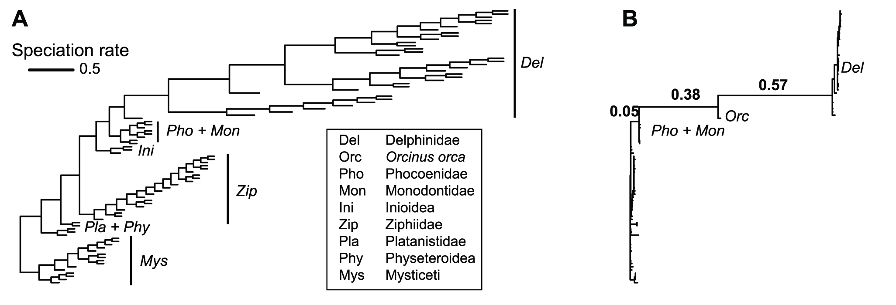
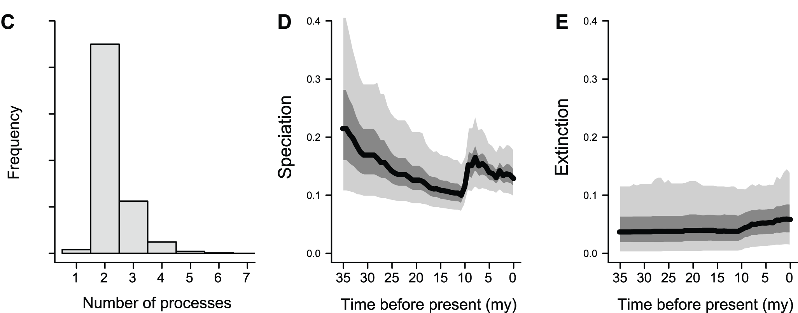
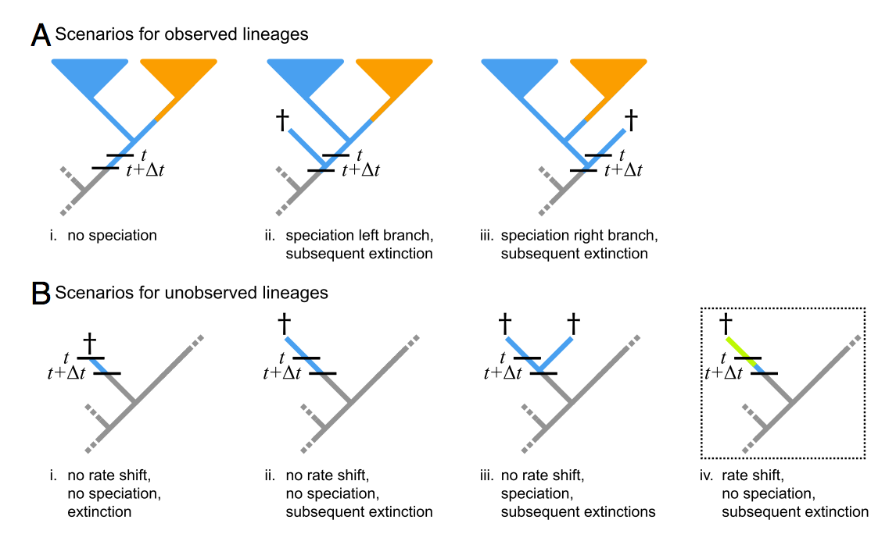
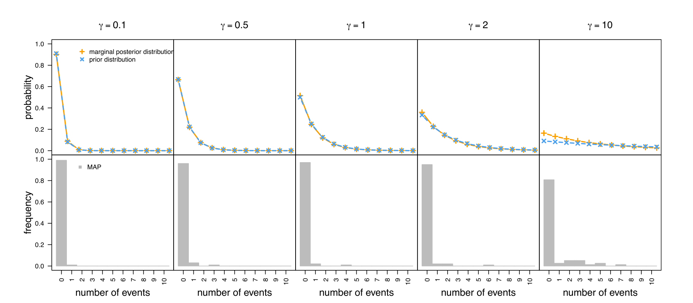
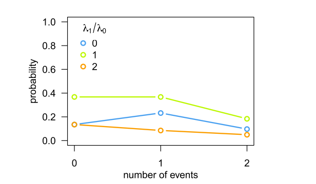
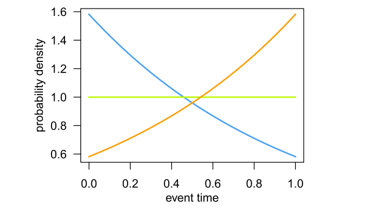

Methods for detecting trait-dependent diversification
=====================================================

> [_The Ecology of Adaptive Radiation_](https://global.oup.com/academic/product/the-ecology-of-adaptive-radiation-9780198505235)
> is an important synthesis on the interplay between the selective environment and diversification

Wouldn't it be nice if we could detect _diversification rate shifts_ (so, changes in the net difference
between speciation, `λ`, and extinction, `μ`) in relation to state shifts? This would be our ticket to
detecting _adaptive ratiations_ and _key innovations_.

The Binary-State Speciation and Extinction model (BiSSE)
--------------------------------------------------------

**Maddison WP, Midford PE, Otto SP**, 2007. Estimating a binary character's effect on speciation and extinction.
_Syst Biol_ **56**(5):701-10
doi:[10.1080/10635150701607033](https://doi.org/10.1080/10635150701607033)

- Assumes that: 
  - An accurate rooted phylogenetic tree with branch lengths is known (the “inferred tree”) 
  - The character state is known for each of the terminal taxa
  - The tree is assumed complete: all extant species in the group have been found and included 
  - The tree is ultrametric (i.e., the total root-to-tip distance is the same for all tips)
- Estimates six parameters: 
  - The instantaneous rates of speciation λ0 and extinction μ0, 
    when the lineage is in state `0` (e.g., _herbivory_)
  - These rates (λ1, μ1) when the lineage is in state `1` (e.g., _carnivory_)
  - The instantaneous rates of character state change (`0 ⟶ 1`, _q_01 and `1 ⟶ 0`, _q_10)

How BiSSE estimates its model parameters
----------------------------------------

- DN0(t) or DN1(t) are the probabilities that a lineage beginning at time _t_ with state 0 or 1 
  evolves into a clade as observed descending from node _N_
- Differential equations track the changes in the parameters as the method traverses from the tips to the root to 
  calculate the likelihood
- (This exploits the general pattern known as _Felsenstein's pruning algorithm_)

Follow up on the SSE methods
----------------------------

- BiSSE can be used for hypothesis testing (likelihood ratio tests)
- BiSSE has been expanded to multistate (MuSSE), continuous (QuaSSE), geography (GeoSSE), etc.
- However, several criticisms have been suggested:
  - Maybe not very powerful: need a lot of taxa in a complete, dated tree; trait values should probably
    have some homoplasy, i.e. not one of many synapomorphies for a megadiverse group
    ([Davis et al. (2013)](https://doi.org/10.1186/1471-2148-13-38))
  - False positives: simulating a character onto an existing tree that already has diversification
    rate variation rejects the null ([Rabosky & Goldberg, 2015](https://doi.org/10.1093/sysbio/syu131))
  

Bayesian Analysis of Macroevolutionary Mixtures (BAMM)
------------------------------------------------------

**DL Rabosky**, 2014. Automatic Detection of Key Innovations, Rate Shifts, and Diversity-Dependence on 
Phylogenetic Trees. _PLoS ONE_ **9**(2): e89543 
doi:[10.1371/journal.pone.0089543](https://doi.org/10.1371/journal.pone.0089543)

"_[A [toolkit](http://bamm-project.org/index.html) to] identify arbitrary numbers of 
time-varying diversification processes on phylogenies without specifying their locations 
in advance_"

> Essentially an extension of BiSSE's algorithms but with potentially infinite processes 
> (as opposed to two in BiSSE, namely "in state 0" and "in state 1")

**Example of tree simulated under mixture of three distinct evolutionary processes.**

- **A** Clade diversification under constant-rate “background” diversification process 
  with λ=0.032 and μ=0
- **B** Shift to new adaptive zone with subsequent 
  [diversity-dependent regulation of speciation](https://github.com/naturalis/mebioda/blob/master/doc/week3/w3d2/lecture3.md#density-dependent-diversification)
  and diversity-independent extinction (blue branches; λ0=0.395; carrying
  capacity K=66; μ=0.041). 
- **C** Another lineage shifts to diversity-dependent speciation regime (red branches; 
  λ0=0.21; K=97; μ=0.012). 
- Despite undergoing two distinct diversity-dependent slowdowns in the rate of 
  speciation, the overall gamma statistic for the tree is positive (Pybus's γ=2.51) and 
  provides no evidence for changes in the rate of speciation through time. 
- Note that a tree with three distinct processes contains two distinct transitions 
  between processes.

Dynamics of cetacean diversification through time as revealed by BAMM analysis
------------------------------------------------------------------------------

- **A** Phylogeny of cetaceans with branch lengths drawn proportional to their marginal 
  speciation rate as estimated using BAMM. A large increase in the rate of speciation 
  (>6-fold) occurred in one of the ancestral branches leading to the Delphinidae 
  (including or excluding the killer whale, Orcinus orca). Despite this increase, the 
  overall trend is towards decelerating rates through time. 
- **B** Cetacean phylogeny with branch lengths scaled by the posterior probability that 
  they contain a rate shift. Numbers above branches denote branch-specific shift 
  probabilities. The probability that a rate shift occurred on at least one of these 
  three branches was 0.975. No other branches had shift probabilities exceeding 0.02. 

- **C** Posterior distribution of the number of distinct processes (including the root 
  process) on the cetacean phylogeny. A two-process model vastly outperforms a 
  one-process model. 
- **D** Speciation rates through time during the extant cetacean radiation; distinct shaded 
  regions denote (from bottom) 0.05, 0.25, 0.50, 0.75, and 0.95 quantiles on the 
  posterior distribution of rates at a given point in time. Massive spike in mean 
  speciation rates at 7.5 Ma corresponds to the early radiation of the Delphinidae clade. 
- **E** Corresponding extinction through time curve. 

Critically evaluating the theory and performance of BAMM
--------------------------------------------------------

**BR Moore, S Höhna, MR May, B Rannala, and JP Huelsenbeck**, 2016. Critically evaluating 
the theory and performance of Bayesian analysis of macroevolutionary mixtures
_PNAS_ **113**(34): 9569-9574
doi:[10.1073/pnas.1518659113](http://doi.org/10.1073/pnas.1518659113)

**Approximation of the likelihood under the BAMM model ignores diversification-rate shifts 
on extinct lineages.**

- The probability of observing the data under the BAMM model is approximated by an 
  algorithm that traverses the tree from the tips to the root in small time steps, Δ_t_. 
- At each step, two terms are computed: 
  - **A** the probability of realizing the observed lineage, _N_, over time _t_, given 
    that it is in process _i_ - denoted _DN,i(t)_ — which sums over all of the 
    possible scenarios that could occur in the instant Δ_t_, and; 
  - **B** the probability of unobserved (extinct or unsampled) lineages, 
    _Ei(t)_, which is computed similarly. 
- The last scenario **iv**, where diversification-rate shifts occur on an extinct lineage,
  is not included in the likelihood computation, causing BAMM to incorrectly estimate the 
  extinction probabilities

Identifiability
---------------

[Wikipedia](https://en.wikipedia.org/wiki/Identifiability):

- In statistics, _identifiability_ is a property which a model must satisfy in order for 
  precise inference to be possible. 
- Different values of the parameters must generate different probability distributions of 
  the observable variables.
- A model that fails to be identifiable is said to be **non-identifiable** or 
  unidentifiable; two or more parametrizations are observationally equivalent.

Figure 4 from Moore et al. 2016, showing the prior and posterior probability 
distributions of rate shift events on top for different prior means, with frequency and 
posterior mode value (MAP, reported by Rabosky) on the bottom.

Coherence
---------

- BAMM adopts a CPP
  ([Compound Poisson Process ](https://en.wikipedia.org/wiki/Compound_Poisson_process))
  prior model to describe the number and location of diversification-rate shifts over the 
  tree  
- Under the CPP prior model, events are uniformly distributed through time (over the tree 
  length) and the number of events is 
  [Poisson-distributed](https://en.wikipedia.org/wiki/Poisson_distribution)
- This implementation is similar to how _substitution_ rate shifts are sampled in other
  methods, but it is not a valid approach if the shifts being sampled _generate the tree_
- Below is a special case of the BAMM model: a pure-birth (μ=0) process with two 
  speciation-rates, λ0 and λ1
- The branching process switches between speciation rates at rate _η_. 

The probability distribution of the number of diversification-rate shifts (and no 
speciation events) does not follow a Poisson distribution

  
The timing of a single event does not follow a uniform distribution, except in 
the special case where λ0=λ1 (i.e., when diversification-rate 
shifts are disallowed, shown by the green line in both panels). 

> Because it cannot describe the correct branching process, the CPP prior model assumed 
> by BAMM is "statistically incoherent".

Heated exchanges follow
-----------------------

Moore et al.:

- [Prior sensitivity in BAMM](http://treethinkers.org/prior-sensitivity-in-bamm/)
- [The relationship between prior sensitivity and extinction probabilities in BAMM](http://treethinkers.org/the-relationship-between-prior-sensitivity-and-extinction-probabilities-in-bamm/)
- [BAMM provides unreliable parameter estimates](http://treethinkers.org/bamm-provides-unreliable-parameter-estimates/)

Rabosky et al.:

- [Is BAMM Flawed? Theoretical and Practical Concerns in the Analysis of Multi-Rate Diversification Models](https://doi.org/10.1093/sysbio/syx037)
- [Bayesian model selection with BAMM: effects of the model prior on the inferred number of diversification shifts](http://doi.org/10.1111/2041-210X.12626)
- [How to make any method "fail": BAMM at the kangaroo court of false equivalency](https://arxiv.org/abs/1711.03253)

And also Meyer & Wiens:

- [Estimating diversification rates for higher taxa: BAMM can give problematic estimates of rates and rate shifts](http://doi.org/10.1111/evo.13378)

----

A good summary of the technical issues is in a very readable blog post on
[MolecularEcologist.org](http://www.molecularecologist.com/2016/08/a-primer-on-the-great-bamm-controversy/)