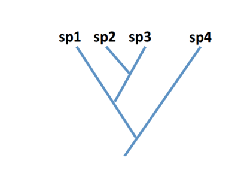
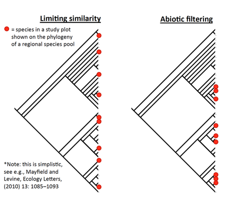
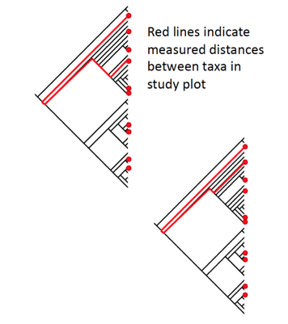
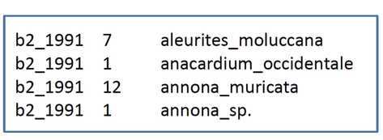
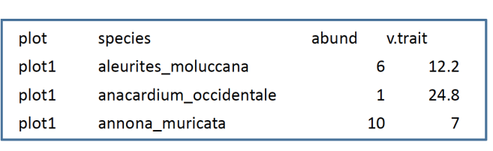
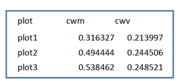

An introduction to phylogenetic and trait patterns, and a tutorial on how to analyze them
=============================================

This tutorial contains
---------------------------------------------
1. **Phylogenetic patterns in community assembly**
   1. 1a Step 1: cleaning your taxonomic lists with TNRS Taxon Scrubber.
   1. 1b Understanding and analyzing NRI and NTI: phylomatic, phylocom
2. **Community assembly patterns must be driven by traits, right?**

   2. 2a Understanding community weighted means and variances of traits. 
   2. 2b How to analyze those metrics: CWM, CWV.
3. **Understanding traits in community phylogenetics and traits**

   3. 3a Do phylogenetic and community trait patterns track each other?
   3. 3b A look at community changes in the Biosphere 2 tropical forest mesocosm
4. **Appendix I**: Troubleshooting Phylocom

   4. 4a For all users
   4. 4b For mac users
   4. 4c For Windows users

Taxonomic Name Resolution Service
---------------------------------------------
1. TNRS, "Taxon Scrubber", by iPlant collaborative, cleans plant taxonomic lists. 
- Matches names from your list to database at Missouri Botanical Garden
- Fixes spelling errors
- Recognizes synonims (one species that has been given more than one name) 
- Provides current accepted genus and family names, and current author(s) (author of first publishec species description with that name)
- Located at: http//: tnrs.iplantcollaborative.org/
2. What to expect: most family names will change, spelling will be fixed, and where synonyms occur, the current accepted name will be provided.
3. Watch out for: 
- mispelled genera: if specific ephitet is not matched (or was a "sp") might match two different genera (usually match < 0.5) 
  - be suspicious and check family.
- Warning "Higher scoring names were found" 
  - download results with "all matches" and check what alternative names are provided. 
4. Search Settings: Take look at these in the upper right of application, but typically,  leave them as default
- For example "constrain best match with higher taxonomy" will ensure that a mispelled genus names will be matched instead of looking for the best overall match to genus_species combo. That can produce that warning statement stated above, which should be investigated. 

Using TNRS Taxon Scrubber 
---------------------------------------------

Copy list of species names and paste it into Taxon Scrubber window, click "submit list" ( file for this tutorial is list for TNRS.xlsx)
- List should be a column with hard returns after each taxon, but format of names can vary: e.g. 
     - Ceiba_pentandra
     - Clitoria racemosa
     - MUSA TEXTILS
     
- Click on "individual accepted names" links for details     
- Click "Download results"
   - I like to download twice: once with "Best matches only" in a "simple format" and a second time with "All matches" in "simple format".
Open text files and copy and paste each one into a separate worksheet in your excel book with your original lists.

Using TNRS Taxon Scrubber 
---------------------------------------------

- You will primarly use your "Best matches" file, which has the same number of rows as your original taxon list, so it can directly replace that list. 
- use the "all matches" output to see details where multiple suggestions where provided. 

Using TNRS Taxon Scrubber 
---------------------------------------------

- First: scan the "warning" columns in your best matches sheet for partial match- higher scoring names were found.
  - Genus name probably did not match an accepted species name, and it may suggest something, a complete different family.
  - Look at your "all matches" sheet to look for all the suggestions, and use your brain to pick the best match (one way is to compare the suggested family name with the original name from your list).
  - Example: see " Zizyphus_jujuba from tutorial file. TNRS "best matches" prioritize the a genus match "Zyziphus" for which it has no option of taxonomic status. 
  - But in "all matches" you see option "Ziziphus jujuba" which has "accepted status". You should choose that one.
  
 Using TNRS Taxon Scrubber 
---------------------------------------------

- Second: look out for match scores < 0.5
  - specific ephitet did not match, and genus did not match 100%, it may suggest the wrong family entirely. So look at option in "all matches", compare suggested family names with original family, make your best judgement.
- Third: family names are often changed
  - this is normal, but if you have taxonomic knowledge, compare original with suggested families side by side. If e.g. "Fabaceae" (peas) became "Pteridaceae" ( a fern family) you probably got a funky name match.
  - if you are suspicious, go to www.tropicos.org, search both family names and compare where they sit in the taxonomyc hierarchy. If the orders differ, or worse, the classes, TRNS probably gave a poor name suggestion. 
- Fourth: synonyms are corrected
  - if a single species has been assigned different names, the "status" column of the output will say "synonym" ; use the "accepted name" provided.
- Finally: copy taxon names from "Accepted name","Accepted genus" and "Accepted family" columns.
  - save both original and scrubbed names to keep a record of changes.
  
 Generating a phylogenetic tree with Phylomatic
---------------------------------------------
- Go to: 
http://.www.phylodiversity.net/ phylomatic/phylomatic.html
- Enter your scrubbed list (see TNRS section of this tutorial) into the window (for this tutorial, use file B2TF_origin)
- Phylomatic is picky, so format must be as follows, including symbols, with all lowercase letters, (even though the site suggest first letter caps): family/genus/genus_species RETURN
- With a good text editor (Notepad++ for Windows or Text Wrangler for Mac) you can change case of a long list easily. In Notepad ++, paste your list, select all and hit ctrl +u. 
- With everything in the right case nack in Excel, concatenate the names together. 
  - e.g. in a new cell, type= concatenate("A,"/",B,"/"C,"_",D1") and copy down. (Be sure to copy and paste special values if you don't want it to remain an equation).
  
 Generating a phylogenetic tree with Phylomatic
---------------------------------------------

- Copy and paste the concatenated list into Phylomatic
 - it is ok to have "sp" for unidentified species, it simply will match by genus. 
- Output format: select "newick" 
- Master phylogeny: select "maximally resolved seed plant tree"

What is a "newick" string?
---------------------------------------------

- A newick string is a way of representing a phylogenetic tree in a text format.
- The tree depicted below should be displayed in a text like this:
  - ((sp1,(sp2,sp3),sp4))
  
  
  
Getting started with Phylocom
---------------------------------------------

- Download from: http://www.phylodiversity.net/phylocom
- there are useful tutorial at: 
  http://bodegaphylo.wikispt.org/Community_Phylogenetics
  http://people.ucalgary.ca/~smwavosi/phylocom.htm
- Open folder containing Phylocom on your computer.
(For mac, see Appendix 1, "Troubleshooting Phylocom" at the end of this tutorial)
- For Windows, go to "W32"
  - Double click "phylocom.bat"
  - Your command line console should open up with some phylocom headings.
- All commands will now look for files in and deposit outputs in your W32 folder.
- Phylocom is picky, so note **Appendix 1** in this tutorial "Troubleshooting Phylocom".

Assigning branch lengths to your phylogeny in Phylocom
---------------------------------------------

- Phylocom comes with a file called "wikstrom.ages", which contains known fossil ages for ancestral angiosperms.
- Phylocom can use these ages to assign branch lengths to your tree that are scaled with respect to time.
- Go to "example folder", open "bladji_example" and **copy** the file the wockstrom.ages. 
- Note: there is also a file called "ages"in the "example" folder. That files goes with a hypothetical example dataset and will not work to assign branch lengths to your tree. 
- Paste "wikstrom.ages" in your W32 folder.
- Delete "wikstrom." form the name so that your are left with "ages".
- Copy your phylogeny text file (newick), (for this tutorial use file phylo_B2TF_origin.txt)
   - Paste into W32 and call it "phylo" with no extension (i.e delete .txt-you may need to adjust folder setting to "show extension of known file types" before you can even see that the file still contains ".txt" then delete the extension. For Windows 7, click the ?Help button and search "shoe the file extensions")
   
Assigning branch lengths to your phylogeny in Phylocom
---------------------------------------------

- With your "phylo" and "ages" in your W32 folder, you can now assign branch lengths.
- In the command line terminal, type phylocom bladji > phylo.ages.txt
   - All commands begin with "phylocom" 
   - Bladji stands for the branch length algorithm
   - The > symbol tells it to to export your result to a file of the following name and type
   - A text file will show un in W32 called "phylo.ages.txt" (but you could name it anything you want)
   - Open the result file to make sure it worked. You should see a newick string with length added, like (genus_sp:75.000)
   - Save this somewhere; now you can copy this aged tree into W32 and make it your "phylo" file for other analysis.
   - Remember **Appendix 1** in this tutorial contains hints for troubleshooting Phylocom.
   
Understanding community phylogenetic metrics NRI and NTI
 ---------------------------------------------
 - Next, we'll analyze Net Relatedness Index (NRI) and Nearest Taxon Index (NTI) for sample community.
 - These increasingly commonly used metrics reflect phylogenetic signal in the organization of your sample plant community.
 - Both compare your sample community to random draws for the regional species pool.
   - Note: regional species pool=phylo file
- How you define your regional pool is up to you. It is usually an area that contains all of the species you think could colonize your study plot. 
  - Changing your regional species pool can give you different results; scale is important: (see Swenson et al., Ecology, 87(10) 2006,pp. 2418-2424)
  
Understanding community phylogenetic metrics NRI and NTI
---------------------------------------------

- Both metrics tell you where taxa in your community are more closely (clustered) or less closely (over-dispersed) related to each other than you would expect by chance. 
 - The difference between them is in phylogenetic scale.
- NRI tells you about the whole phylogeny, and is a good indicator when the environment has excluded entire clades (groups of related species)
- NTI tells you about the tip of the phylogeny, and is a good indicator when species exclusion is due to high competition between closely related species.
 - Limiting similarity
 
 
 
 Understanding community phylogenetic metrics NRI and NTI
---------------------------------------------

- The raw measure for NRI is mean pairwise phylogenetic distance (MPD)
 - The mean of the distances (length along phylogeny) between all possible pair of species 
- The raw measure for NTI is mean nearest taxon distance (MNTD)
 - The mean of the distances between species and its most closely related species
 
 
 
Analyzing community phylogenetic metrics in Phylocom
---------------------------------------------

- MPD.rnd and MNTD.rnd are the mean MPD and the mean MNTD for your null community generated by random draws from your regional species pool. 
- NRI = -1 * (MPD.sample - MPD.rnd) / sd (MPD.rnd)
- NTI = -1 * (MNTD.sample - MNTD.rnd) / sd (MNPD.rnd)
  - Dividing by the st.dev scales the index by the variance among the randomized plot. This standardizes for regional phylogenies of different sizes (look at the equation and think about why that's true)
- Statistical significance is determined by ranking the order of plots (rnd and samples) by MPD and MNTD.
  - If MPD.saple < MPD.rnd
  - p = 2* (#plot with MPD < MPD.sample) / total #plots
  - Multiply by tow because it is a two-tailed t-test
  - So, wirh 999 randomized plots, a MPD.sample ranking 15 would give p = 0.03
  
Analyzing NRI and NTI in Phylocom
---------------------------------------------

- You will need a phylogenetic tree with branch lengths assigned, and a "sample" file.
- Your sample file is a text file and contains three columns with no headers, separated by tabs: 

- *Note: The R package "Picante" can also measure these. But Phylocom is useful because its algorithms can deal with polytomies (multifurcations in phylogeny  as opposed to bifurcations). 

Analyzing NRI and NTI in Phylocom
---------------------------------------------
- Copy your sample file into folder W32 and call it "sample" (remember no extensions like ".txt")
  - Tutorial file: sample_B2Tf_1993.txt
- Copy your phylogenetic file with branch lengths (previous section) into folder W32 and name it "phylo"
- Go to your command line terminal with Phylocom started (phylocom.bat in folder W32)
  - Type : phylocom comstruct > results.xls
- The results suggest some phylogenetic clustering by NRI and NTI, but rank shows the results to be non-significant for both (see "Understanding NRI and NTI" in this tutorial)

Analyzing NRI and NTI in Phylocom
---------------------------------------------

- Using switches in Phylocom:
  - Switches are options, specified by the dash "-" symbol, that can be added after commands in any order
  - The default number of randomized draws from the regional species poll is 2.999. You can specify 5.000randomizations by typing:
  - phylocom comstruct -r5000 > results.xls
  - Another comstruct default is that species are treated as present/absent. Use the "-a" switch weight the analyses by abundances in your sample file:
  - phylocom comstruct -r5000 -a > results.xls
  
Analyzing NRI and NTI in Phylocom
---------------------------------------------

- Use your own null model 
- In my case, for analyzing the community changes in Biosphere 2 tropical mesocosm over time, I used my own null model (one more appropriate for a community that has experienced only extinction and no recruitment) to geenrate null communities.
- So, to analyze NRI and NTI, just create a sample list containing all of your null communities, and use: 
 - phylocom comstruct -r 1 > results.xls
- Limiting the analysis to one randomization ensures that it runs quickly across your null communities.
- Then delete all entries in the results except plot name, MPD and MNTD.
- Put those rows results of your observed community at the top of the null communitiesin Excel.
- Calculate average and st.dev of MPD and MNTD of the null communities and calculate NRI and NTI using the equations of the previous section of this tutorial.
- Determine significance by sorting MPD and MNTD ascending and numbering (ranking) them in order (see previous section of this tutorial).

Part 2 Understanding and analyzing trait patterns in community assembly
---------------------------------------------

Understanding and analyzing trait patterns metric CWM and CWV
---------------------------------------------

- Community Weighted Mean (CWM) and Community Weighted Variance are simple but powerful metrics in the analysis of community assembly and response to change. 
- These are simply the first two moments of abundance-distribution of a given trait in the community.
- These metrics are weighted by the relative abundance of each species. 
  - The argument for abundance-weightening is that species are rarely evenly distributed in the environment, and the functioning of a forest is the result of the traits of each plant, not of each species.
  
Calculating trait patterns metric CWM and CWV
---------------------------------------------

- Relative abundance (A)
 - A1 = #individuals in sp1 / total #individuals
- Community weighted mean (CWM)
 - CWM = A1*sp1 trait value + A2*sp2 trait value + A3...
- Community weighted variance (CWV)
 - CWV = A1(value.of.trait1 - CWM)^2 - A2(v.trait2 - CWM)^2 + A3...
 - or the sum of abundance weighted squared deviation of trait space values from the copmmunity weighted mean.
 
Calculating trait patterns metric CWM and CWV
---------------------------------------------

- Calculating CWM and CWV with an R script
 - these equations are simple, but cumbersome across many sample of null communities -> Use R!
- An R script for calculating these across any number of plots of variable sizes is included with this tutorial, called "CWM_CWV.r"

Calculating trait patterns metric CWM and CWV
---------------------------------------------

- CWM_CWV.r script for R
 - First download the package "doBy" and all of its dependencies into R (if you don't know how to use this, google "Download packages in R")
 - Input data should be .csv files (saved as such from Excel) called "rawdata.csv" that looks like this (with precisely these headings)
 
 
 
 - "v.trait" is the value of the trait (like "max_height"), "abundance" is the number of individuals of that species in the plot
 - it is ok if the file "rawdata.csv had other columns with other information
- HOWEVER: rows with missing values (like no trait data) must be omitted!

Calculating trait patterns metric CWM and CWV
---------------------------------------------

- CWM_CWV.r script for R
 - in R, set your working directory to the folder containing "rawdata.csv"
  - Tutorial file "rawdata contains specific leaf area from the Biosphere 2 tropical forest mesocosm at several time points
- Open up the file "CWM_CWV.r" either in R as Rscript or in notepad. Copy and paste the entire code at once into R.
- The script will output a file called " CWM_CWV_output.csv" into the folder specified as your working directory. Opened in Excel it will look like this: 

Part 3 Understanding trends in community phylogenetics and traits
---------------------------------------------

Understanding trends in community phylogenetics and traits
---------------------------------------------

- You have learned how to analyze phylogenetic trends (NRI and NTI) and community trait patterns (CWM and CWV).
 - Are they related? Do you expect them to change with respect to one another?
- All natural changes in a species pool are driven by species interactions with each other and with the environment.
 - **Those interactions are mediated by traits**
- Let's take a look at an example of phylogenetic and trait patterns changing in tandem.
 - Data from analysis of the Biosphere 2 tropical forest biome (TC Taylor et al., MS in prep)
 
 Understanding trends in community phylogenetics and traits
---------------------------------------------

- Compare these trends in specific leaf area CWM and CWV with phylogenetic trends NRI and NTI. 
- When NRI goes up (environmental filtering), community trait means change.
- When NTI goes down (limiting similarity), trait variance increases!
- Again, this may be a bit simplified , read the literature and think about it. 

Appendix 1 Troubleshooting Phylocom
---------------------------------------------

Troubleshooting Phylocom
---------------------------------------------

- For all users
 - You must be able to see and delete extensions (like ".txt") from files. Change setting to show extension for known file types (next two slides)
 - If Phylocom crashes when you try to execute a command, it is usually because one of your files is not in the right format, examine them closely. Compare them to files in "example" folder, or to the files included in this tutorial.
 
 Troubleshooting Phylocom
---------------------------------------------

- For Mac users
 - Also see file accompanying this tutorial called : "Bje_Phylocom_notes_for_Mac.docx" 
  - Open up program "Terminal" in utilities folder in applications
  - Type pwd to see your current directory (e.g. /Users/owner)
  - Now type cd../../ to move you up two directories
  - Then type cd Application/phylocom-4.2/
  - Type ls to see a list of directories
  - Type cd mac to change directory to the Mac folder
  - the mac folder is where you should dump all your working files like phylo,ages,sample etc. Phylocom outputs will also go to the mac folder
- Executing commands requires typing "./" e.g. ./phylocom comstruct > results.xls.
- Seeing and deleting extensions of known file types (like ".txt")
  - Hold control and right click the file, choose ' get info', go to 'name and extensions'. If it says "phylo.txt" delete ".txt" so it says "phylo".
  - It must be done from Phylocom to read files like "phylo", "sample", "ages" and "traits".
  
 Troubleshooting Phylocom
---------------------------------------------

- For Windows users
 - The simpliest way to get started is to execute the .bat file in your W32 folder to avoid the hassle of asetting your working directory etc. 
 - You must delete the file extensions (like ."txt") from phylo, ages, sample etc. files.
  - Windows hides file extensions for known files tyoes. In XP go to folder option and find and deselect radio button for "hide extensions of known file types". 
  - In Windows 7 click the ?Help button  and search "show file extensions" to see access to option in control panel. 
 
  
  
  

  
   

