Functional Diversity through space and time: Methods for calculating FD
=============================================

Outlines
---------------------------------------------
1. **Functional Diversity**
   1. 1a Functional richness – Fric
   1. 1b Functional evenness - FEve
   1. 1c Functional divergence - FDiv
   1. 1d Functional dispersion – Fdis
   1. 1e Functional Group Richness – FGR

**Authors**
Mason et. al 2005
Laberte and Legandgre 2010

2. **Null Modelling**
Kraft, 2008

3. **Beta diversity**

   3. 3a Functional Sorensons –Fsor
   3. 3b Nearest Neighbor distance – Dnn
   3. 3c Pairwise dissimilarity - DPw
Swenson, 2010

Functional Diversity
----------------
The distribution of the species and abundance of a  community in niche space, including:
- the amount of niche space filled by species in the  community (functional richness)
- the evenness of abundance distribution in filled niche  space (functional evenness)
- the degree to which abundance distribution in niche space  maximizes divergence in functional characters within the  community (functional divergence).

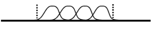

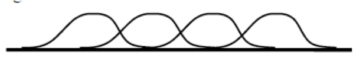

**Functional Richness**  

 

 

**Functional Evenness**  

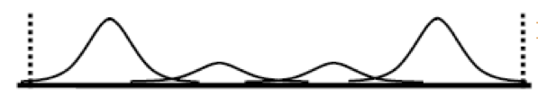

**Functional Divergence** 

Functional Dispersion
----------------

Functional Diversity
----------------

dummy$trait
----------------
trait data frame of 8 functional traits on 8 species

dummy$abun
----------------
matrix of abundances of the 8 species from 10 communities

Dummy.dist <- gowdis(dummy$trait)
----------------

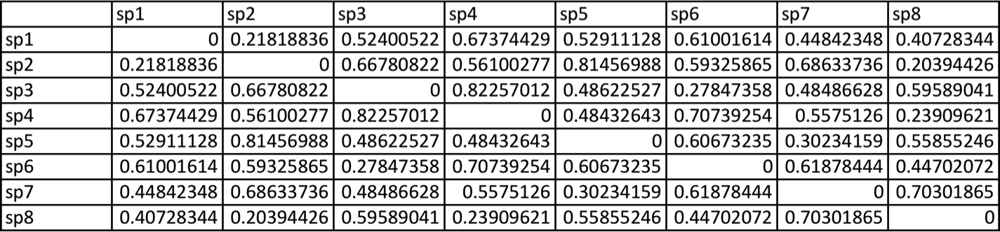 
- 	gowdis computes the Gower (1971) similarity coefficient exactly as  described by Podani (1999),then converts it to a dissimilarity coefficient  by using D = 1 - S. It integrates variable weights as described by  Legendre and Legendre (1998).

dummy.fdisp<-fdisp(dummy.dist,dummy.abun)
----------------

 

Dummy.dbFD <- dbFD(dummy$trait, dummy$abun)
----------------

**What do all of these errors mean?**
Species x species distance matrix was not Euclidean. 'sqrt' correction was applied.  FEVe: Could not be calculated for communities with <3 functionally singular species.
FRic: To respect s > t, FRic could not be calculated for communities with <3 functionally  singular species.
FRic: Dimensionality reduction was required. The last 5 PCoA axes (out of 7 in total)  were removed.
FRic: Quality of the reduced-space representation (based on corrected distance matrix)
= 0.6108352
FDiv: Could not be calculated for communities with <3 functionally singular species.

Dummy.dbFD <- dbFD(dummy$trait, dummy$abun)
----------------

**“Species x species distance matrix was not Euclidean. 'sqrt'  correction was applied.”**
This is because “dbFD” does a PCoA and then has to account for native  eigenvalues. The package comes with four possible correction methods and  the default here is to take the square root of the distances. This doesn’t  always work so you always choose another correction method.

Dummy.dbFD <- dbFD(dummy$trait, dummy$abun)
----------------
FRic: To respect s > t, FRic could not be calculated for communities with <3  functionally singular species.
FRic: Dimensionality reduction was required. The last 5 PCoA axes (out of 7 in  total) were removed.
FRic: Quality of the reduced-space representation (based on corrected distance  matrix) = 0.6108352
FDiv: Could not be calculated for communities with <3 functionally singular  species

**Fric**
**FDiv**  }	requires convex hull measurement
**Feve**
For these two measures you need more species than traits. If you  don’t have this you can subset of the PCoA aces as “traits.” Since  this is a loss of information you can use “qual.Fric” as an R2 type  ratio. In this example we have about 0.61

Functional Richness - FRic
----------------

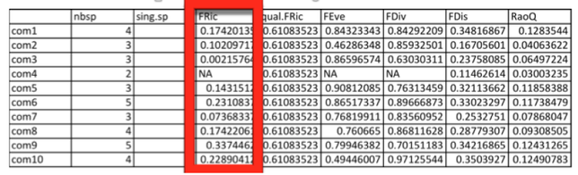 

Fric is the convex hull volume. It can be abundance weighted.  If it’s one trait it’s the “range” 

Functional Richness - FRic
----------------

Functional Evenness - FEve
----------------

 
 

FEve - the evenness  of abundance  distribution in filled  niche space

Functional Divergence - FDiv
----------------

 
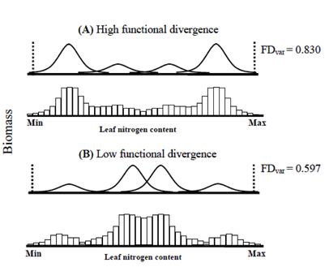  

Fdiv - the degree to which  abundance distribution in  niche space maximizes  divergence in functional  characters within the  community

Functional Dispersion - FDis
----------------

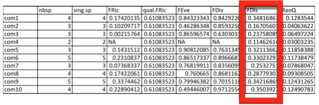

- Average distance to the (abundance weighted) centroid
- FDis is unaffected by species richness
- Can be computed from any distance or dissimilarity measure
  it can handle any number and type of traits not strongly influenced by outliers
- Similar to Rao’s Q
- Can be used as a beta diversity measure

CWM
----------------

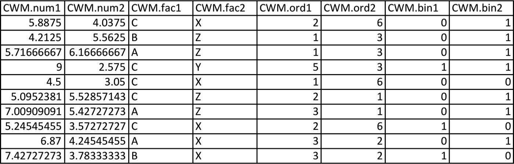
Community weighted mean trait values.

FGR
----------------
withFGR <- dbFD(dummy$trait, dummy$abun, calc.FGR = T)  
withFGR$FGR
withFGR$spfgr

 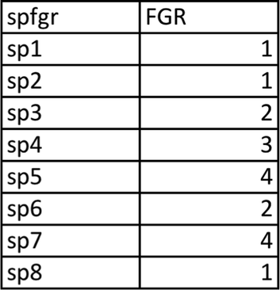

Dummy.functcomp <- functcomp(dummy$trait,  dummy$abun)
----------------

- functcomp returns the functional composition of a set of  communities, as measured by the community level weighted means  of trait values
- For a continuous trait CWM is the mean trait value of all species  present in the community, weighted by their relative abundances.

Dummy.functcomp <- functcomp(dummy$trait,  dummy$abun)
----------------

	
For ordinal, nominal and binary traits, either the dominant class is  returned, or the abundance of each individual class is returned (when  CWM.type	is "all" ).

Null Models: Using Kraft’s R-code  as an example.
----------------
- Test if species in a community are a random subset of  potential colonists from a larger species pool with respect to  a single continuous trait.
- Test trait mean, range, variance, kurtosis, and three metrics  of even spacing (SDNN, SDNNr, SDNDr).
- Compares the rank of the observed community to the null  distribution (can be used to calculate a p-value), it also  calculates a standard effect size.
- Random draws can be weighted by a species abundance or  occurance freuquency.

Run all the functions from the null  model script first
----------------
Now lets make and add the necessary data from the FD  package
- First load the species data which includes:
                 - Species list
                 - Two cwm traits for each species
                 - Abundance
                               
- fd_sp<-read.csv("fd_sp.csv",header=T)
- sp<-c("sp1", "sp2", "sp3", "sp4", "sp5", "sp6", "sp7", "sp8")
- trait<-(fd_sp$sp.num2)
- abundance<-floor(fd_sp$abund)

pool<-data.frame(sp, trait)
----------------
must contain all the species in all communities

sp_list_community1<-c("sp1", "sp2","sp5","sp6")  
test_trait_data(sp_list_community1, pool, log=TRUE,  reps=999, abweight=TRUE, abdata=abundance,  verbose=TRUE)->summary_verbose  
summary_verbose
----------------

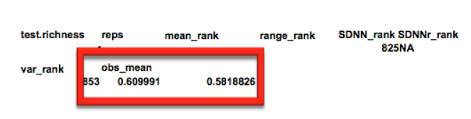

Do this for each community that  has a minimum of 4 species
----------------
- sp_list_community6<-c("sp2", "sp5","sp6","sp7","sp8") 
test_trait_data(sp_list_community6, pool, log=TRUE, reps=999, abweight=TRUE,  abdata=abundance, verbose=TRUE)->summary_verbose
 *summary_verbose*
-  sp_list_community8<-c("sp5","sp6","sp7","sp8")  
test_trait_data(sp_list_community8, pool, log=TRUE, reps=999, abweight=TRUE,  abdata=abundance, verbose=TRUE)->summary_verbose
*summary_verbose*
- sp_list_community9<-c("sp1","sp2","sp3","sp4","sp7")  
test_trait_data(sp_list_community9, pool, log=TRUE, reps=999, abweight=TRUE,  abdata=abundance, verbose=TRUE)->summary_verbose
*summary_verbose*
-  sp_list_community10<-c("sp2","sp3","sp7","sp8")  test_trait_data(sp_list_communit10, pool, log=TRUE, reps=999, abweight=TRUE,  abdata=abundance, verbose=TRUE)->summary_verbose

null<-read.csv("null_graph.csv",header=T)
----------------
species data including observed and null mean trait  values for each community

 

Trait beta diversity
----------------

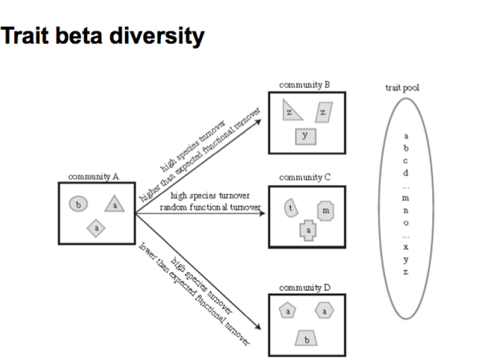 

Trait beta diversity
----------------
**Functional Sorenson's**    **Shared function between two communities**

                

**Nearest neighbor distance**  
More functionally similar communities will have lower nearest neighbor distances

      

**Pairwise dissimilarity**     **All pairwise distances between species**

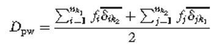           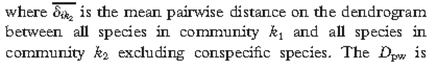

Mean Pairwise distance
----------------
from Picante Package
Calculates mean pairwise distance separating taxa in a community

dis.trait <- gowdis(tussock$trait)
dis.traitm<-as.matrix(dis.trait) #53 rows and 53 columns
abun.m<-as.matrix(tussock$abun) #30 rows and 53 columns  tussock.mpd<-mpd(abun.m, dis.traitm) #  ses.mpd.tussock.abundweighted<- ses.mpd (abun.m,dis.traitm,
null.model="taxa.labels”,abundance.weighted=TRUE) #standard  effect size, not abundance weighted

Nearest neighbor distance
----------------
comdist.tussock <- comdist(abun.m,dis.traitm)  plot(comdist.tussock)

Trait dendrogram
----------------
comdist.clusters.tussock <- hclust(comdist.tussock)  plot(comdist.clusters.tussock)
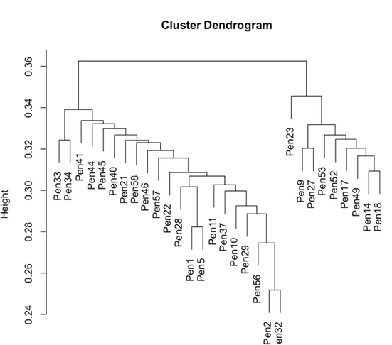 

Phylosor
----------------
Shared function between two communities

clust.dist.trait<-hclust(dis.trait)  clust.dist.trait.asphylo<-as.phylo(clust.dist.trait)
phylsor.tussock<-phylosor(abun.m,clust.dist.trait.asphylo

