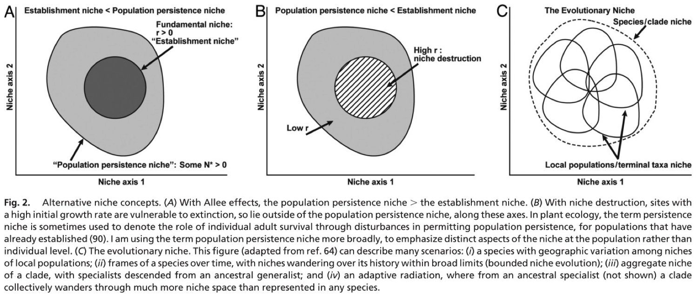
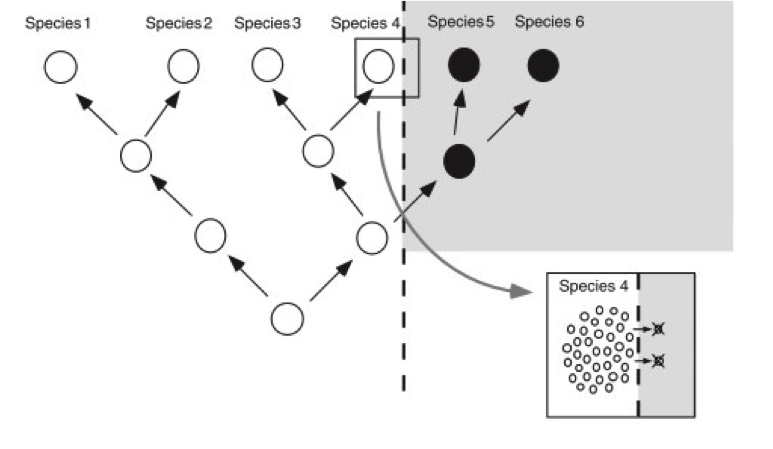
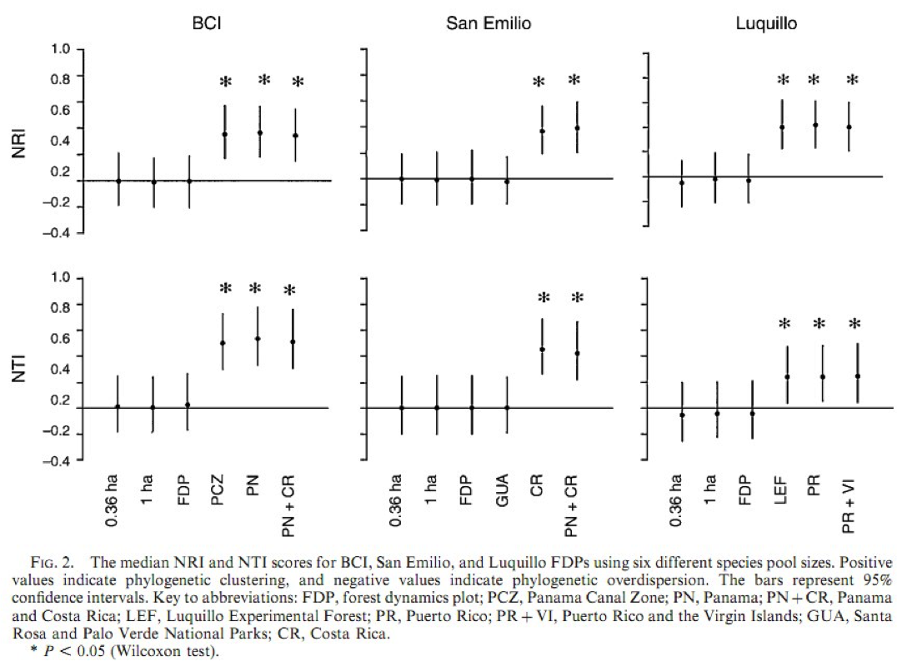
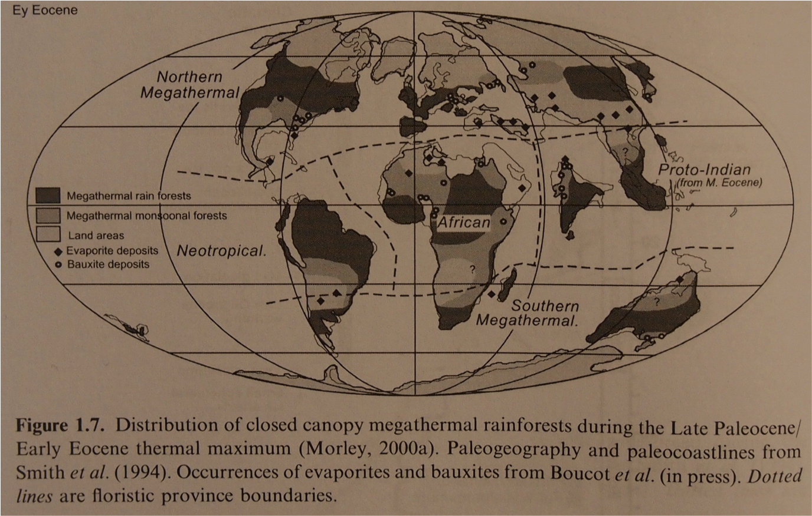
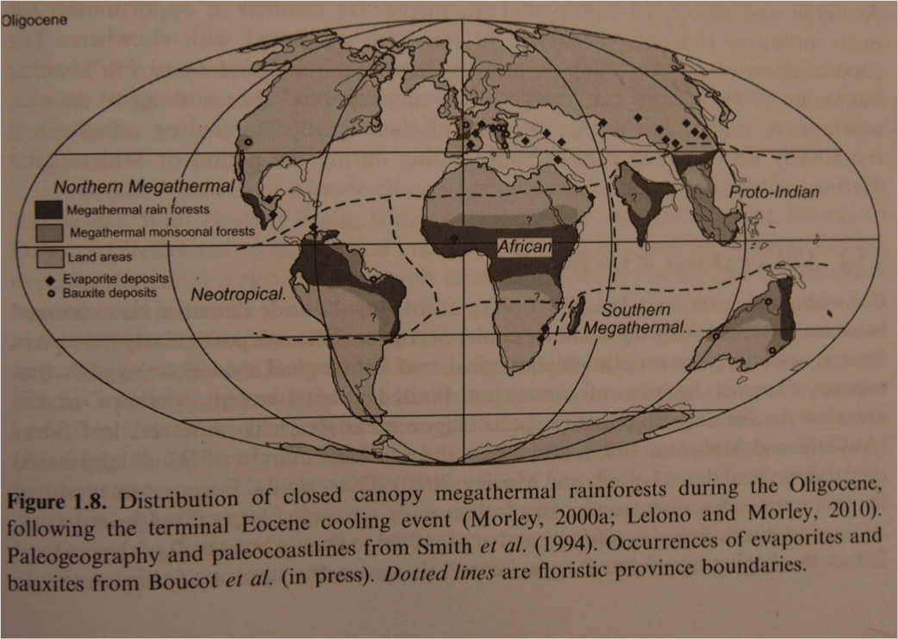
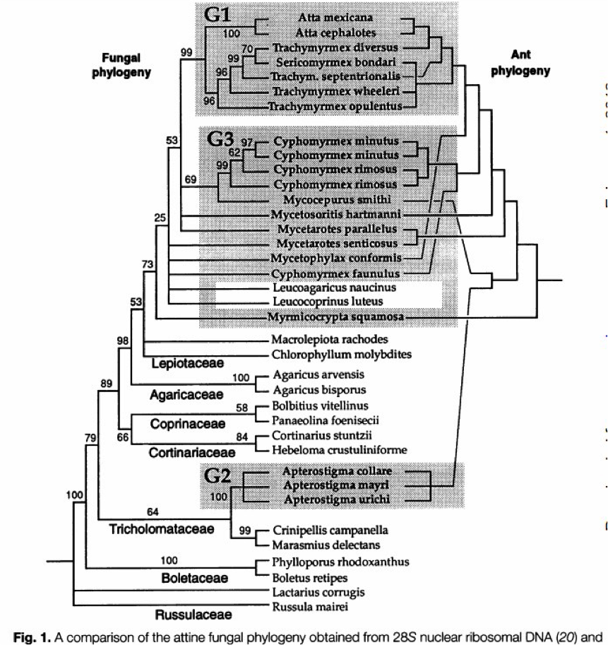
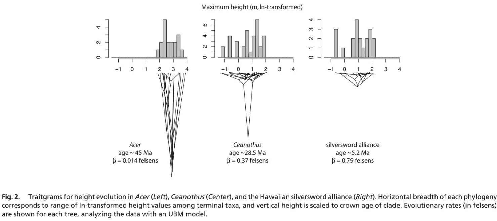

Phylogenetic Niche/Trait  Conservatism
=============================================

What’s a niche?
----------------
- Grinellian niche: “The niche‐relationships of  the California thrasher” The Auk 1917.
     - Defined based on observed habitat characteristics  within species distribution (coarse scale).
- Eltonian niche: Animal Ecology 1927
     - Emphasizing local‐scale biotic interactions.
- Reviewed by Soberon (2007)

What’s a niche?
----------------
- Hutchinsonian niche (1957): The set of biotic and abiotic conditions within which a species can persist.  Fundamental vs. realized niche.
    – Where intrinsic growth rate (r0 = per‐capita birth  rate minus death rate) ≥ 0.
- Reviewed and applied to current  understanding by Holt (2009).

Holt 2009
----------------

Wiens et al., 2010
----------------
- Sometimes niche‐related traits evolve rapidly,  sometimes very slowly
“Niche conservatism (NC) is the retention of  niche‐related ecological traits over time.”
     – Note interchangeable use of ‘niche’ and ‘trait’.
- Phylogenetic niche conservatism (PNC) =  retention of traits within clades (among  related species)

Wiens et al., 2010
----------------

Wiens et al., 2010
----------------
- Contrasting fine vs. coarse‐scale niches
   - What are some examples at each scale?
   - What gives rise to the barriers (depicted in the  inset) in each example?
   - Crisp et al., 2009: Biome stasis at speciation  outweighs biome shifts 25
 

Wiens et al., 2010
----------------
- “A test of NC without a related question or application is somewhat meaningless.”
- NC is scale‐dependent

Community Assembly
----------------
**Competition**
 
**Environmental Filtering**

Community assembly (Swenson et al.,  2006)
----------------

Community assembly (Swenson et al.,  2006)
----------------
- Show spatial and phylogenetic scale  dependency.

Wiens et al., 2010
----------------
- Species distribution models (SDM)
     - Mapping the climatic distribution of a species  provides a predictor for climatic factors that set  range limits.
     - NC can be tested by asking whether the SDM for  one species predicts the geographic range of its  sister species (Peterson et al., 1999).
     
Wiens et al., 2010    

- Species distribution models (SDM)
     - Is that good enough? Does the current realized niche  of a species tend to reflect its fundamental niche?
     - Take care with ‘forbidden combinations!’
     - Jared Diamond (1975) catalogued all bird species occurring  on each of many small islands, all nearby to each other.
     - Dubbed all combinations of species that never occurred  together as “forbidden combinations”.
     - Received much flack and sparked much debate over  dynamics of realized vs. fundamental niches.
     
Wiens et al., 2010
----------------
- Climatic change
    - Paleontology suggests the climate change induced  movement of species more than changes in traits  or extinction (p. 1314).
    - Review of 53 bird species showed 48 tracked their  previous climatic niches as climate changed (p.  1316; Tingley et al., 2009).

Wiens et al., 2010
----------------

Figure from chapter 1 of Bush et al., 2011

Wiens et al., 2010
----------------
Collej 2011: Lowland tropical rainforest par)cularly suscep)ble to climate change  because they will have to move up to 1000km to find thermal refuge.

Figure from chapter 1 of Bush et al., 2011

Wiens et al., 2010
----------------
- Invasive species
    - Wiens and Graham (2005) found a strong  relationship between native and introduced range  limits.
- Species interactions
    - Figs and fig wasps
    - Fungus‐farming ants and their fungi (Chapela et  al., 1994)
    - Herbivores and plants (Wieblen et al., 2006)
    
Chapela et al., 1994: fungus‐farming  ants and their fungi
----------------

Wieblen et al., 2006
----------------
- Assessed host‐plant phylogenetic  conservatism of insect‐herbivores in
- Found that 25‐44% of herbivores feeding on  more than one plant species were clustered  on the plant phylogenetic tree; 0‐6% were  overdispersed.

Phylogenetic and functional diversity  and ecosystem (aggregate) function
----------------
- Cadoje et al., 2009: Phylogenetic diversity explains grassland productivity better than traits.
- So where do traits come into the picture?
- Why is PNC typically about the environment or phylogeny and not the traits?

Proportion NC:not NC
----------------
- Using realized niches as a baseline, how can  we assess what proportion of species or  clades show NC in response to climate change  or invasions?
      – Extinction and non‐invasion typically make no data  points!
      
Hof et al., 2010
----------------
- Phylogenetic signals in the climatic niches of  the world’s amphibians.
- First analysis for PNC in entire clade  worldwide.

Hof et al., 2010 ‐ methods
----------------
- Ordination technique
    - Climatic niche estimated based on species  locations
    - Defines the mean and variance (breadth) of  environmental conditions used by the species
    - What you see is what you get: No population  dynamics or ecophysiological estimates involved

Hof et al., 2010 ‐ methods
----------------
- Blomberg’s randomization
   - Take phylogenetic tree and randomly distribute  data (traits, etc.) across tips.
   - Ask whether that data fits the phylogeny better than when randomly distributed
- Vicariance component analysis (VCA)
   - How much of species‐level niche variance is  explained at different taxonomic levels.

Hof et al., 2010 ‐ methods
----------------
- ANOSIM
     - Niche dissimilarity calculated as Euclidean distance (in  ordination space) between sp pairs.
     - Then ask: Is average dissimilarity between species  within a group (e.g., genus) less than dissimilarity  between species of different groups?
     - Yes = PNC!
- Wilcoxon rank sums
     - Calculated pairwise niche overlap (on OMI axes 1 and  2)
     - Asked: is niche overlap higher within groups than  between them?
     - Yes = PNC!

Hof et al., 2010 ‐ results
----------------
- PNC observed in majority of cases using all  analyses.
- However, phylogenetic signal was variable  among different regions within each clade.
     – E.g., using ANOSIM, 3 of 13 analyses showed  larger within‐family niche differences than  between family niche differences.
     
Hof et al., 2010 ‐ Discussion
----------------
- Their analyses were based on realized climatic  niches
    – How would you expect the results to differ if  based on fundamental niches?
- Can their results be used to infer amphibian  clade responses to climate change?

Ackerly 2009
----------------
- Introducing the ‘felsen;
- 1 felsen = 1 unit of variance between sister  taxa in ln‐tranformed traits per million years.
- Measured rate of accrual of variance in trait  values within clades for:
    - Traits: mature height, seed size, leaf size
    - Clades: Aesculus, Acer (north temperate);  Caenothus, Arbutoideae, (California); lobeliads  and silverswords (Hawaii)

Ackerly 2009
----------------
- Accrual of variance in height through time.
- 0.14 (Acer) to 0.79 felsens (silversword)
- Average rates: seed size < height < leaf size

Questions for John Wiens
----------------
- Where are the traits in PNC?
- Why does phylogenetic diversity explain  ecosystem function better than  functional  diversity?
- Is climatic niche modeling enough to predict  species/clade responses?
- How can we improve our ability to predict  those responses?

Discussion with John Weins
----------------
- Previous suggestions that narrower niche  width is correlated with niche diversification
    - He tried to find this in newts but didn’t, it seemed  the other way around.
- Where is niche conservatism now?
    - Some still think “it’s stupid” ‐> answer is whether  you find it a useful way of thinking or not.
    
Discussion with John Wiens
----------------
- What’s the way forward with PNC?
    - Mechanisms behind it are largely unknown.
- So is it dangerous to use it if we don’t understand  why it works (e.g., to predict species/clade/  ecosystem responses)?
    - PNC helps to see pajerns. We can use those pajerns  to generate hypotheses, and test those at the species  scale.	We can then use that more mechanistic  knowledge to inform further investigation at the  phylogenetic scale.
- (Ty) The feedback of research between scales is  important and a way forward for PNC and  species/ecosystem predictions.

Citations
----------------
- Ackerly, 2009. Conservatism and diversification of plant functional traits:  evolutionary rates versus phylogenetic signal. PNAS 106:19699‐19706.
- Bush et al., 2011. Tropical Rainforest Responses to Climatic Change (2nd  edi)on). Springer.
- Cadoje et al., 2009. Using phylogenetic, functional and trait diversity to  understand pajerns of plant community productivity. PLoS ONE 4:e5695.
- Chapela et al., 1994. Evolutionary history of the symbiosis between fungus‐  growing ants and their fungi.  Science 266:1691‐1694.
- Corlej 2011. Impacts of warming on tropical lowland rainforests. Trends in  Ecology and Evolu)on 26:606‐613.
- Crisp et al., 2009. Phylogenetic biome conservatism on a global scale.  Nature 458:754‐756
- Grinell 1917. The niche‐relationships of the California thrasher. The Auk  34:427‐433.
- Hadley et al., 2009. Niche conservatism above the species level. PNAS  106:19707‐19714.
- Hof et al., 2010. Phylogenetic signals in the climatic niches of the world’s  amphibians. Ecography 33:242‐250.
- Holt 2009. Bringing the Hutchinsonian niche into the 21st century: ecological  and evolutionary perspectives. PNAS 106:19659‐19665.

Citations
----------------
- Hutchinson 1957: Concluding remarks.  Cold Spring Harbor Symposium.
- Peterson et al., 1999. Conservatism of ecological niches in evolutionary
time. Science 285:1265‐1267.
- Soberon 2007. Grinnellian and Eltonian niches and geographic  distributions of species. Ecology Lejers 10:1115‐1123.
- Swenson et al., 2006. The problem and promise of scale dependency in  community phylogentics. Ecology 87:2418‐2424.
- Tingley et al., 2009. Birds track their Grinnellian niche through a century  of climate change. PNAS 106:19637‐19643.
- Wieblen et al., 2006. Phylogenetic dispersion of host use in a tropical  insect herbivore community. Ecology 87:S62‐S75.
- Wiens et al., 2010. Niche conservatism as an emerging principle in  ecology and conservation biology. Ecology Lejers 13:1310‐1324.
- Wiens and Graham 2005. Niche conservatism: integrating evolution,  ecology, and conservation biology. Annual Review of Ecology, Evolution,  and        Systematics 36:519‐539.

Other resources
----------------
- Kraft et al., 2007. Trait evolution, community assembly, and the phylogenetic structure of ecological communities. The American Naturalist 170:271‐283.
- Olalla‐Tarraga et al., 2011. Climatic niche conservatism and the evolutionary  dynamics in species range boundaries: global congruence across mammals and  amphibians. Journal of Biogeography 38:2237‐2247.
- Pennington et al., 2009. Woody plant diversity, evolution, and ecology in the  tropics: perspec)ves from seasonally dry tropical forests.
- Pfennig et al., 2010. Phenotypic plasticity’s impacts on diversifica)on and  speciation. Trends in Ecology and Evolu)on 25:459‐467.
- Powell et al., 2009. Phylogenetic trait conservatism and the evolution of functional  trade‐offs in arbuscular mycorrhizal fungi. Proceedings of the Royal Society – B  276:4237‐4245.
- Salamin et al., 2010. Assessing rapid evolution in a changing environment. Trends  in Ecology and Evolution 25:692‐698.
- Whitney et al., 2011. A 45 kyr paleoclimate record from the lowland interior of  tropical South America. Paleogeography, Paleoclimatology, Paleoecology  307:177‐192.
