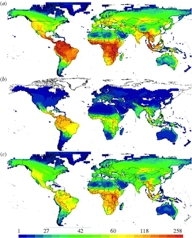
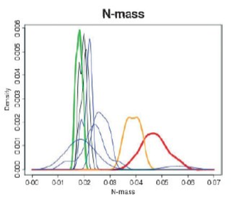
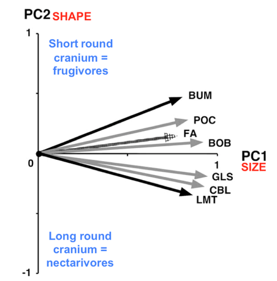
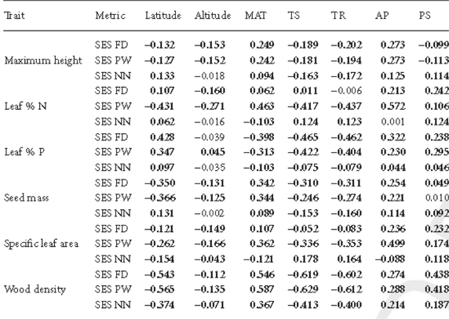
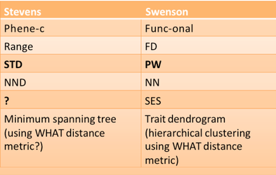
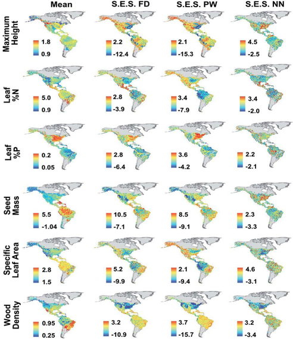

Changes in functional trait diversity over space and time
=============================================

Diversity and traits
----------------
- Traits interact with and respond to the  environment.
- Mechanistic hypotheses testing about geographic distribu-on of biodiversity should  consider traits.
- Now technology can allow us to address this  question across spatial scale.

Changes in trait diversity over space and time
----------------
- **Continental level**
   - Swenson et al. 2012 GEB
   - Stevens et al. 2006 Oikos

- **Community level**
   - Swenson et al. 2012 Ecology
   - Ding et al. 2011 Oikos

Species richness maps for (a) all the species, (b) bats only and (c) all species other than bats,  showing how bats influence the overall latitudinal diversity gradient.
----------------
**Can you just replace                   
species with traits?**

**Can functional trait ecology 
teach us something NEW about 
latitudinal diversity gradients?**

Buckley L B et al. Proc. R. Soc.  
B doi:10.1098/rspb.2010.0179

Stevens et. al 2006
----------------
**Changes in phenetic diversity of bats with  latitude and species richness**

*Methods*‐ measured 7 morphological features in  32 bat communi-es in the new world.
Decomposed into PCA and then measured “functional diversity” metrics then regressed these metrics with latitude and species richness.

Functional Diversity Metrics
----------------
Stevens et. al 2006

Range – the amount of phenetic variation in a community  STD – uniformity of species
NND – local packing

Stevens et. al 2006
----------------
                    

----------------

Stevens et. al 2006
----------------

Species Richness - Latitude
----------------

Swenson et. al 2012 GEB
----------------
- Favorability hypothesis: in climatically difficult regions abio-c filtering  should produce a regional assemblage that is less func-onally diverse  than expected given the species richness and the global pool of traits.
- Abiotic filtering – Environmental filtering is expected to constrain the overall distribution of function observed within assemblages with the greatest amount of filtering occurring in the least favorable  locations along local‐scale gradients.
- Biotic filtering ‐ Biotic interactions become more important in more  favorable abiotic conditions, thereby giving rise to a reduction in  functional similarity between species within a local.

Swenson et. al 2012 GEB
----------------
Favorability hypothesis: in climatically difficult regions abiotic filtering should produce a regional assemblage that is less funtionally diverse than  expected given the species richness and the global pool of traits.

1. How functional traits vary across environmental gradients
2. Functional over and under trait dispersion at large geographic scales

Swenson et. al 2012 GEB
----------------
- FD – functional diversity
- PW – mean pair‐wise func-onal trait distance
- NN – mean nearest neighbor distance

- Traits used: Foliar %N and %P and SLA, max  height, wood density
- Methods: Matched species occurrences with mean trait values in one degree grid cells. Used trait dendrograms to calculate FD, PW, and NN. Compares to 
- null distribution to calculates SES.SES.

Trait  dispersion
----------------
Swenson et. al 2012 GEB

Conclusion
----------------
- Functional trait diversity in the tropics is higher than expected given the global pool of traits and observed species richness. This  supports the favorability hypothesis.

EXTRA SLIDES:
----------------
**Climatic correlation**
Swenson et. al 2012 GEB

Compare terms
----------------

Swenson et. al 2012 GEB
----------------

