rait Covariation and Optimality  Approaches to Understand Them
=============================================

General Background
----------------
A trait is any morphological, physiological or phenological feature  measurable at the individual level, from the cell to the whole-organism level, without reference to the environment or any other level of organization. (Violle et al., 2007)

Leaf: as a very important functional component of plants (wright et al. 2004)

**Morphological Trait**                 
e.g. leaf thickness, leaf  size, SLA

**Phenological Trait**
e.g. leaf age

**Chemical Trait?**
e.g. leaf chlorophyll, leaf N, and leaf P

**Physiological Trait**
e.g. photosynthetic assimilation rate, and respiration rate

General Background
----------------
Enormous interspectic variation in plants traits has been observed (Reich et al., 1997; Wright et al., 2004)
*Table 1 from Reich et al. (1997); leaves of 111 species collected across 6 biomes worldwide
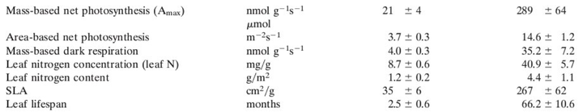

**Morphological Trait** | **Phenological Trait**
e.g. leaf thickness, leaf  size, SLA | e.g. leaf age
**Chemical Trait?** | **Physiological Trait**   
e.g. leaf chlorophyll, leaf N, and leaf P | e.g. photosynthetic assimilation  rate, and respiration rate

General Background
----------------
Enormous interspectic variation in plants traits has been observed (Reich et  al., 1997; Wright et al., 2004)
Table 1 from Reich et al. (1997); leaves of 111 species collected across 6 biomes worldwide

Such big variation is thought to represent adaptions to the range of  environmental conditions spanning from tropics to tundra (Reich et al., 1997).  Also, most of these traits are actually interrelated, rather than independent.

**What is the pattern of trait covaraition?**
**Why do traits covary and even some functions appear to converge despite different trait combinations?**

Papers Covered
----------------
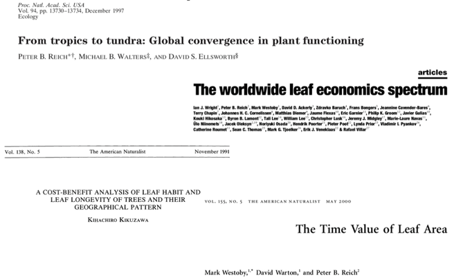

Trait Covaraition: From Tropics to Tundra
----------------
(Leaf trait data of 111 species across **6 biomes** were collected and analyzed)
Figure 1 from Reich et al. (1997); Relations among mass-based photosynthesis, SLA, nitrogen, and LL

Reich et al. 1997. PNAS

Trait Covaraition: From Tropics to Tundra
----------------
(Leaf trait data of 111 species across **6 biomes** were collected and analyzed)
Figure 1 from Reich et al. (1997); Relations among mass-based photosynthesis, SLA, nitrogen, and LL

- Scaling among different traits (see table 1 for more details)
- Scaling slope is pretty similar across 6 biomes
- The intercepts are significantly different across biomes

Reich et al. 1997. PNAS

Trait Covaraition: From Tropics to Tundra
----------------
* Multiple leaf trait relationships  are similar regardless of biome or climate regime | 

Figure 3,  Figure 4 from Reich et al. (1997)

Trait Covaraition: From Tropics to Tundra
----------------
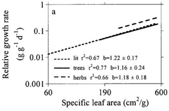

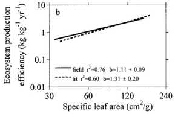

Reich et al. 1997. PNAS

Summary of Reich et al. (1997)???s Paper
----------------

a **???pattern???** : Scaling relationship of leaf traits was found and demonstrated convergent evolution and global generality in plant functioning
a **???hypothesis???**: interrelated constraints that involve compromises in leaf structure and function, because of limits on the multiple services that carbon  and N can perform in a leaf

e.g. No combination of thin, short-lived leaves and low Amax
e.g. No combination of thick, dense, and/or long lived leaves with high mass-based  leaf N, Amax and Dark respiration rate

1. In thick/dense leaves, within-leaf shading can limit the amount of light reaching chloroplasts
2. Leaves of high N are attractive nutritionally, and thus subject to higher rates of herbivory
3. Species that grow fast and have high Amax would be at a disadvantage in maintaining long-lived foliage and impose a less than optimal allocation of resources at different positions

Summary of Reich et al. (1997)???s Paper
----------------
a **???pattern???** : Scaling relationship of leaf traits was found and demonstrated  convergent evolution and global generality in plant functioning
a **???hypothesis???** : interrelated constraints that involve compromises in leaf  structure and function, because of limits on the multiple services that carbon  and N can perform in a leaf

e.g. No combination of thin, short-lived leaves and low Amax
e.g. No combination of thick, dense, and/or long lived leaves with high mass-based  leaf N, Amax and Dark respiration rate

In thick/dense leaves, within-leaf shading can limit the amount of light reaching chloroplasts **(not efficient)**
Leaves of high N are attractive nutritionally, and thus subject to higher rates of herbivory **(not efficient)**
Species that grow fast and have high Amax would be at a disadvantage in  maintaining long-lived foliage and impose a less than optimal allocation of resources at different positions **(not efficient)**

Summary of Reich et al. (1997)???s Paper
----------------
**Some points mentioned but still quite unknown:**
1. Why area based Amax don???t hold the same relationship as mass based Amax,  with SLA, Leaf life span, and Leaf nitrogen
2. What actually controls the scaling intercept among these relationships
3. Still lack of strong tools to explain the pattern found in this paper

Leaf Economics Spectrum
----------------
(Global plant trait network (Glopnet) spanning 2548 species from 219 families at  175 sites worldwide)
They assume an inherent economics in leaf, which could be described and  quantified by revenues and expenditures per unit investment, measured by biomass  or C, N or P.

*Figure 3 from Reich et al. (1997)

At the quick return end are species with high leaf nutrient concentrations, high rates of  photosynthesis and respiration, short leaf lifetimes  and low dry mass investment per leaf area.

At the slow return end are species with long leaf  lifetimes, expensive high LMA leaf construction,  low nutrient concentrations, and low rates of  photosynthesis and respiration.

Wright et al. 2004. Nature

Leaf Economics Spectrum
----------------
**Mass-base leaf traits & Area-base leaf traits**

Nmass=Narea*SLA or Nmass=Narea/LMA)

The same Narea can be combined with high Nmass and low LMA or low  Nmass and high LMA (long-life leaf), which actually represents the total  different environmental condition

Because of the covariation between leaf N and LMA, relationships between leaf N and other traits changed substantially when expressed on an area rather than on a mass basis

The coordination among leaf traits appears to be stronger and simpler on a mass basis than an area basis

Kikuzawa Model: a cost-benefit analysis
----------------
**Origin**: This model was developed to explain leaf habit, geographical distribution  pattern of evergreen and deciduous trees

**Key Issue**: leaf age (or leaf longevity) are key to differentiate evergreen &  deciduous trees

**Main Assumption**: Leaves, as a resource-gaining organ, produce or replace a leaf  to maximize its life time net carbon gain.

**Main Problem**: is to find when the tree should replace its leaves, by which the net  gain by a leaf per unit time over the entire life span is maximum

Kikuzawa. 1991. The American Naturist

Kikuzawa Model: a cost-benefit analysis
----------------
Main Problem: is to find when the tree should replace its leaves, by which the net  gain by a leaf per unit time over the entire life span is maximum
**g = G/t**
Where g is the marginal gain, and G is the life time net gain by a leaf G=lifetime photosynthetic production ???maintenance cost???construction cost

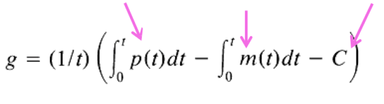

Where daily photosynthetic rate (p) is considered to be a monotonic decreasing  function, while maintenance cost (m) is assumed to decrease in proportion to p.

Kikuzawa. 1991. The American Naturist

Kikuzawa Model: a cost-benefit analysis
----------------
Main Problem: is to find when the tree should replace its leaves, by which the net  gain by a leaf per unit time over the entire life span is maximum
G=lifetime photosynthetic production ???maintenance cost	???construction cost

Kikuzawa also introduced the concept of **favorable period f(yr; 0 < f =< 1)**
for photosynthesis alternate within a year, and in this case g is expressed as

e.g. t=2.5yr  and f=0.5 yr

Kikuzawa. 1991. The American Naturist

Kikuzawa Model: a cost-benefit analysis
----------------

maximize: 

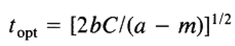

Kikuzawa. 1991. The American Naturist

Kikuzawa Model: a cost-benefit analysis
----------------

1. Leaf longevity is expected to be  short when initial net  photosynthetic rate of the leaf is  large (Reich et al., 1997)
2. Leaf longevity is long when the  construction cost of the leaf is  large (Coley, 1988)
3. Leaf longevity is short when the  decrease in net photosynthetic rate  with time is large (Mastumoto,  1984)

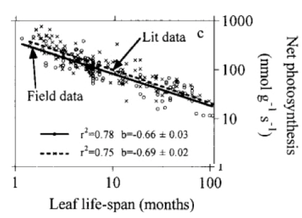
*Figure 1 from Reich et al. (1997)

Kikuzawa. 1991. The American Naturist

Kikuzawa Model: a cost-benefit analysis
----------------
**Origin**: This model was developed to explain leaf habit, geographical distribution  pattern of evergreen and deciduous trees

**Key Issue**: leaf age (or leaf longevity) are key to differentiate evergreen &  deciduous trees

**Main Assumption**: Leaves, as a resource-gaining organ, produce or replace a leaf  to maximize its life time net carbon gain.

**Main Problem**: is to find when the tree should replace its leaves, by which the net  gain by a leaf per unit time over the entire life span is maximum

Main Finding:

Kikuzawa. 1991. The American Naturist

The Time Value of Leaf Area
----------------
Plant growth can be understood as a process of investment leading to  returns and reinvestment.
1. The revenue-stream is shaped by three variables:
2. The light capture area per milligram dry mass invested,  analogous to a potential rate of return on investment
3. The longevity of the leaf, analogous to the expected  duration of the revenue stream
A time discount rate, quantifying the fact that light-capture area  deployed in the immediate future is more valuable to the plant the  same area deployed at some later time.

Westoby et al. 2000. The American Naturist

The Time Value of Leaf Area
----------------

Why do species with lower SLA not evolve toward higher value?
A likely answer is that low-SLA species, investigating more mass per unit  leaf area, build leaves with greater life span

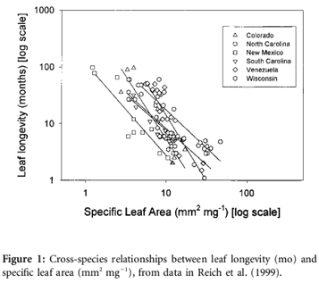

Westoby et al. 2000. The American Naturist

The Time Value of Leaf Area
----------------

Time discounting effect and the time value of leaf area
Future persistence of leaf area should less  valuable than immediate production of  leaf area
1. reduced revenue from older leaves,  due to overshading
2. reduced revenue from older leaves,  due to accumulation of algae, fungi, debris, and so forth, on the leaf surface  and as a result of damage from herbivores
3. There is the risk that the plant will no longer be alive to benefit
4. Opportunity cost effect

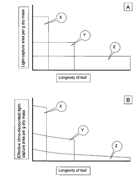

The Time Value of Leaf Area
----------------

Goals of this paper:
1. Approximately what level of time discounting would have the  effect of setting the expected level of SLA at some intermediate  level

2. When time discounting is taken into account, is SLA predicted to have a narrow and clear-cut optimum

Westoby et al. 2000. The American Naturist

The Time Value of Leaf Area
----------------

Equal-Benefit-Set Formulation
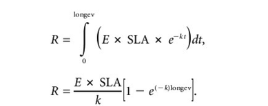

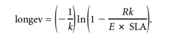

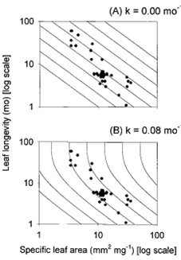

Westoby et al. 2000. The American Naturist

The Time Value of Leaf Area
----------------

Westoby et al. 2000. The American Naturist

Summary
----------------

A pattern was found: global convergence of plant traits
Two Theories were proposed: Leaf economics and cost-benefit analysis
Equal benefit theory was proposed to explain the interspecific variation  of leaf traits at local scale
