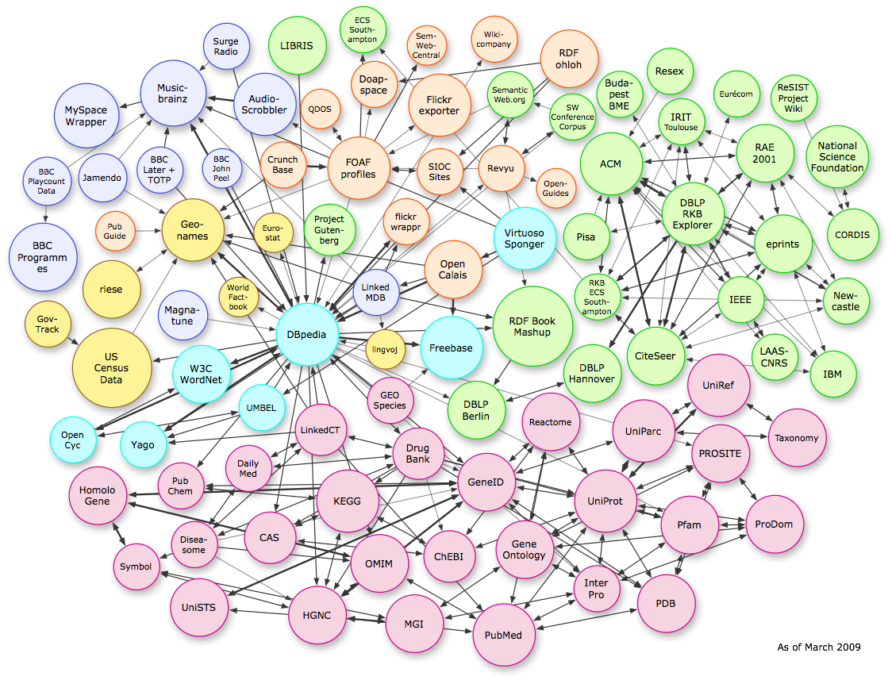

Querying the EoL trait bank
===========================

The [Encyclopedia of Life](http://eol.org) is a web project that aims to provide 
global access to knowledge about life on earth. It does this by constructing a web
page for each species and aggregating information from a variety of sources on that
page. As such, the way species are uniquely identified is by their
`page_id`. For example, the `page_id` of the [Sea Otter](https://eol.org/pages/46559130)
is `46559130`, as you can see in the URL of the page.

> Exercise 1: find the `page_id` of your model organism on the EoL website

### Triples and subjects

You will notice that for many species (probably your model organism as well) there is
a tab called _data_ on the species page. This leads to all the trait data that are
available on the EoL website. Each individual trait value has a number of different
bits of information associated with it:

- Where the information originally came from (as of late 2018 this is shown on the right)
- What the name of the trait is
- What the trait value is
- More detailed information when you expand the record by clicking the triangle

For example, a value for the trait `geographic distribution includes` might be `Japan`,
on the basis of a number of observations recorded in the `Japan Species List`. The
basic fact that the geographic distribution of this species includes Japan can be 
represented as a 'triple':

A triple is like a machine-readable sentence, and it is called that way because it 
consists of three parts: the subject, the predicate, and the object. For the sentence
'the sky is blue', the subject is 'the sky', the predicate is 'is', and the object
is 'blue'. Likewise, the picture shows a subject (`http://example.org/123`), a predicate
(`ex:age`), and an object (`43`). The triple thus means to say that whatever is identified
by the URL has an age of 43.

> Exercise 2: for any EoL trait record, what is the subject?

### Predicates

On several occasions during the course we've discussed the importance of making it
unambiguously clear what we mean when we use a certain term in our data. For example, 
when you combine different data tables, do columns with the same name automatically 
mean they hold the same data? Are columns with different names necessarily different? 
It is impossible to say unless the terms that we use are anchored on a globally unique
definition. We variously used the word 'ontology' or 'controlled vocabulary' for this.

The EoL trait bank uses this in a big way. Every predicate (so, every term about a
species, such as `geographic distribution includes`) is anchored on an ontology. Many
predicates are basically invented and defined by EoL itself, but others are borrowed from
external ontologies. This is a good idea, because we are only going to be able to
link up on the web of data if there is a shared agreement across different data sources
on what our predicates mean. And to make sure that we uniquely identify the predicate, 
it is given a URL (even if that doesn't necessarily mean that the URL resolves to a web
page! The important part is that it is unique across the entire world, which URLs
automatically are.)

> Exercise 3: for the predicate 'Leaf Complexity', what is its URL? What ontology does it come from?

### Objects

The third part of a triple is the object. In the picture of the triple, the object is
the literal value `43`. It is possible that this is ambiguous, because we don't know
right away what the unit is here. Perhaps it is the case that the definition of the
predicate `ex:age` specifies this, for example by stating that this is age in years
(as opposed to days, millions of years, milliseconds). On other occasions we have 
already seen how this is commonly specified, for example when we collected occurrence
data: the terms [dwc:decimalLatitude](https://terms.tdwg.org/wiki/dwc:decimalLatitude)
and [dwc:decimalLongitude](https://terms.tdwg.org/wiki/dwc:decimalLongitude) are clear
enough. (So, yes, GBIF uses ontologies as well, and so do BoLD, GenBank, and many other
databases with biodiversity data.)

In many cases it becomes unwieldy, or really impossible, to cram information about the
object into the predicate such that the object can remain a literal value. Instead, the
object also becomes a term from an ontology. For example, the territorial extent of 
Japan has varied over the years, so whether a species includes Japan in its geographical
distribution depends on what is meant by that, which EoL clarifies by using
[this globally unique anchor](http://www.geonames.org/1861060).

> Exercise 4: for the trait value 'green' (for example as the object of the triple
> where the predicate is 'leaf color'), what is the definition? What ontology does that
> come from?

So, there are _literal_ objects, which are usually numbers (counts, measurements), and
there are objects that themselves are ontology terms. You can imagine that those objects
can, in turn, become subjects of other statements. There are many things that can be
said about Japan, or about the color green, so they can naturally become subjects of
other triples. And the objects of those triples can in turn become the subjects of others,
and so on. Within and across data resources, this creates a very large network 
(or 'graph') of data:

### Graph databases

As we saw in the first week, networks (or "graphs") can be stored in relational databases:
a phylogenetic tree is a graph - a [DAG](https://en.wikipedia.org/wiki/Directed_acyclic_graph) - 
that can be traversed using recursive queries. These queries are basically of the form
Q1: "get me the children of this node", Q2: "now get me the children of the children", and so
on. This quickly becomes tedious, and it doesn't work in the same way when there are cycles
in the tree, for example when a node has multiple ancestors.

The solution is to not use a relational database, but a graph database. In a graph database
you search for patterns without having to specify how these come about (a relational database
requires you to be more explicit about what joins with what). The most commonly used graph
database right now is probably [Neo4J](https://neo4j.com), which has its own query language,
[cypher](https://neo4j.com/docs/cypher-manual/current/).

It looks a bit like the standard language SQL that we saw in weeks 1 and 2, but it's a dialect
specific to Neo4J and it uses ASCII art to represent relations:

The above picture shows that "a likes b" (what's the subject? The predicate? The object?), 
where `(a)` and `(b)` are now nodes (vertices) in the graph, and `-[:LIKES]->` is the 
relationship between them (an edge connecting the nodes in the graph). So how does this
work with the Linnean taxonomy? Assume the following:

- Nodes in the EoL graph have a `page_id`
- They also have a `canonical` name (i.e. the accepted taxonomic name) and a `parent`
- The `parent` attribute creates a pattern just like the `-[:LIKES]->` thing

With this information we can run a query where we can get _all_ the ancestors of the
Sea Otter in one go (and without clever, pre-computed index columns). The following
allows you to run that query. It is going to return JSON data, so it's a good idea to have
a browser extension that allows you to view JSON 
([chrome plugin](https://chrome.google.com/webstore/detail/json-viewer/gbmdgpbipfallnflgajpaliibnhdgobh?hl=nl),
[firefox plugin](https://addons.mozilla.org/nl/firefox/addon/jsonview/)) before you run the
query:

<form action='https://eol.org/service/cypher'>
  <textarea name='query' id='query' style='clear:all;width:100%' rows='8'>
MATCH (origin:Page {page_id: 46559130})-[:parent*]->(ancestor:Page)
OPTIONAL MATCH (ancestor)-[:parent]->(parent_of_ancestor:Page)
RETURN ancestor.page_id, ancestor.canonical, parent_of_ancestor.page_id
LIMIT 100  
  </textarea>
  <input type='submit' style='clear:all;width:100%' />
</form>

To unpack the query above, line by line:

1. Give me all the `ancestor` pages with which the `origin` (identified by `page_id` 46559130)
   has a `parent` relation. The clever thing here is that the `parent` relation is _transitive_,
   i.e. parent-of-parent also matches (and parent-of-parent-of-parent, etc.)
2. For any of these ancestors, give me their parent. This clause is optional, because not
   all ancestors have a parent. Which one doesn't?
3. For the matching ancestors, give me the `page_id` and the `canonical`, and the
   `parent_id` of its parent (this is allowed to be 'null')
4. Limit the results to 100 ancestors.

> Exercise 5: Now try the same thing with your model organism's page_id

## Querying for trait data

From the [EoL documentation](https://github.com/EOL/eol_website/blob/master/doc/trait-schema.md)
it looks like a `(Page)`, i.e. a taxon, can have zero or more `-[trait]->` patterns, which
point to a `(Trait)` node. The trait node in turn points to a `(Term)` node with which it has a
`-[:predicate]->` relation (i.e. what is the specific predicate term that we use for this trait),
and optionally another `(Term)` node that gives the measurement units of the literal trait value.

Here is an example to fetch a single trait triple for the Sea Otter:

<form action='https://eol.org/service/cypher'>
  <textarea name='query' id='query' style='clear:all;width:100%' rows='8'>
MATCH (t:Trait)<-[:trait]-(p:Page),
(t)-[:predicate]->(pred:Term)
WHERE p.page_id = 46559130 AND pred.uri = "http://purl.obolibrary.org/obo/VT_0001259"
OPTIONAL MATCH (t)-[:units_term]->(units:Term)
RETURN p.canonical, pred.name, t.measurement, units.name
LIMIT 1
  </textarea>
  <input type='submit' style='clear:all;width:100%' />
</form>

Line by line, the query roughly goes like this:

1. Give me the traits `t` for a page `p`
2. For those traits `t`, go on and give me the predicate term `pred`
3. Do this given that `page_id` of page `p` is 46559130 and the predicate has 
  [this](http://purl.obolibrary.org/obo/VT_0001259) URL
4. If the trait also has a units term, give me that as well
5. Return the triple, i.e. subject `p.canonical`, predicate `pred.name`, object `t.measurement` and add the `units.name`
6. I only want the first result

> Exercise 6: Run the query with your model organism's page_id. Do you get any results? If not, why not?

> Exercise 7: Run the query with your model organism's page_id, but increase the `LIMIT` (like, set it 
> to 100, for example), and remove the second part of the `WHERE` close, so without the part from the 
> `AND` statement onwards on line 3.

Because we've removed the restriction to a specific predicate in Exercise 7, we get whatever predicates 
are available. However, many of them have no literal object value. Why? Because the object is not a 
literal `measurement` (such as the body mass) but something else, such as an ontology term for a habitat type.

